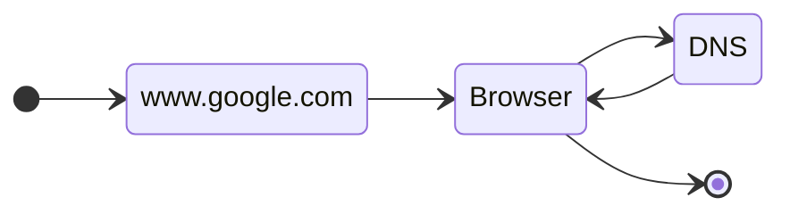

---

<Toc columns="2" maxDepth="3"></Toc>

---
layout: two-cols
---

## Internet x Web

É comum confundir os dois termos, mas eles não são sinônimos: a Web é apenas um dos serviços que rodam sobre a Internet, assim como email ou compartilhamento de arquivos.

### Internet

- **Infraestrutura**: rede física e lógica que conecta computadores no mundo todo.
- Cabos, roteadores, satélites, protocolos como **TCP/IP**.
- Existe desde 1969 (ARPANET), décadas antes da Web.

::right::

### Web (WWW)

- **Serviço/aplicação** que roda por cima da Internet.
- Conjunto de documentos e recursos conectados por hiperlinks, acessados via **HTTP** e exibidos em um *browser*.
- Criada em 1989 por Tim Berners-Lee, no CERN.

<!--
Analogia: a Internet é como o sistema rodoviário, a Web é um tipo de tráfego que passa por essas estradas (assim como email, streaming e jogos online são outros tipos de tráfego).
-->

---
layout: image-left
image: prensa.jpeg
backgroundSize: contain
---

## História da Web

A história do conhecimento humano também é a história de como ele se espalha: a escrita libertou o saber da memória oral, a prensa de Gutenberg (1440) tornou os livros baratos o bastante para copiar em massa, e as bibliotecas públicas organizaram esse acervo para qualquer leitor acessar.

A Web repete esse mesmo movimento em escala digital, ao conectar documentos por hiperlinks acessíveis de qualquer computador na Internet, ela reduziu a praticamente zero o custo de copiar, distribuir e encontrar informação, comprimindo em poucas décadas uma democratização do conhecimento que antes levava séculos.


---
layout: image-right
image: /VannevarBush.png
backgroundSize: contain
---

### Ligações associativas

Em *"As We May Think"* (1945), **Vannevar Bush** propôs o **Memex**, um dispositivo capaz de armazenar documentos conectados por "*trilhas associativas*": em vez de navegar por um índice fixo e hierárquico, o leitor saltaria de um documento a outro seguindo relações de sentido, o mesmo princípio por trás do hyperlink que usamos hoje.


---
layout: image-right
image: /TedNelson.jpg
backgroundSize: contain
---

### Texto não-linear

Um livro impõe uma leitura linear, página após página. Em 1963, **Ted Nelson** cunhou o termo *hypertext* para descrever texto organizado em rede, onde qualquer trecho pode referenciar outro, permitindo caminhos de leitura não-lineares. Ele tentou concretizar essa ideia no projeto **Xanadu**, décadas antes da Web existir.


<!--
Vannevar Bush não chegou a construir o Memex, era um conceito teórico publicado na revista The Atlantic.
Ted Nelson também cunhou o termo "hipermídia". O projeto Xanadu começou em 1960 e continuou em desenvolvimento por décadas.
Esses dois trabalhos são frequentemente citados como os precursores conceituais do que Tim Berners-Lee implementou de fato em 1989.
-->

---
layout: image-right
image: /Sir_Tim_Berners-Lee.jpg
---
## Breve resumo da história da Web

A world wide web(www) como conheçemos hoje é produto de vários trabalhos e pesquisas, mas principalmente
reconhecida como trabalho de [Sir Tim Berners-Lee](https://www.w3.org/People/Berners-Lee/){style="color: lightblue;"}, desenvolvido no CERN em 1989.

Ele é creditado como criador das especificações URIs, HTTP and HTML.

## Camadas da Web

- **Internet** ARPANET 1969, *J.C.R Licklider* e TCP/IP 1975, *Cerf & Kahn*
- **Email** 1971, *Ray Tomlinson*
- **Browsers** DOS Houdini 1986, *Neil Larson* e Mosaic 1993, *Marc Andreessen*

<!--
WWW World Wide Web 1989 at CERN(*Conseil européen pour la Recherche nucléaire*) Tim Berners-Lee <p>
Criado para compartilhar dados entre máquinas no CERN <p>
W3C - https://www.w3.org/ World Wide Web Consortium <p>
HTTP - Hypertext Transfer Protocol 1989 at CERN Tim Berners-Lee
HTML - 1989 publicado 1991

ARPA - Atual DARPA(*Defense Advanced Research Projects Agency*)

Tim Berners-Lee combinou essas ideias com a infraestrutura da Internet já existente (**TCP/IP**) e definiu três peças técnicas para torná-las realidade em escala global: **URI** (endereçar um recurso), **HTTP** (transportá-lo) e **HTML** (marcar os links dentro dele).
-->
---


<!--
 A ARPA criou a ARPANET (*Advanced Research Projects Agency Network*). <p>
Era simultaneamente um backbone e uma rede experimental, inicialmente <p>
a ARPANET ligou 4 universidades.

Ray Tomlinson criou o primeiro programa para a ARPANET(email)
-->

---

## Como funciona?

Computadores(no sentido amplo da palavra) conectados a internet assumem o papel de cliente ou servidor.

O cliente faz uma requisição para o servidor, que responde com algum conteúdo.

<br>


<!--
There are more things in heaven and earth, Horatio, than are dreamt of in your philosophy.
--William Shakespeare <p>

Internet connection, TCP/IP, DNS, HTTP, Code, Assets<p>
DNS - Domain Name Server <p>
HTTP - Hyper Text Transfer Protocol <p>
Outras URI, são URN(uniform resource names), são definidos no RDF(Resource Description Framework) mantido pela W3C
-->
---

## URI

URI(*Uniform Resource Identifier*) é uma sequência de caracteres utilizada para identificar um recurso na rede.
O tipo mais comum de URI é a URL(*Uniform Resource Locator*)

## Anatomia da URL

<br>

<pre class="pre">          <span style="color:rgb(0, 76, 178)">userinfo</span>       <span style="color:rgb(0, 177, 17)">host</span>      <span style="color:rgb(178, 111, 0)">port</span>
          <span style="color:rgb(0, 76, 178)">┌──┴───┐</span> <span style="color:rgb(0, 177, 17)">┌──────┴──────┐</span> <span style="color:rgb(178, 111, 0)">┌┴┐</span>
  https://john.doe@www.example.com:123/forum/?tag=networking&amp;order=newest#top
  <span style="color:rgb(178, 111, 0)">└─┬─┘</span>   <span style="color:rgb(176, 0, 177)">└─────────────┬────────────┘</span><span style="color:rgb(0, 76, 178)">└──┬──┘</span> <span style="color:rgb(0, 178, 17)">└────────────┬────────────┘</span> <span style="color:rgb(178, 111, 0)">└┬┘</span>
  <span style="color:rgb(178, 111, 0)">scheme</span>          <span style="color:rgb(176, 0, 177)">authority</span>            <span style="color:rgb(0, 76, 178)">path</span>              <span style="color:rgb(0, 178, 17)"><span style="color:rgb(0, 178, 17)">query</span></span>         <span style="color:rgb(178, 111, 0)">fragment</span>

  mailto:John.Doe@example.com
  <span style="color:rgb(178, 111, 0)">└─┬──┘</span> <span style="color:rgb(0, 76, 178)">└────┬─────────────┘</span>
  <span style="color:rgb(178, 111, 0)">scheme</span>     <span style="color:rgb(0, 76, 178)">path</span>
</pre>

---

## DNS Lookup
<br>

- Para acessar um determinado site ou aplicativo você digita uma URL (exemplo, www.google.com) na barra de endereço
do navegador.
- Essa URL é um nome feito para ser lido por humanos, a comunicação entre cliente e servidor é feita utilizado endereços
numéricos chamados endereços de IP(*IP address*).
- Para fazer essa conversão de URL para IP, o *browser* se comunica com um servidor DNS(*Domain Name System*). Pense
nele como uma agenda telefonica. Nome > número
- O DNS procura o endereço associado a URL enviada e retorna esse IP para o *browser*

<br>


```mermaid
stateDiagram-v2
    direction LR
    [*] --> www.google.com
    www.google.com --> Browser
    Browser --> DNS
    DNS --> Browser
    Browser --> [*]
```

<!--

## Status Code

Depois de processar o que foi solicitado no request ele envia o response de volta para o browser contendo:
- *Status Code*: indica se a solicitação foi bem-sucedida (por exemplo, 200 para OK, 404 para Não encontrado).
- *Headers*: fornecem informações adicionais sobre a resposta, como o tipo de conteúdo (por exemplo, HTML, imagem).
- *Body*: Contém os dados reais solicitados, normalmente em formato HTML para páginas da web.

O [Status Code](https://datatracker.ietf.org/doc/html/rfc7231){style="color: lightblue;"} fornece informações sobre o resultado do request. Os status são agrupados em:

- 1xx - Informativo
- 2xx - Sucesso
- 3xx - Redirecionamento
- 4xx - Erro no cliente
- 5xx - Erro no servidor


### [200](https://httpstatusdogs.com/200-ok) - Retorno com sucesso em um HTTP request

::right::
### [404](https://httpstatusdogs.com/404-not-found) - O *resource* solicitado não foi encontrado


https://developer.mozilla.org/en-US/docs/Web/HTTP/Status
http://httpstatus.com.br/
https://httpstatusdogs.com/
-->
---

# HTML

```html
<!DOCTYPE html>
<html lang="en">
<head>
  <meta charset="UTF-8">
  <meta name="viewport" content="width=device-width, initial-scale=1.0">
  <title>Hello World!</title>
  <link rel="stylesheet" href="style.css">
</head>
<body>
  <h1 id="hello-message">Hello World!</h1>
  <script src="script.js"></script>
</body>
</html>
```

---
layout: two-cols
---

## *Parsing* HTML

Após receber o conteúdo do *response*, o navegador vai começar a fazer o *Parsing* dos dados. **Parsing** significa
analisar e converter um programa em um formato interno para ser executado.

O Navegador vai então usar um componente chamado *Engine* ou motor para fazer o *Parsing*. Existem diversos tipos de
*Engine*:

- Blink(Chromium): Chrome, Edge, Brave, Vivaldi, Opera... Escrito em `C++` e mantido pelo Google.
- Gecko: Firefox. Escrito em `C++ e JavaScript`, recentemente começou ter partes escritas em `Rust` e mantido pela
Mozilla.
- WebKit: Safari, Otter, Epiphany, escrito em `C++` e mantido pela Apple.

::right::

### *Tokenization*

No processo de *Tokenization*, é feita uma análise léxica do documento e convertido em tokens, imagine separar uma frase
em palavras


---
layout: two-cols
---
## *DOM*

Depois que o primeiro token é criado, começa o processo de *tree building*, que cria uma estrutura chamada DOM(*Document
Object Model*), e vai adicionando os tokens gerados.

A árvore é montada começando pelo elemento root `<html>` e vai refletindo a arquitetura utilizada entre as tags,
definindo `parent nodes` e `child nodes`, quanto mais *nodes*, mais tempo vai levar para criar o DOM tree.

Enquanto o DOM é criado conforme novos tokens são gerados, eles são adicionados ao DOM. Ao encontrar recursos como
CSS stylesheets, Javascript files, fontes de texto ou bibliotecas, o parser para a execução, espera o download desses
arquivos para continuar a geração.

::right::


<!--
That's why, if yu're working with Javascript it is recommended to add your <script>
tags at the end of the HTML file, or if you want to keep them in the <head> tag, you should
add to them the defer or async attribute (async allows for asynchronous as soon as the script is
downloaded and defer allows execution only after the whole document has been parsed).
-->

---
layout: two-cols
---


## *Parsing* CSS

```css
body {
  font-size: 16px;
  color: white;
}
h1 {
  font-size: 32px;
}
section {
  color: tomato;
}
section .mainTitle {
  margin-left: 5px
}
div {
  font-size: 20px;
}
```

::right::

Se existir folha de estilos, é realizado o *parsing* do CSS sendo criado o CSSOM(*CSS Object Model*). Utilizando
Tokenization, o parser recebe os bytes, converte em caracteres, depois tokens, depois nodes e depois
eles são conectados no CSSOM.


---
layout: two-cols
---

## Javascript

Quando existe Javascript no response, ele deve ser primeiro compilado e/ou interpretado, para isso é utilizado um motor
Javascript. Dentre os motores mais utilizados estão, V8, Javascript core, Chakra e SpiderMonkey.

### Compilação

No processo de compilação, o código escrito em uma linguagem de alto nível é convertido em linguagem de máquina gerando
um object file, para depois ser executado ou não.

### Interpretação

Durante o processo de interpretação o código é "lido" linha a linha e executado imediatamente.


::right::

### JIT

JIT(*Just in time compilation*) e trabalha intercalando compilação e interpretação. Dessa forma o código é traduzido para
linguagem de máquina enquanto é executado. Essa execução vai compilar o código para linguagem de máquina.

Apesar de Javascript ser uma linguagem interpretada e não precisar de compilação, a maioria dos navegadores utiliza JIT

---

## Paint

Após todo o processo visto anteriormente o navegador processa todo o conteúdo gerado e organiza o layout para ser
renderizado.


---

## Referências
___
https://www.w3.org/People/Berners-Lee/

https://en.wikipedia.org/wiki/Uniform_Resource_Identifier#Conception

https://medium.com/@rohitpatil97/http-request-http-response-context-and-headers-part-iii-5c37bd4cb06b

https://www.iana.org/assignments/uri-schemes/uri-schemes.xhtml

https://developer.mozilla.org/en-US/docs/Web/HTTP/Headers

https://www.rfc-editor.org/rfc/rfc9110.html

https://developer.mozilla.org/en-US/docs/Web/Performance/How_browsers_work#overview

https://dev.to/arikaturika/how-web-browsers-work-part-1-with-illustrations-1nid

https://www.w3.org/Style/CSS20/history.html

https://developer.mozilla.org/en-US/docs/Glossary/Call_stack

https://dev.to/arikaturika/how-web-browsers-work-the-render-tree-part-7-with-illustrations-24h3

https://hardtec.com.br/arpanet-as-origens-da-internet/

https://www.alura.com.br/artigos/ada-lovelace-charles-babbage-eniac-breve-historia-computacao