---

<Toc columns="2" maxDepth="3"></Toc>

---

## O que é um sistema de mensageria?

Um **sistema de mensageria** (message broker) é uma peça de infraestrutura que permite que serviços troquem informação de forma **assíncrona**, sem que o serviço que envia precise conhecer, chamar diretamente ou esperar resposta imediata do serviço que recebe.

Em vez de um serviço chamar o outro via HTTP/REST (comunicação síncrona), ele publica uma **mensagem** em um **broker**, e quem estiver interessado a consome quando estiver pronto.

- Produtor (Producer){style="color: lightgreen;"} publica a mensagem, sem saber quem vai consumi-la.
- Broker{style="color: lightgreen;"} armazena e entrega a mensagem com garantias (persistência, ordem, retry).
- Consumidor (Consumer){style="color: lightgreen;"} processa a mensagem no seu próprio ritmo.

Esse desacoplamento é a base de arquiteturas orientadas a eventos (Event-Driven Architecture).

---

### Por que não usar apenas chamadas síncronas (REST)?

Em uma arquitetura de microsserviços puramente síncrona, cada serviço depende da disponibilidade e do tempo de resposta de todos os outros que ele chama diretamente:

- Se o serviço de **pagamentos** está lento, o serviço de **pedidos** fica bloqueado esperando, mesmo que o cliente já devesse ter recebido uma resposta.
- Um pico de tráfego em um serviço se propaga para todos que dependem dele (efeito cascata).
- Adicionar um novo consumidor de um evento (ex: enviar e-mail ao criar pedido) exige alterar o serviço produtor para chamá-lo.
- Não há buffer: se o consumidor cair, a informação se perde, a menos que o produtor implemente retry manualmente.

Sistemas de mensageria resolvem esses problemas introduzindo uma camada intermediária que absorve picos, garante entrega e permite adicionar novos consumidores sem tocar no produtor.

---
layout: two-cols
---

## Comunicação síncrona

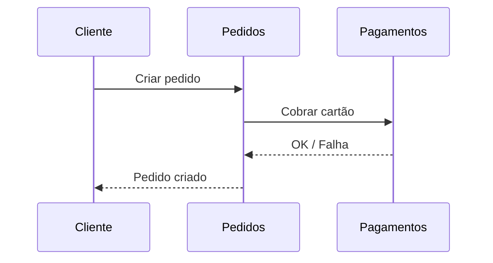

O serviço de Pedidos **fica bloqueado** esperando a resposta de Pagamentos. Se Pagamentos cair ou ficar lento, Pedidos também é afetado diretamente.

::right::

## Comunicação assíncrona

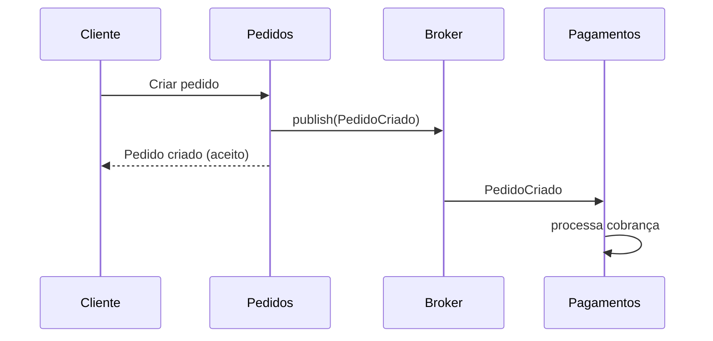

Pedidos publica o evento e **segue em frente**. Pagamentos consome quando puder, sem bloquear o fluxo do cliente.

---

## Conceitos fundamentais

Independente da ferramenta (RabbitMQ, Kafka, SQS...), a maioria dos sistemas de mensageria compartilha os mesmos conceitos-base:

- **Message (Mensagem)**{style="color: lightgreen;"}: o dado transmitido, geralmente com um payload (JSON, Avro, Protobuf) e metadados (headers, timestamp, tipo).
- **Producer (Produtor)**{style="color: lightgreen;"}: quem publica a mensagem no broker.
- **Consumer (Consumidor)**{style="color: lightgreen;"}: quem lê e processa a mensagem.
- **Broker**{style="color: lightgreen;"}: o servidor que recebe, armazena e roteia as mensagens (ex: RabbitMQ, Kafka).
- **Queue (Fila)**{style="color: lightgreen;"}: estrutura FIFO onde as mensagens ficam até serem consumidas.
- **Topic (Tópico)**{style="color: lightgreen;"}: canal lógico usado no padrão publish/subscribe, onde múltiplos consumidores podem receber a mesma mensagem.

---
layout: two-cols
---

## Padrões de troca de mensagens

Existem dois padrões principais de entrega, e a maioria dos brokers modernos suporta os dois de alguma forma:

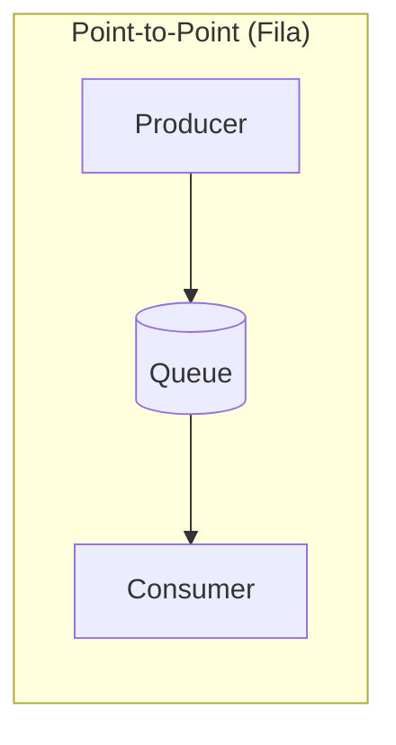
::right::

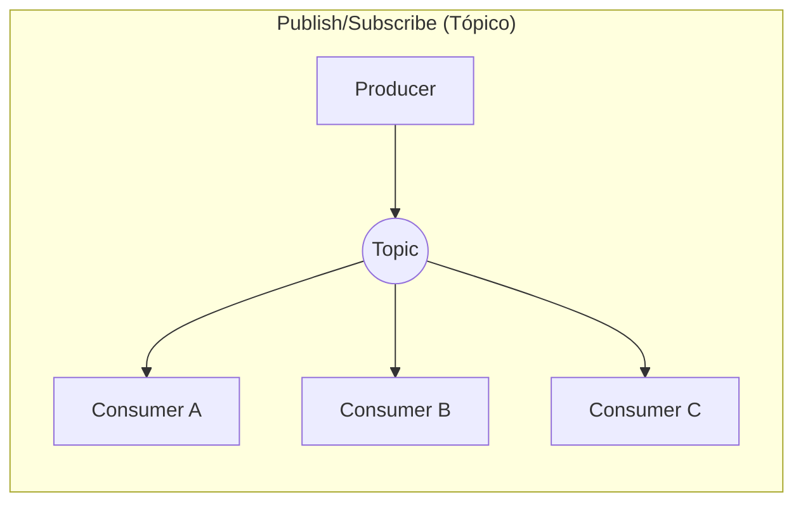

- **Point-to-Point**: cada mensagem é consumida por **apenas um** consumidor (ótimo para distribuir trabalho/tarefas).
- **Publish/Subscribe**: cada mensagem é entregue a **todos** os consumidores inscritos (ótimo para notificar múltiplos interessados no mesmo evento).

---

## Vantagens de sistemas de mensageria

- **Desacoplamento**{style="color: lightgreen;"}: o produtor não precisa saber quem (ou quantos) consumidores existem, nem seu endereço.
- **Resiliência**{style="color: lightgreen;"}: se um consumidor cair, a mensagem permanece na fila até ele voltar (dependendo da configuração de persistência).
- **Absorção de picos (buffering)**{style="color: lightgreen;"}: em um pico de tráfego, mensagens se acumulam no broker em vez de derrubar o consumidor.
- **Escalabilidade horizontal**{style="color: lightgreen;"}: basta adicionar mais consumidores para processar mensagens em paralelo.
- **Extensibilidade**{style="color: lightgreen;"}: novos consumidores podem se inscrever em eventos existentes sem qualquer mudança no produtor.
- **Processamento assíncrono**{style="color: lightgreen;"}: tarefas demoradas (envio de e-mail, geração de relatório, processamento de imagem) não bloqueiam a resposta ao usuário.

---

## Desafios de sistemas de mensageria

Mensageria resolve problemas, mas introduz complexidade própria:

1. **Ordem das mensagens**{style="color: lightgreen;"}: nem todo broker garante ordem global; muitas vezes só é garantida dentro de uma fila ou partição.
2. **Mensagens duplicadas**{style="color: lightgreen;"}: falhas de rede podem causar reentrega. Consumidores precisam ser **idempotentes** (processar a mesma mensagem duas vezes sem efeito colateral duplicado).
3. **Mensagens "envenenadas" (poison messages)**{style="color: lightgreen;"}: uma mensagem malformada pode travar um consumidor em loop de retry. Resolvido com **Dead Letter Queues (DLQ)**.
4. **Consistência eventual**{style="color: lightgreen;"}: como o processamento é assíncrono, existe uma janela de tempo onde o estado do sistema ainda não reflete o evento publicado.
5. **Debug e observabilidade**{style="color: lightgreen;"}: rastrear uma mensagem através de múltiplos serviços é mais difícil do que seguir uma chamada HTTP síncrona.

---

## Garantias de entrega (Delivery Semantics)

Todo sistema de mensageria precisa escolher (ou permitir configurar) uma garantia de entrega:

- **At most once**{style="color: lightgreen;"}: a mensagem é entregue **no máximo uma vez**. Pode se perder, mas nunca duplica. Rápido, mas arriscado.
- **At least once**{style="color: lightgreen;"}: a mensagem é entregue **uma ou mais vezes**. Nunca se perde, mas pode duplicar, exige consumidores idempotentes. É o modelo mais comum (RabbitMQ e Kafka na configuração padrão).
- **Exactly once**{style="color: lightgreen;"}: a mensagem é entregue **exatamente uma vez**. O ideal, mas caro e complexo de garantir de ponta a ponta (Kafka oferece isso dentro do próprio cluster com transações).

Na prática, a maioria dos sistemas do mundo real assume **at least once** e resolve duplicidade na camada de aplicação.

---
layout: image-right
image: /rabbitmq-logo-with-name.svg
backgroundSize: 80% auto
---

## RabbitMQ

RabbitMQ é um **message broker tradicional**, criado em 2007, que implementa o protocolo **AMQP** (Advanced Message Queuing Protocol).

Seu foco é **roteamento flexível de mensagens**: o produtor não publica direto numa fila, e sim em uma **Exchange**, que decide (com base em regras) para quais filas a mensagem deve ir.

É a escolha clássica para **filas de tarefas**, RPC assíncrono e cenários onde a ordem de roteamento importa mais do que throughput extremo.

---
layout: two-cols
---

## O que é o protocolo AMQP

**AMQP** (Advanced Message Queuing Protocol) é um **protocolo aberto de camada de aplicação**, padronizado pela OASIS/ISO, que define como produtores, brokers e consumidores trocam mensagens **pela rede**.

Diferente de APIs proprietárias, o AMQP especifica o **formato binário exato dos dados no fio** (wire-level protocol), qualquer cliente que implemente a especificação consegue falar com qualquer broker compatível, independente da linguagem ou fornecedor.

::right::


- **Agnóstico de linguagem**{style="color: lightgreen;"}: clientes em Java, Python, Node.js, .NET, Go, etc.
- **Agnóstico de fornecedor**{style="color: lightgreen;"}: RabbitMQ, ActiveMQ Artemis, Azure Service Bus, Solace...
- **Confiável por design**{style="color: lightgreen;"}: define acknowledgments, transações e entrega persistente como parte do próprio protocolo, não como extensão.

---
layout: two-cols
---

## Connections, Channels e Frames

O AMQP organiza a comunicação em camadas, para ser eficiente mesmo com muitos fluxos de mensagens simultâneos:

**Connection**{style="color: lightgreen;"}
Uma conexão TCP de longa duração entre o cliente e o broker (geralmente uma por aplicação), autenticada no início (ex: usuário/senha via SASL).

**Channel**{style="color: lightgreen;"}
Uma "conexão virtual" leve, multiplexada dentro de uma única Connection. Cada thread/worker costuma abrir seu próprio Channel, evitando o custo de abrir uma conexão TCP nova para cada operação.

**Frame**{style="color: lightgreen;"}
A menor unidade de dados transmitida no protocolo (method frame, header frame, body frame...). Uma mensagem publicada é, na prática, serializada em uma sequência de frames.

::right::

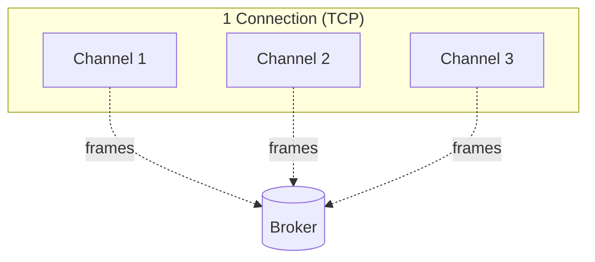

Abrir/fechar uma Connection é caro (handshake TCP + auth); abrir/fechar um Channel é barato, por isso a recomendação é **reutilizar Connections e criar Channels por unidade de trabalho**.

---
layout: two-cols
---

## Anatomia de uma mensagem AMQP

Toda mensagem AMQP é composta por **properties** (metadados) + **body** (o payload em si, tratado como bytes opacos pelo protocolo, pode ser JSON, texto, binário...).

**Properties mais usadas**{style="color: lightgreen;"}

- `content-type`: formato do body (ex: `application/json`)
- `delivery-mode`: `1` (transient, só em memória) ou `2` (persistent, gravado em disco)
- `correlation-id`: liga uma resposta à requisição original (RPC assíncrono)


::right::

- `reply-to`: fila para onde a resposta deve ser publicada
- `priority`: prioridade da mensagem na fila
- `expiration` (TTL): tempo até a mensagem expirar


```js
ch.publish(
  'pedidos',        // exchange
  'pedido.criado',  // routing key
  Buffer.from(JSON.stringify(pedido)),
  {
    contentType: 'application/json',
    deliveryMode: 2,       // persistent
    correlationId: 'req-42',
    replyTo: 'pedidos.rpc.reply',
    expiration: '60000',   // 60s
  }
)
```

O `body` é opaco para o broker, ele roteia com base nas **properties** e na **routing key**, sem nunca inspecionar o conteúdo do payload.

---

## Arquitetura do RabbitMQ

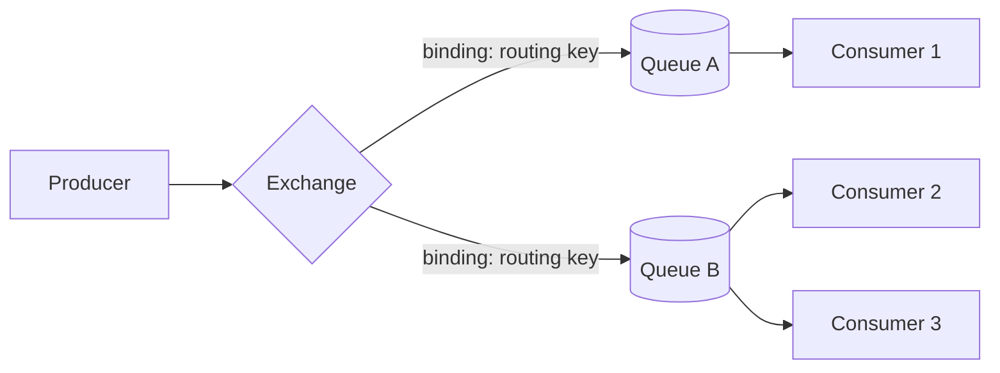

- **Exchange**{style="color: lightgreen;"}: recebe a mensagem do produtor e decide o roteamento.
- **Binding**{style="color: lightgreen;"}: regra que conecta uma Exchange a uma Queue, geralmente baseada em uma **routing key**.
- **Queue**{style="color: lightgreen;"}: onde a mensagem fica armazenada até um consumidor processá-la (via `ack`/`nack`).

O produtor **nunca** conhece a fila diretamente, apenas publica na Exchange com uma routing key.

---
layout: two-cols
---

## Tipos de Exchange

**Direct**{style="color: lightgreen;"}
Roteia para a fila cuja binding key é **exatamente igual** à routing key da mensagem. Ideal para roteamento 1:1 exato (ex: `pedido.criado` → fila de pedidos).

**Fanout**{style="color: lightgreen;"}
Ignora a routing key e envia a mensagem para **todas** as filas ligadas à exchange. Usado em broadcast (ex: notificar todos os serviços interessados em um evento).

**Topic**{style="color: lightgreen;"}
Roteia com padrões (`*` = uma palavra, `#` = zero ou mais). Ex: `pedido.*.criado` casa com `pedido.br.criado`.

**Headers**{style="color: lightgreen;"}
Roteia com base em atributos (headers) da mensagem em vez da routing key.

::right::

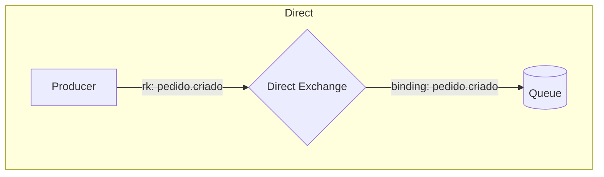

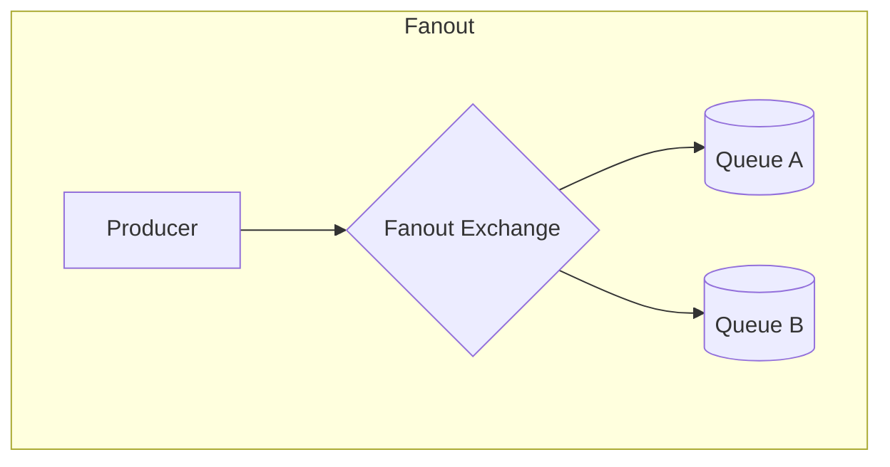

---
layout: two-cols
---

## RabbitMQ na prática

Exemplo com a biblioteca `amqplib` (Node.js): um produtor publica em uma exchange `topic` com routing key `pedido.criado`, e um consumidor se inscreve nessa fila.

**Exemplo de uso**{style="color: lightgreen;"}

Serviço de Pedidos publica `pedido.criado`; serviços de E-mail e Estoque, cada um com sua própria fila, se inscrevem no mesmo evento via bindings diferentes.

::right::

```js
// producer.js
const conn = await amqp.connect(url)
const ch = await conn.createChannel()

await ch.assertExchange('pedidos', 'topic')

ch.publish(
  'pedidos',
  'pedido.criado',
  Buffer.from(JSON.stringify({
    id: 42, total: 199.9
  }))
)
```

```js
// consumer.js (serviço de e-mail)
const q = await ch.assertQueue('email-service')
await ch.bindQueue(q.queue, 'pedidos', 'pedido.*')

ch.consume(q.queue, (msg) => {
  const data = JSON.parse(msg.content)
  enviarEmailConfirmacao(data)
  ch.ack(msg)
})
```

---

## Casos de uso do RabbitMQ

- **Filas de tarefas (task queues)**{style="color: lightgreen;"}: distribuir trabalho pesado (processar imagem, gerar PDF, enviar e-mail) entre múltiplos workers, cada mensagem processada por apenas um worker.
- **RPC assíncrono**{style="color: lightgreen;"}: um serviço publica uma requisição e aguarda a resposta em uma fila de callback, mantendo a semântica de "chamada" sem bloquear a thread.
- **Roteamento complexo de eventos**{style="color: lightgreen;"}: quando a lógica de "quem recebe o quê" é sofisticada (padrões, prioridades, dead-lettering automático por TTL).
- **Sistemas com baixo/médio volume e forte necessidade de garantias por mensagem**{style="color: lightgreen;"}: confirmações (`ack`/`nack`), prioridade de mensagens, TTL por fila.

RabbitMQ **não é a melhor escolha** quando o volume é gigantesco (milhões de eventos/segundo) ou quando é preciso reprocessar o histórico completo de eventos, aí entra o Kafka.

---
layout: image-right
image: /Kafka.png
backgroundSize: 70% auto
---

## Apache Kafka

Kafka não é exatamente um "message broker" tradicional, é uma **plataforma de streaming de eventos distribuída**, criada no LinkedIn (2011), pensada para lidar com **grandes volumes de eventos em tempo real**.

Diferente do RabbitMQ, o Kafka **não remove** a mensagem depois de consumida: ele guarda um **log imutável e ordenado** de eventos por um período configurável (ou para sempre), permitindo que múltiplos consumidores leiam o mesmo histórico de formas independentes.

---

## Arquitetura do Kafka

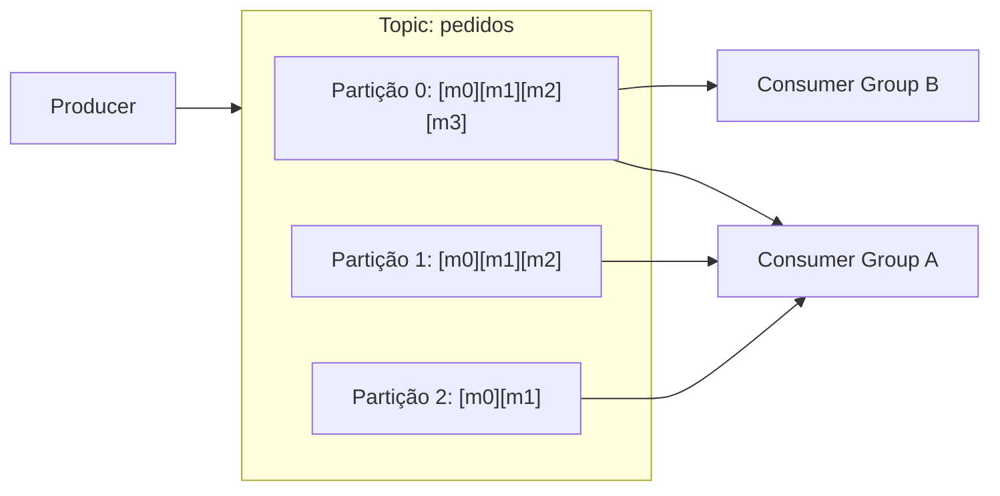

- **Topic**{style="color: lightgreen;"}: canal lógico onde eventos são publicados (ex: `pedidos`).
- **Partição**{style="color: lightgreen;"}: cada topic é dividido em partições, permitindo paralelismo. A ordem só é garantida **dentro** de uma partição.
- **Offset**{style="color: lightgreen;"}: posição sequencial de cada mensagem dentro da partição, é o que o consumidor usa para saber "onde parou".
- **Consumer Group**{style="color: lightgreen;"}: consumidores no mesmo grupo dividem as partições entre si (cada partição só é lida por um consumidor do grupo); grupos diferentes leem o topic de forma independente.

---

## Particionamento, ordem e replay

- Uma mensagem publicada com uma **chave (key)** sempre cai na mesma partição (via hash), isso garante ordem para mensagens da mesma entidade (ex: todos os eventos do pedido `#42` ficam na mesma partição, e portanto em ordem).
- Como o Kafka **não apaga** a mensagem ao consumir, um novo consumidor (ou um serviço reiniciado) pode voltar a um offset anterior e **reprocessar o histórico**, algo impossível em uma fila tradicional que já descartou a mensagem.
- Isso torna o Kafka natural para **Event Sourcing**: o log de eventos é a fonte da verdade, e o estado atual pode ser reconstruído reprocessando o log do início.
- O trade-off é a complexidade operacional: gerenciar partições, replicação entre brokers e rebalanceamento de consumer groups exige mais conhecimento do que uma fila simples.

---
layout: two-cols
---

## Kafka na prática

Exemplo com `kafkajs` (Node.js): um produtor publica eventos de pedido usando o `id` do pedido como chave, garantindo que todos os eventos do mesmo pedido fiquem na mesma partição (e em ordem).

**Exemplo de uso**{style="color: lightgreen;"}

Um serviço de Analytics e um serviço de Estoque consomem o mesmo topic `pedidos`, cada um em seu próprio consumer group, processando os eventos de forma independente e no seu próprio ritmo.

::right::

```js
// producer.js
const producer = kafka.producer()
await producer.connect()

await producer.send({
  topic: 'pedidos',
  messages: [{
    key: String(pedido.id),
    value: JSON.stringify(pedido),
  }],
})
```

```js
// consumer.js (serviço de estoque)
const consumer = kafka.consumer({
  groupId: 'estoque-service'
})
await consumer.connect()
await consumer.subscribe({ topic: 'pedidos' })

await consumer.run({
  eachMessage: async ({ message }) => {
    const pedido = JSON.parse(message.value)
    await baixarEstoque(pedido)
  },
})
```

---

## Casos de uso do Kafka

- **Event-Driven Architecture em larga escala**{style="color: lightgreen;"}: dezenas de microsserviços reagindo aos mesmos eventos de negócio (pedido criado, pagamento aprovado, estoque baixo).
- **Event Sourcing / CQRS**{style="color: lightgreen;"}: usar o log de eventos como fonte da verdade e reconstruir estados/projeções a partir dele.
- **Streaming e analytics em tempo real**{style="color: lightgreen;"}: agregações, dashboards e alertas processando eventos assim que chegam (Kafka Streams, ksqlDB).
- **Agregação de logs e métricas**{style="color: lightgreen;"}: centralizar logs de muitos serviços em um pipeline único antes de enviá-los para armazenamento/observabilidade (ex: para Elasticsearch, Splunk).
- **Integração entre sistemas (CDC)**{style="color: lightgreen;"}: capturar mudanças em um banco de dados (Change Data Capture, via Debezium) e propagá-las como eventos para outros sistemas.

---

## RabbitMQ vs Kafka

| | RabbitMQ (Fila) | Kafka (Partição) |
|---|---|---|
| Modelo | Message broker (fila) | Log distribuído de eventos |
| Mensagem após consumo | Removida da fila | Permanece (até expirar/reter) |
| Throughput | Médio | Muito alto |
| Reprocessar histórico | Não (a menos que reenviado) | Sim (replay por offset) |
| Roteamento | Flexível (exchanges) | Simples (topic + partição) |
| Complexidade operacional | Menor | Maior (cluster, partições, replicação) |
| Melhor para | Task queues, RPC, roteamento fino | Streaming, event sourcing, altíssimo volume |

<!-- Não é "um substitui o outro", muitos sistemas usam **os dois**, cada um resolvendo um problema diferente. -->

---

## MQTT

**MQTT** (Message Queuing Telemetry Transport) é um protocolo de mensageria **publish/subscribe extremamente leve**, criado em 1999 (IBM) e hoje padronizado pela OASIS.

Diferente do AMQP, o MQTT foi desenhado desde o início para **redes instáveis, dispositivos com pouco poder de processamento e banda limitada**, o cenário típico de **IoT** (sensores, câmeras, dispositivos embarcados).

O protocolo é minimalista: um cabeçalho fixo de apenas **2 bytes**, sem o modelo rico de exchanges/bindings do AMQP — só **broker + topics**.

---
layout: two-cols
---

## Arquitetura do MQTT

Todo cliente MQTT se conecta a um **broker** (ex: Mosquitto, EMQX, HiveMQ, AWS IoT Core) e nunca fala diretamente com outro cliente.

- **Publisher**{style="color: lightgreen;"}: publica uma mensagem em um **topic** (ex: `casa/sala/temperatura`).
- **Subscriber**{style="color: lightgreen;"}: se inscreve em um topic (ou padrão de topics) e recebe as mensagens publicadas nele.
- **Broker**{style="color: lightgreen;"}: recebe as publicações e as roteia para todos os subscribers inscritos, não existe fila persistente por consumidor como no RabbitMQ.

Um mesmo cliente pode ser publisher e subscriber ao mesmo tempo, e um dispositivo costuma manter **uma única conexão TCP** aberta com o broker por longos períodos.

::right::

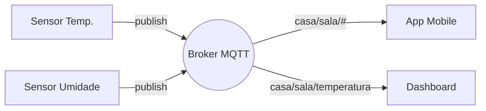

---

## Topics e Wildcards

Topics no MQTT são strings hierárquicas separadas por `/`, sem precisar ser declarados antecipadamente (o broker os cria implicitamente quando alguém publica ou assina).

- `casa/sala/temperatura`
- `casa/cozinha/umidade`
- `fabrica/linha1/sensor42/status`

Dois wildcards permitem assinar múltiplos topics de uma vez:

- **`+`**{style="color: lightgreen;"} — casa **um único nível**. Ex: `casa/+/temperatura` casa com `casa/sala/temperatura` e `casa/cozinha/temperatura`, mas não com `casa/sala/andar1/temperatura`.
- **`#`**{style="color: lightgreen;"} — casa **múltiplos níveis** (só pode ser o último caractere). Ex: `casa/#` casa com tudo abaixo de `casa/`.

---
layout: two-cols
---

## QoS (Quality of Service)

MQTT define três níveis de garantia de entrega, escolhidos **por mensagem**, equilibrando confiabilidade contra overhead de rede:

**QoS 0 — At most once**{style="color: lightgreen;"}
"Fire and forget". A mensagem é enviada uma vez, sem confirmação. Pode se perder. Mais rápido e mais leve.

**QoS 1 — At least once**{style="color: lightgreen;"}
O broker confirma o recebimento (`PUBACK`). A mensagem pode ser reenviada em caso de falha, podendo chegar **duplicada**.

**QoS 2 — Exactly once**{style="color: lightgreen;"}
Handshake de 4 vias (`PUBREC`/`PUBREL`/`PUBCOMP`) garante entrega única, sem duplicar. Mais confiável, porém mais lento e custoso.

::right::

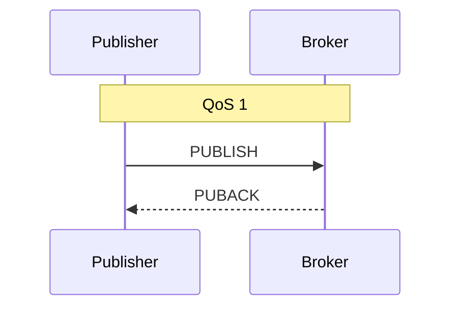
<!-- 
Outros dois recursos importantes do protocolo:

- **Retained messages**{style="color: lightgreen;"}: o broker guarda a última mensagem de um topic e a entrega imediatamente a quem se inscrever depois, útil para "último estado conhecido" (ex: última temperatura lida).
- **Last Will and Testament (LWT)**{style="color: lightgreen;"}: mensagem que o broker publica automaticamente se um cliente cair sem se desconectar corretamente, permite detectar dispositivos offline. -->

---
layout: two-cols
---

## MQTT na prática

Exemplo com a biblioteca `mqtt` (Node.js): um sensor publica leituras de temperatura, e um dashboard se inscreve em todos os sensores da casa usando wildcard.

**Exemplo de uso**{style="color: lightgreen;"}

Sensores de diferentes cômodos publicam em `casa/<comodo>/temperatura`; o dashboard assina `casa/+/temperatura` e recebe leituras de todos eles, sem conhecer cada sensor individualmente.

::right::

```js
// sensor.js (publisher)
const client = mqtt.connect('mqtt://broker.local')

client.on('connect', () => {
  setInterval(() => {
    client.publish(
      'casa/sala/temperatura',
      JSON.stringify({ valor: lerSensor() }),
      { qos: 1, retain: true }
    )
  }, 5000)
})
```

```js
// dashboard.js (subscriber)
const client = mqtt.connect('mqtt://broker.local')

client.on('connect', () => {
  client.subscribe('casa/+/temperatura', { qos: 1 })
})

client.on('message', (topic, payload) => {
  const { valor } = JSON.parse(payload)
  atualizarPainel(topic, valor)
})
```

---

## Casos de uso do MQTT

- **IoT e sensores**{style="color: lightgreen;"}: telemetria de dispositivos com bateria/banda limitada (temperatura, GPS, consumo de energia), onde o overhead de protocolo importa muito.
- **Smart home**{style="color: lightgreen;"}: comunicação entre dispositivos e hubs domésticos (Home Assistant, HomeKit-bridges usam MQTT como backbone comum).
- **Telemetria automotiva e industrial (IIoT)**{style="color: lightgreen;"}: monitoramento de máquinas e frotas em campo, com conectividade instável.
- **Mensageria leve entre serviços mobile**{style="color: lightgreen;"}: notificações e sincronização em apps com conexões intermitentes, graças ao suporte nativo a `keep-alive` e reconexão.

MQTT **não é a melhor escolha** quando é preciso roteamento sofisticado (exchanges do RabbitMQ) ou altíssimo throughput com replay de histórico (Kafka), seu ponto forte é ser **simples e leve o suficiente para rodar em qualquer dispositivo**.

---

## RabbitMQ vs Kafka vs MQTT

| | RabbitMQ | Kafka | MQTT |
|---|---|---|---|
| Modelo | Message broker (fila) | Log distribuído de eventos | Pub/sub leve |
| Protocolo | AMQP | Protocolo próprio (TCP binário) | MQTT (TCP, cabeçalho de 2 bytes) |
| Foco | Roteamento flexível | Altíssimo volume + replay | Baixo overhead, redes instáveis |
| Público típico | Backend/microsserviços | Backend/streaming/analytics | IoT, dispositivos embarcados, mobile |
| Persistência da mensagem | Fila até consumo | Log retido (replay por offset) | Sem persistência (exceto retained) |
| Complexidade  | Média | Alta | Baixa |

<!-- Cada protocolo nasceu para um contexto diferente: AMQP para roteamento corporativo confiável, Kafka para streaming em escala, MQTT para o "último quilômetro" com dispositivos limitados. -->

---

## Outros sistemas de mensageria

Além de RabbitMQ e Kafka, vale conhecer:

<div class="grid grid-cols-2 gap-4">
<div>

- **ActiveMQ**{style="color: lightgreen;"}: broker Java tradicional, também baseado em filas/tópicos JMS, similar em propósito ao RabbitMQ.
- **Amazon SQS / SNS**{style="color: lightgreen;"}: filas (SQS) e pub/sub (SNS) totalmente gerenciados na AWS, sem necessidade de operar infraestrutura própria.

</div>
<div>


</div>
</div>

- **Google Cloud Pub/Sub**{style="color: lightgreen;"}: equivalente gerenciado do Google Cloud, forte em escala global.
- **Redis Streams**{style="color: lightgreen;"}: estrutura de streaming dentro do próprio Redis, útil quando já se usa Redis e não se quer operar outro serviço à parte.

---

## Padrões arquiteturais que dependem de mensageria

- **Event-Driven Architecture (EDA)**{style="color: lightgreen;"}: serviços reagem a eventos publicados por outros, em vez de serem chamados diretamente, reduz acoplamento entre times e serviços.
- **Saga Pattern**{style="color: lightgreen;"}: transações distribuídas são quebradas em uma sequência de eventos/mensagens, cada serviço executando sua parte e publicando o próximo evento (ou um evento de compensação em caso de falha).
- **CQRS (Command Query Responsibility Segregation)**{style="color: lightgreen;"}: eventos de escrita alimentam, via mensageria, modelos de leitura otimizados e separados do modelo de escrita.
- **Transactional Outbox**{style="color: lightgreen;"}: para garantir que uma mudança no banco e a publicação do evento aconteçam de forma consistente, o evento é gravado numa tabela "outbox" na mesma transação do banco, e um processo separado o publica no broker.

---

## Boas práticas com sistemas de mensageria

1. **Idempotência**{style="color: lightgreen;"}: sempre assuma que uma mensagem pode chegar duplicada e desenhe o consumidor para lidar com isso (ex: checar um ID de mensagem já processado).
2. **Dead Letter Queue (DLQ)**{style="color: lightgreen;"}: mensagens que falham repetidamente devem ir para uma fila separada para investigação, em vez de travar o processamento das demais.
3. **Schema e versionamento**{style="color: lightgreen;"}: defina um contrato claro para o payload (ex: JSON Schema, Avro) e pense em compatibilidade retroativa antes de mudar o formato de um evento.
4. **Observabilidade**{style="color: lightgreen;"}: propague um `trace id`/`correlation id` nas mensagens para conseguir rastrear um fluxo através de múltiplos serviços.
5. **Monitoramento do broker**{style="color: lightgreen;"}: acompanhe profundidade de fila (RabbitMQ) ou consumer lag (Kafka), filas crescendo indicam que os consumidores não acompanham o ritmo dos produtores.

---

## Resumo

- Mensageria permite comunicação **assíncrona e desacoplada** entre microsserviços, trocando espera bloqueante por eventos e filas.
- **RabbitMQ**: broker AMQP flexível, ótimo para filas de tarefas e roteamento fino de mensagens.
- **Kafka**: plataforma de streaming baseada em log distribuído, ótima para altíssimo volume, replay de eventos e event sourcing.
- **MQTT**: protocolo pub/sub leve, ótimo para IoT e dispositivos com pouca banda/processamento e redes instáveis.
- A escolha entre eles (ou entre outras opções gerenciadas como SQS/SNS/Pub-Sub) depende do volume, da necessidade de reprocessamento, do público-alvo (backend vs. dispositivos) e da complexidade de roteamento exigida.
- Independente da ferramenta, os desafios se repetem: **idempotência, ordem, duplicidade e observabilidade** precisam ser tratados no desenho do sistema, não só na configuração do broker.

---

https://www.rabbitmq.com/tutorials

https://kafka.apache.org/documentation/

https://mqtt.org/

https://microservices.io/patterns/data/saga.html

https://microservices.io/patterns/data/transactional-outbox.html
