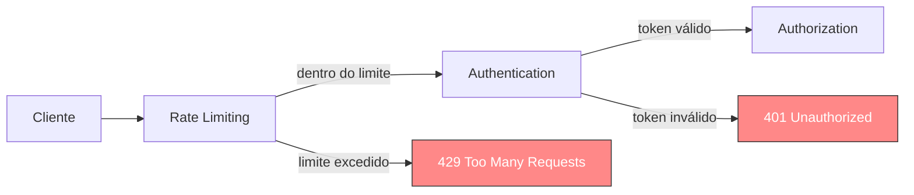
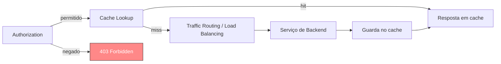

---

<Toc columns="2" maxDepth="3"></Toc>

---

## Comunicação entre microsserviços

Dentro da Arquitetura Web baseada em microserviços um dos pontos críticos é a comunicação entre eles.
Em uma arquitetura de microsserviços, cada serviço é projetado para ser independente, mas ainda precisam 
se comunicar para cumprir os requisitos da aplicação. Escolher uma estratégia de comunicação eficaz 
entre microsserviços é crucial, pois impacta o desempenho, a confiabilidade e a manutenibilidade do sistema.

A comunicação pode ser dividida em dois padrões principais:

- Comunicação Síncrona{style="color: lightgreen;"}
  
  Utilizado em APIS REST principalmente e outros protocolos como GRPC e Graphql, dependem de um `request` e um `response`.

- Comunicação Assíncrona{style="color: lightgreen;"}

  Utilizado quando o processamento de uma requisição pode ser ou precisa ser assíncrona. Para trabalhar com esse 
  tipo de comunicação são utilizados sistemas de mensageria, streaming de eventos ou outras técnicas.
  

---

### Desafios na Comunicação entre Microsserviços

A comunicação entre microsserviços apresenta alguns desafios devido à sua natureza distribuída. Esses desafios podem afetar o desempenho, a consistência e a resiliência do sistema como um todo. Abaixo, estão alguns dos principais desafios na comunicação entre microsserviços:

1. Latência e Desempenho{style="color: lightgreen;"}
Em uma arquitetura distribuída, a comunicação entre microsserviços pode introduzir latência, especialmente em comunicações síncronas (como HTTP/REST). Cada chamada entre serviços exige tempo de rede, processamento e pode acumular latência, especialmente em sistemas onde há muitas chamadas encadeadas.
Minimizar a latência exige otimizar a comunicação e, quando possível, utilizar métodos assíncronos para reduzir o tempo de espera entre serviços.
2. Consistência dos Dados{style="color: lightgreen;"}
Garantir consistência entre microsserviços é difícil, especialmente porque cada serviço gerencia seu próprio banco de dados. Diferentes serviços podem ter visões diferentes dos dados em um determinado momento.
Técnicas como o padrão Saga ou eventual consistency (consistência eventual) ajudam a mitigar esses problemas, mas exigem um planejamento cuidadoso para garantir que o sistema se comporte conforme esperado.

---

3. Gestão de Erros e Tolerância a Falhas{style="color: lightgreen;"}
Falhas de comunicação são comuns, se um serviço dependente falha ou fica temporariamente indisponível, isso pode afetar outros serviços.
Padrões como Circuit Breaker (Disjuntor), Retry (Re-tentativa) e Fallback (Retorno Alternativo) ajudam a lidar com falhas de maneira controlada. O Circuit Breaker, por exemplo, interrompe temporariamente chamadas para um serviço problemático, enquanto o Retry tenta repetir chamadas com falhas antes de desistir.
4. Gerenciamento de Segurança{style="color: lightgreen;"}
Cada microsserviço requer autenticação e autorização para garantir que dados e operações sejam acessados apenas por serviços autorizados. Ferramentas como OAuth, JSON Web Tokens (JWT), e autenticação de API ajudam na proteção, mas adicionar esses controles em cada serviço aumenta a complexidade.
5. Monitoramento e Observabilidade{style="color: lightgreen;"}
Em uma arquitetura de microsserviços, rastrear o caminho de uma requisição que passa por vários serviços é desafiador. É necessário monitorar e observar a saúde dos serviços, identificando onde ocorrem problemas e gargalos.
Ferramentas de rastreamento distribuído, como Graphana, Datadog, NewRelic e Prometheus, ajudam a monitorar o fluxo entre serviços e a identificar problemas de desempenho e falhas de comunicação.

<!--
6. Gerenciamento de Escalabilidade
7. Orquestração vs. Coreografia
8. Dependências de Tempo de Execução
9. Problemas de Versão e Compatibilidade
10. Problemas de Dependência e Acoplamento
-->

---
layout: image-right
image: /alexander-graham-bell.avif
---

## Why

Em 1876 Alexander Graham Bell fez a primeira chamada telefonica e registrou a patente do telefone. E a forma inicial
era através de uma conexão direta entre cada ponto de telefone para cada outro ponto.

Ou seja para cada ligação entre uma casa e outro precisava de um cabo entre elas, um ano depois em 1878, a confusão 
entre cabos passando por cima de postes, árvores e casas foi uma bagunça.

Para resolver esse problema Grambell utilizou de uma companhia telefonica a primeira desse tipo, onde cada casa era 
conectada a telefonica que fazia o redicionamento da chamada para o local correto.

<!--
Alexander Graham Bell was a Scottish-born Canadian-American inventor, scientist, 
and engineer who is credited with patenting the first practical telephone. 
He also co-founded the American Telephone and Telegraph Company in 1885.
-->

---
layout: two-cols
---

## API Gateway

Um Gateway da API é um componente de rede que funciona entre o cliente e os serviços de backend.
Em vez de se comunicar diretamente com seu backend, os clientes enviam suas chamadas apenas para o gateway da API.

Lá, as solicitações recebidas podem ser processadas diretamente ou encaminhadas para os serviços subjacentes.

Um API pode implementar os serviços de Reverse Proxy e Load Balance, além de outras funcionalidades.

Dentre as alternativas recomendo o Kong e o [express gateway](https://www.express-gateway.io/)

::right::

<div class="relative h-full">


</div>

<!--
 Autenticação
 Controle de acesso
 Roteamento
 Monetização
 Rate Limit
 Load balance
 Caching
 Monitoring, loging
 Monetizing
 -->

---
layout: image
backgroundSize: contain
image: /apigateway.png
---

---

## O problema por trás do Traffic Routing

Em uma arquitetura de microsserviços, cada serviço roda em um host e porta diferentes, e pode ter várias instâncias escaláveis dinamicamente. Sem uma camada central de roteamento:

- O cliente precisaria conhecer o endereço de **cada** serviço individualmente.
- Qualquer mudança de infraestrutura (novo host, nova instância) quebraria os clientes que já conhecem o endereço antigo.
- Expor todos os serviços diretamente na internet aumenta a superfície de ataque.
- Migrar clientes para uma nova versão de um serviço exigiria atualizar cada consumidor manualmente.

O API Gateway resolve isso concentrando o roteamento em um único ponto de entrada, escondendo a topologia interna do sistema.

---
layout: two-cols
---

## Traffic Routing

Componente central do gateway, decide para qual serviço de backend encaminhar cada requisição, com base em caminho (path), host, versão da API ou cabeçalhos.

**Exemplo de uso**{style="color: lightgreen;"}

Encaminhar `/users/*` para o serviço de usuários e `/orders/*` para o serviço de pedidos, ou manter clientes na `v1` de uma API enquanto novos clientes já usam a `v2`.

::right::

```js
const routes = [
  { 
    prefix: '/users', 
    target: 'http://users-service:3001'
  },
  { 
    prefix: '/orders', 
    target: 'http://orders-service:3002'
  },
  { 
    prefix: '/payments', 
    target: 'http://payments-service:3003' 
  },
]

function resolveTarget(path) {
  const route = routes.find(
    r => path.startsWith(r.prefix)
  )
  return route ? route.target : null
}

resolveTarget('/orders/42') // http://orders-service:3002
```

---

## O problema por trás do Rate Limiting

Sem controle de quantas requisições um cliente pode fazer em um determinado período:

- Um único cliente (ou bot) pode monopolizar a capacidade do sistema, prejudicando todos os outros usuários.
- Picos de tráfego inesperados podem derrubar serviços que não foram dimensionados para aquele volume.
- Ataques de força bruta, como tentativas repetidas de senha, ficam mais fáceis de executar sem custo algum.
- Custos de infraestrutura podem disparar ao escalar automaticamente para atender tráfego abusivo.

Rate Limiting garante um uso justo dos recursos e protege a disponibilidade do sistema para os clientes legítimos.

---
layout: two-cols
---

## Rate Limiting

Protege os serviços de backend limitando quantas requisições um cliente pode fazer em uma janela de tempo, evitando abuso, picos de tráfego e ataques de força bruta.

**Exemplo de uso**{style="color: lightgreen;"}

Limitar uma API pública a 100 requisições por minuto por chave de API, retornando `429 Too Many Requests` quando o limite é excedido.

::right::

```js
const limits = new Map()
const WINDOW_MS = 60_000
const MAX_REQUESTS = 100

function isAllowed(clientId) {
  const now = Date.now()
  const entry = limits.get(clientId)
    ?? { count: 0, start: now }

  if (now - entry.start > WINDOW_MS) {
    entry.count = 0
    entry.start = now
  }

  entry.count++
  limits.set(clientId, entry)
  return entry.count <= MAX_REQUESTS
}

isAllowed('api-key-123') // true, até estourar o limite
```

---
layout: two-cols
---

## Rate Limiting no Kong

Na prática, ferramentas como o Kong implementam Rate Limiting como um **plugin declarativo**, sem precisar escrever ou manter essa lógica manualmente em cada serviço.

O próprio Kong adiciona os headers `X-RateLimit-*` nas respostas, informando ao cliente quantas requisições ainda restam.

::right::

```yaml
plugins:
  - name: rate-limiting
    route: orders-route
    config:
      minute: 100
      policy: local
      fault_tolerant: true
      hide_client_headers: false
```

---

## Authentication

Sem verificar a identidade de quem chama a API:

- Qualquer pessoa poderia acessar dados e operações sensíveis sem nenhuma restrição.
- Cada microsserviço teria que implementar e manter sua própria lógica de login/token, duplicando código e risco de falhas de segurança.
- Não seria possível saber quem realizou uma determinada requisição, dificultando auditoria e rastreabilidade de incidentes.

Centralizar a autenticação no gateway garante que só requisições identificadas cheguem aos serviços internos.

---
layout: two-cols
---

### Authentication

Verifica **quem** está fazendo a requisição, antes dela chegar aos serviços de backend. O gateway centraliza essa validação (API keys, JWT, OAuth2) para que os serviços não precisem reimplementá-la individualmente.

**Exemplo de uso**{style="color: lightgreen;"}

Validar o token JWT enviado no header `Authorization` de toda requisição que chega no gateway, rejeitando com `401 Unauthorized` quem não apresentar um token válido.

::right::

```js
const jwt = require('jsonwebtoken')

function authenticate(req, res, next) {
  const token = req.headers.authorization
    ?.replace('Bearer ', '')

  try {
    req.user = jwt.verify(token, process.env.JWT_SECRET)
    next()
  } catch {
    res.status(401).json({ error: 'Token inválido' })
  }
}
```

---

## Authorization

Saber quem é o cliente não é suficiente:

- Um usuário autenticado, mas sem privilégios adequados, poderia acessar rotas administrativas ou dados de outros usuários.
- Sem controle de permissões, qualquer erro de lógica em um serviço pode expor operações críticas do sistema.
- Auditorias de compliance, como LGPD e PCI, exigem provar que o acesso a dados sensíveis é restrito por papel ou escopo.

Authorization garante que cada cliente autenticado só realize as ações para as quais tem permissão.

---
layout: two-cols
---

### Authorization

Depois de saber quem é o cliente, o gateway decide **o que** ele pode fazer, verificando papéis (roles) ou escopos (scopes) do token antes de encaminhar a requisição ao serviço.

**Exemplo de uso**{style="color: lightgreen;"}

Permitir que apenas usuários com o papel `admin` acessem rotas de administração (`/admin/*`), bloqueando os demais com `403 Forbidden`.

::right::

```js
function authorize(requiredRole) {
  return (req, res, next) => {
    if (req.user?.role !== requiredRole) {
      return res.status(403)
        .json({ error: 'Acesso negado' })
    }
    next()
  }
}

app.use('/admin', authenticate, authorize('admin'))
```

---

## Caching

Sem armazenar respostas já calculadas:

- Requisições idênticas e repetidas forçam o backend a refazer o mesmo trabalho (consultas ao banco, cálculos) várias vezes.
- A latência percebida pelo cliente é sempre a pior possível, mesmo quando a resposta não mudou desde a última chamada.
- Sob alta demanda, o mesmo dado pode ser recalculado centenas de vezes por segundo, desperdiçando capacidade do sistema.
- Sem um local centralizado de cache, cada serviço acaba implementando sua própria estratégia, de forma inconsistente.

Caching no gateway evita esse retrabalho, servindo respostas já conhecidas diretamente, sem sequer acionar o backend.

---
layout: two-cols
---

### Caching

O gateway pode guardar temporariamente a resposta de requisições idempotentes (normalmente `GET`) e devolvê-la diretamente em chamadas futuras idênticas, sem acionar o serviço de backend.

**Exemplo de uso**{style="color: lightgreen;"}

Cachear por 60 segundos a resposta do catálogo de produtos, que muda pouco, reduzindo drasticamente a carga no banco de dados durante picos de tráfego.

::right::

```js
const cache = new Map()
const TTL_MS = 60_000

function getCached(key) {
  const entry = cache.get(key)
  if (!entry) return null

  if (Date.now() - entry.time > TTL_MS) {
    cache.delete(key)
    return null
  }
  return entry.value
}

function setCached(key, value) {
  cache.set(key, { value, time: Date.now() })
}

// GET /products
getCached('/products')
  ?? fetchFromBackendAndCache('/products')
```

---

## API Composition

Um app mobile ou uma SPA frequentemente precisa de dados de **vários** serviços para montar uma única tela. Sem um ponto de agregação:

- O cliente precisa fazer várias chamadas HTTP separadas, uma para cada serviço, aumentando a latência total percebida.
- O cliente passa a conhecer a topologia interna dos serviços, ficando acoplado a detalhes que deveriam ser internos.
- Em redes móveis (mais lentas e instáveis), cada round-trip extra piora significativamente a experiência do usuário.
- Qualquer mudança na forma como os serviços se dividem internamente quebra todos os clientes que fazem essas chamadas diretamente.

API Composition resolve isso combinando várias respostas de backend em uma única resposta, adaptada às necessidades do cliente.

---
layout: two-cols
---

### API Composition (BFF)

O gateway (ou uma camada de Backend for Frontend) chama múltiplos serviços internamente e agrega os resultados antes de devolver uma única resposta ao cliente.

**Exemplo de uso**{style="color: lightgreen;"}

Uma tela de "detalhes do pedido" que precisa combinar dados do serviço de pedidos, do serviço de usuários e do serviço de pagamentos em uma única chamada do cliente.

::right::

```js
async function getOrderDetails(orderId) {
  const order = await fetch(
    `http://orders-service:3002/orders/${orderId}`
  ).then(r => r.json())

  const [user, payment] = await Promise.all([
    fetch(
      `http://users-service:3001/users/${order.userId}`
    )
      .then(r => r.json()),
    fetch(
      `http://payments-service:3003/payments/${orderId}`
    )
      .then(r => r.json()),
  ])

  return { ...order, user, payment }
}
```

---

## O pipeline de um API Gateway (1/2)

Da entrada da requisição até a decisão de autorização:



Rate Limiting barato roda primeiro para descartar abuso cedo; só quem passa por autenticação chega até a decisão de autorização.

---

## O pipeline de um API Gateway (2/2)

Da decisão de autorização até a resposta final ao cliente:



Só quem é autorizado chega ao cache e ao roteamento; um hit de cache evita completamente a chamada ao serviço de backend.

---

## Riscos e trade-offs de um API Gateway

Centralizar tanta responsabilidade em um único componente traz custos que também precisam entrar na decisão:

- **Ponto único de falha**{style="color: lightgreen;"}: se o gateway cai, todos os serviços atrás dele ficam inacessíveis. Exige múltiplas instâncias e alta disponibilidade.
- **Latência extra**{style="color: lightgreen;"}: toda requisição ganha um "hop" a mais na rede antes de chegar ao backend real.
- **Complexidade operacional**{style="color: lightgreen;"}: mais um componente crítico para monitorar, escalar, atualizar e proteger — e um alvo atrativo para ataques.
- **Acoplamento de configuração**{style="color: lightgreen;"}: regras de roteamento, rate limit e autenticação de todos os serviços passam a viver em um lugar só, exigindo processo e disciplina para não virar gargalo de mudanças.

Um API Gateway resolve problemas reais, mas não é gratuito: ele precisa ser tratado como parte crítica da infraestrutura, não como um detalhe de implementação.

---
layout: two-cols
---

## Load Balancer

O balanceamento de carga é a técnica usada para distribuir com eficiência solicitações de rede recebidas em um grupo de servidores e microsserviços na web.
Ele funciona como um "gerenciador", para dividir a carga entre diversos serviços garantindo nenhum fique sobrecarregado ou ocioso.

Diversos softwares existem para fazer o trabalho de Load Balancer dentre eles podemos destacar o Apache e o NGINX.

Para isso algum algoritmo de loadbalance é aplicado, dentre eles podemos destacar...

::right::

<div class="relative h-full">


</div>

<!-- Beneficios do load balance
Reduced downtime
Scalable
Efficiency
Redundancy
Flexibility
-->

---
layout: two-cols
---

## Round Robin

Distribui as requisições dos clientes sequencialmente entre todos os servidores disponíveis, um após o outro, retornando ao início da lista ao chegar no final.

**Exemplo de uso**{style="color: lightgreen;"}

Três instâncias idênticas de uma API stateless, sem sessão nem cache local, onde qualquer servidor pode atender qualquer requisição igualmente bem.

::right::

```js
const servers = ['srv1', 'srv2', 'srv3']
let current = 0

function nextServer() {
  const server = servers[current]
  current = (current + 1) % servers.length
  return server
}

nextServer() // srv1
nextServer() // srv2
nextServer() // srv3
nextServer() // srv1
```

---
layout: two-cols
---

## Sticky Round Robin

Uma melhoria do Round Robin: a primeira requisição de um cliente é distribuída normalmente, mas as requisições seguintes desse mesmo cliente são sempre enviadas ao mesmo servidor.

**Exemplo de uso**{style="color: lightgreen;"}

Aplicações que guardam estado de sessão em memória local (ex.: carrinho de compras), onde o cliente precisa continuar sendo atendido pelo mesmo servidor.

::right::

```js
const servers = ['srv1', 'srv2', 'srv3']
const sessions = new Map()
let current = 0

function getServer(clientId) {
  if (!sessions.has(clientId)) {
    sessions.set(clientId, servers[current])
    current = (current + 1) % servers.length
  }
  return sessions.get(clientId)
}

getServer('user-42') // srv1
getServer('user-42') // srv1 (mesmo servidor)
```

---
layout: two-cols
---

## Least Connections

A nova requisição é enviada ao servidor que possui o menor número de conexões abertas no momento, considerando a capacidade relativa de cada um.

**Exemplo de uso**{style="color: lightgreen;"}

Servidores com capacidade parecida, mas atendendo requisições de duração muito variável, como upload de arquivos ou streaming de vídeo.

::right::

```js
const servers = [
  { name: 'srv1', connections: 4 },
  { name: 'srv2', connections: 1 },
  { name: 'srv3', connections: 7 },
]

function leastConnections() {
  return servers.reduce((min, s) =>
    s.connections < min.connections ? s : min
  )
}

leastConnections().name // srv2
```

---
layout: two-cols
---

## Least Time

Combina o tempo médio de resposta de cada servidor com o número de conexões ativas em uma fórmula, e envia a requisição ao servidor com o melhor resultado.

**Exemplo de uso**{style="color: lightgreen;"}

APIs sensíveis à latência, como serviços de pagamento, onde não basta ter poucas conexões: o servidor também precisa responder rápido.

::right::

```js
const servers = [
  { name: 'srv1', connections: 3, avgResponseMs: 120 },
  { name: 'srv2', connections: 2, avgResponseMs: 300 },
  { name: 'srv3', connections: 5, avgResponseMs: 90 },
]

function leastTime() {
  return servers.reduce((best, s) => {
    const score = s.connections * s.avgResponseMs
    const bestScore =
       best.connections * best.avgResponseMs
    return score < bestScore ? s : best
  })
}

leastTime().name // srv1
```

---
layout: two-cols
---

## Hash

Distribui as requisições com base em uma chave definida pelo desenvolvedor (ex.: id do usuário ou URL). A mesma chave sempre é roteada para o mesmo servidor.

**Exemplo de uso**{style="color: lightgreen;"}

Cache distribuído por tenant/usuário, garantindo que requisições da mesma chave sempre cheguem ao nó que já tem os dados em cache.

::right::

```js
const servers = ['srv1', 'srv2', 'srv3']

function hash(key) {
  let h = 0
  for (const char of key) h = (h * 31 
    + char.charCodeAt(0)) >>> 0
  return h
}

function getServer(key) {
  return servers[hash(key) % servers.length]
}

getServer('tenant-acme')   // sempre o mesmo servidor
getServer('tenant-globex') // sempre o mesmo servidor
```

---
layout: two-cols
---

## IP Hash

Um caso especial do Hash: o endereço IP do cliente é usado como chave. Isso garante persistência de sessão sem precisar de sticky sessions explícitas.

**Exemplo de uso**{style="color: lightgreen;"}

Aplicações legadas que dependem do cliente sempre falar com o mesmo servidor, mas sem suporte a cookies de sessão ou sticky sessions do load balancer.

::right::

```js
const servers = ['srv1', 'srv2', 'srv3']

function hashIp(ip) {
  return ip.split('.').reduce((acc, n)
    => acc + Number(n), 0)
}

function getServer(clientIp) {
  return servers[hashIp(clientIp) % servers.length]
}

getServer('192.168.0.10') // sempre o mesmo servidor
```

---
layout: two-cols
---

## Random Two Choices

Escolhe dois servidores aleatoriamente e, entre esses dois, aplica o algoritmo de menor número de conexões, evitando o custo de avaliar todos os servidores.

**Exemplo de uso**{style="color: lightgreen;"}

Clusters muito grandes, com dezenas ou centenas de servidores, onde calcular least connections sobre todos eles a cada requisição seria caro.

::right::

```js
const servers = [
  { name: 'srv1', connections: 4 },
  { name: 'srv2', connections: 1 },
  { name: 'srv3', connections: 7 },
  { name: 'srv4', connections: 2 },
]

function randomTwoChoices() {
  const [a, b] = [...servers]
    .sort(() => Math.random() - 0.5)
    .slice(0, 2)
  return a.connections < b.connections ? a : b
}

randomTwoChoices().name
```

---
layout: two-cols-header
---


::center::

## Forward Proxy x Reverse Proxy

Proxies são elementos essenciais em redes de computadores e desempenham papéis importantes em segurança, desempenho e controle de acesso.

::left::

#### Forward proxy

Um forward proxy atua como um intermediário entre os clientes e a internet, direcionando as requisições dos clientes para os servidores externos. 
É usado principalmente para controle de acesso à internet, cache de conteúdo, segurança e anonimização.

- Proteger clientes
- Controlar acessos
- Bloquear conteúdo
- Cache


::right::

#### Reverse proxy

O reverse proxy atua como um intermediário entre os clientes e os servidores. 
Ele recebe as requisições dos clientes e as encaminha para o servidor correto na rede interna.
Ele é muito utilizado para balanceamento de carga, roteamento de requisições, cache de conteúdo e segurança.

- Proteger servidores
- Aumentar o desempenho
- Balanceamento de carga
- Cache
- Criptografar e descriptografar as comunicações SSL


<!-- 
Mais utilizado quando se tem um cluster de serviços em uma intranet
Utilizado para fazer a comunicação entre uma rede fechada e a internet

Nginx, apache, haproxy
-->

---
layout: image
backgroundSize: contain
image: /reverseproxy.webp
---


---

https://medium.com/@dinubhagya97/load-balncing-f9e5a120a402

https://www.umlboard.com/design-patterns/api-gateway

https://ngrok.com/blog-post/reverse-proxy-vs-api-gateway

https://www.youtube.com/watch?v=0frGo7vJV30&t=2s
