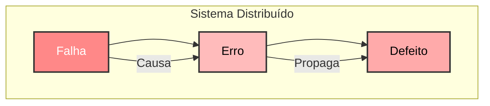
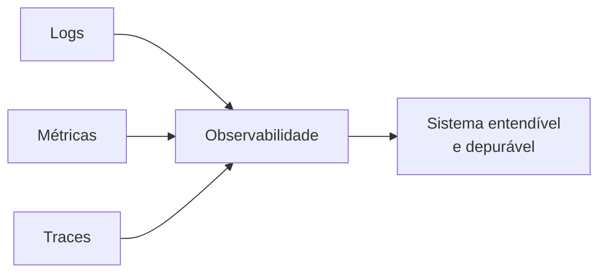
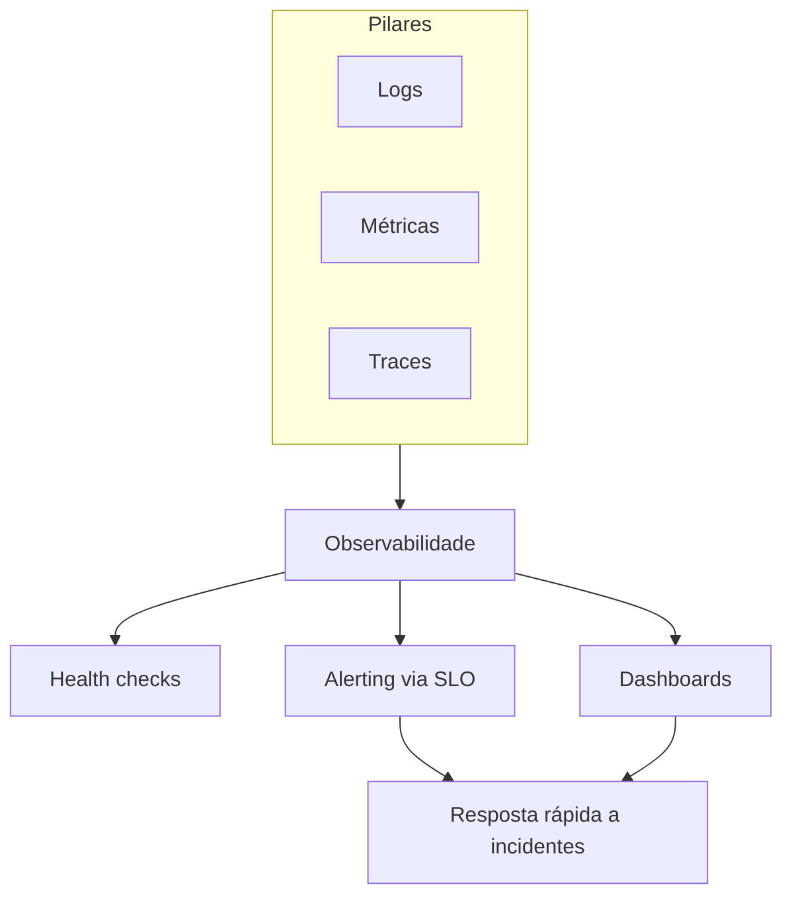

---

<Toc columns="2" maxDepth="3"></Toc>

---

## Por que monitorar microsserviços?

Em um monolito, uma falha costuma acontecer em um único processo e é fácil de localizar. Em uma arquitetura de microsserviços, uma única requisição do usuário pode atravessar dezenas de serviços, filas e bancos de dados diferentes.

Sem visibilidade sobre esse fluxo, perguntas simples ficam difíceis de responder:

- Qual serviço está lento agora?{style="color: lightgreen;"}
- Por que essa requisição falhou?{style="color: lightgreen;"}
- O sistema está saudável o suficiente para suportar o pico de tráfego?{style="color: lightgreen;"}

Monitoramento é o processo contínuo de coleta, análise e visualização de métricas para garantir que sistemas estejam funcionando corretamente. 


---

### Monitoramento x Observabilidade

Os termos são usados de forma intercambiável, mas têm uma diferença importante:

1. Monitoramento{style="color: lightgreen;"}
   É reativo: define métricas e limiares conhecidos previamente ("alerte se a CPU passar de 80%"). Responde perguntas que você já sabia que precisava fazer.

2. Observabilidade{style="color: lightgreen;"}
   É investigativa: fornece dados ricos o suficiente (logs, métricas e traces correlacionados) para responder perguntas novas, sobre problemas que ninguém previu, sem precisar fazer deploy de código novo para investigar.

Em microsserviços, observabilidade é essencial porque a quantidade de combinações possíveis de falha (rede, latência, versão, região, dependência) cresce muito mais rápido do que em um monolito.

---

### Defeito, erro e falha

Em sistemas distribuídos, compostos por múltiplos computadores interconectados, a ocorrência de falhas não é uma possibilidade remota, mas sim uma realidade inevitável. Diferentemente de sistemas centralizados, onde o erro geralmente se limita a um único ponto, em sistemas distribuídos uma falha pode se propagar por toda a rede, comprometendo a confiabilidade, a disponibilidade e a consistência do sistema como um todo.

- Define como as falhas se manifestam
- Proporciona entendimento dos efeitos e consequências
- Conceitos-chave: Falha - Erro - Defeito
  - **Falha** (*fault*): trata de inconsistências físicas ou lógicas, que podem causar um erro.
  - **Erro** (*error*): é um estado inconsistente do sistema, que pode levar a um defeito.
  - **Defeito** (*failure*): é um comportamento incorreto de um sistema frente a sua especificação

A relação entre esses conceitos pode ser vista da seguinte maneira: uma Falha pode causar um Erro, e um erro pode levar a uma Defeito caso não seja tratado adequadamente.

---
layout: two-cols
---

- Falha (Fault): causa inicial – pode ser de hardware, software, rede ou humana.

- Erro (Error): estado incorreto do sistema resultante da falha.

- Defeito (Failure): manifestação externa percebida pelo usuário, quando o sistema não entrega o serviço correto.

::right::



---

## Os três pilares da observabilidade

<br>



- **Logs** — o que aconteceu, em detalhe, em um ponto específico do tempo
- **Métricas** — números agregados ao longo do tempo (contadores, gauges, histogramas)
- **Traces** — o caminho completo de uma requisição através de vários serviços

Nenhum pilar sozinho é suficiente. Métricas dizem *que* algo está errado, traces dizem *onde*, logs dizem *por quê*.

---

### Logs

Logs são registros de eventos discretos. Em microsserviços, cada serviço gera os seus próprios logs, geralmente em containers efêmeros, se o log fica só no disco do container, ele morre com o container.

Boas práticas:

- **Logging estruturado**{style="color: lightgreen;"}: emitir JSON em vez de texto livre, facilitando busca e agregação
- **Centralização**{style="color: lightgreen;"}: enviar todos os logs para um sistema central (não depender de acessar cada máquina/container)
- **Correlation ID**{style="color: lightgreen;"}: incluir um identificador único da requisição em todos os logs relacionados a ela, mesmo entre serviços diferentes

```json
{
  "timestamp": "2026-09-08T14:32:10Z",
  "level": "error",
  "service": "orders-api",
  "trace_id": "4bf92f3577b34da6a3ce929d0e0e4736",
  "message": "failed to charge payment",
  "order_id": "ord_8231",
  "http_status": 502
}
```

---

#### Ferramentas para logs

Stack mais comuns para centralizar e consultar logs em uma arquitetura distribuída:

- **ELK / Elastic Stack**{style="color: lightgreen;"} — Elasticsearch (armazenamento e busca), Logstash/Beats (coleta), Kibana (visualização)
- **Grafana Loki**{style="color: lightgreen;"} — indexa apenas metadados (labels), armazenamento mais barato, integração nativa com Grafana
- **Fluentd / Fluent Bit**{style="color: lightgreen;"} — coletores leves, muito usados como agentes em cada pod/container no Kubernetes

O padrão comum: cada serviço escreve logs em `stdout`, um agente coletor lê e envia para o sistema central, o serviço não precisa saber para onde os logs vão.

---

#### Níveis de log

Nem todo evento tem a mesma importância. Classificar cada linha de log em um **nível de severidade** é o que permite filtrar ruído e priorizar o que precisa de atenção imediata.

| Nível | Quando usar |
|---|---|
| **DEBUG**{style="color: #9aa0a6;"} | Detalhe técnico útil só durante desenvolvimento/depuração |
| **INFO**{style="color: #4fc3f7;"} | Eventos normais do fluxo de negócio (pedido criado, usuário logado) |
| **WARN**{style="color: #ffca28;"} | Algo inesperado, mas o sistema se recuperou sozinho (retry, fallback usado) |
| **ERROR**{style="color: #ef5350;"} | Uma operação falhou e precisa de investigação, mas o serviço continua no ar |
| **FATAL / CRITICAL**{style="color: #ff1744;"} | O serviço não consegue mais operar e vai encerrar/reiniciar |

Em produção, é comum manter `INFO` para cima ligado por padrão e habilitar `DEBUG` temporariamente ao investigar um incidente, logar tudo em `DEBUG` o tempo todo, em muitos serviços simultâneos, gera custo de armazenamento e ruído que atrapalha a busca.

---

#### Cores nos logs

A maioria dos coletores e visualizadores (terminal, Kibana, Grafana Loki, Datadog) colore cada linha conforme o nível. Isso é uma forma de **acelerar a leitura visual** em meio a milhares de linhas.

```bash
2026-09-08 14:30:01 INFO  orders-api  pedido ord_8231 criado
2026-09-08 14:30:04 WARN  orders-api  retry 1/3 ao chamar payments-api
2026-09-08 14:30:07 ERROR orders-api  falha ao cobrar pagamento ord_8231
2026-09-08 14:30:07 FATAL orders-api  conexão com banco perdida, encerrando
```
Convenção quase universal entre ferramentas (terminal ANSI, dashboards, IDEs):

- **Cinza/branco apagado**{style="color: #9aa0a6;"} — DEBUG, baixa prioridade
- **Azul/ciano**{style="color: #4fc3f7;"} — INFO, neutro
- **Amarelo**{style="color: #ffca28;"} — WARN, atenção
- **Vermelho**{style="color: #ef5350;"} — ERROR/FATAL, urgente

---

#### Psicologia das cores aplicada a logs

As cores escolhidas não são arbitrárias, seguem associações que o cérebro humano já processa de forma quase automática, muito antes de ler a palavra:

- **Vermelho**{style="color: #ef5350;"} — associado a perigo, alerta, "pare agora". Em cultura ocidental é a cor mais forte de urgência (sinais de trânsito, botões de emergência). Usar para ERROR/FATAL aproveita essa resposta imediata de atenção.
- **Amarelo/laranja**{style="color: #ffca28;"} — associado a cautela, "atenção, mas sem pânico" (placas de "cuidado"). Ideal para WARN: algo saiu do esperado, mas ainda não é uma crise.
- **Azul/verde**{style="color: #4fc3f7;"} — associado a calma, normalidade, segurança. Bom para INFO/sucesso: reforça que o fluxo está dentro do esperado.
- **Cinza**{style="color: #9aa0a6;"} — neutro, "fundo", baixa saliência visual, apropriado para DEBUG, que deve ser visualmente discreto.

Esse mapeamento cria uma **hierarquia de saliência**: ao olhar rapidamente para uma tela cheia de logs, o olho é puxado primeiro para o vermelho, depois o amarelo, e só depois para o resto, replicando a própria ordem de prioridade de triagem de um incidente.

---

Cuidados importantes:

- **Nunca depender só da cor**{style="color: lightgreen;"}: cerca de 8% dos homens têm alguma forma de daltonismo, sempre reforçar o nível também com texto/ícone (`WARN`, `ERROR`), não só com a cor
- **Consistência entre ferramentas**{style="color: lightgreen;"}: se o time usa vermelho para erro no terminal, mas o dashboard usa vermelho para "em progresso", a associação psicológica vira ruído em vez de ajuda

---

### Métricas

Métricas são valores numéricos agregados ao longo do tempo, muito mais baratos de armazenar e consultar do que logs.

Tipos principais:

- **Counter**{style="color: lightgreen;"} — valor que só cresce (total de requisições, total de erros)
- **Gauge**{style="color: lightgreen;"} — valor que sobe e desce (uso de memória, conexões ativas)
- **Histogram / Summary**{style="color: lightgreen;"} — distribuição de valores (latência por percentil: p50, p95, p99)

Duas abordagens clássicas para decidir *o que* medir:

- **Método RED**{style="color: lightgreen;"} (para serviços): **R**ate, **E**rrors, **D**uration
- **Método USE**{style="color: lightgreen;"} (para recursos): **U**tilization, **S**aturation, **E**rrors

---

#### Prometheus e Grafana

O par mais usado no ecossistema de microsserviços, especialmente com Kubernetes:

- **Prometheus**{style="color: lightgreen;"} — banco de séries temporais que faz *pull* (scraping) periódico de um endpoint `/metrics` exposto por cada serviço
- **Grafana**{style="color: lightgreen;"} — camada de visualização e dashboards, consulta o Prometheus (e outras fontes) via query language

```txt
# exemplo de métrica exposta em /metrics (formato Prometheus)
http_requests_total{service="orders-api", method="POST", status="500"} 42
http_request_duration_seconds_bucket{le="0.5"} 1024
```

```txt
# taxa de erro 5xx nos últimos 5 minutos
sum(rate(http_requests_total{status=~"5.."}[5m]))
  /
sum(rate(http_requests_total[5m]))
```

---

### Tracing distribuído

Uma única requisição do usuário pode passar por vários serviços. O **distributed tracing** reconstrói esse caminho completo, mostrando quanto tempo foi gasto em cada etapa.

Conceitos-chave:

- **Trace**{style="color: lightgreen;"} — representa a jornada completa de uma requisição
- **Span**{style="color: lightgreen;"} — representa uma unidade de trabalho dentro do trace (uma chamada HTTP, uma query no banco)
- **Context propagation**{style="color: lightgreen;"} — o `trace_id`/`span_id` precisa ser propagado entre serviços via headers HTTP (ou metadados de mensagem)

```mermaid
gantt
    dateFormat X
    axisFormat %L ms
    section Trace
    API Gateway        :0, 20
    orders-api         :20, 120
    payments-api       :60, 90
    inventory-api      :150, 60
```



---

#### OpenTelemetry e ferramentas de tracing

- **OpenTelemetry (OTel)**{style="color: lightgreen;"} — padrão aberto (CNCF) para instrumentação de logs, métricas e traces; virou o padrão de facto, substituindo instrumentações proprietárias
- **Jaeger**{style="color: lightgreen;"} — backend de tracing distribuído open source, muito usado com Kubernetes
- **Zipkin**{style="color: lightgreen;"} — alternativa mais antiga ao Jaeger, mesmo conceito
- **Datadog APM / New Relic / Honeycomb**{style="color: lightgreen;"} — soluções comerciais que unem os três pilares em uma única plataforma

```js
// instrumentação manual simplificada com OpenTelemetry
const tracer = trace.getTracer('orders-api')

async function createOrder(req) {
  return tracer.startActiveSpan('create-order', async (span) => {
    span.setAttribute('order.id', req.orderId)
    await chargePayment(req)
    span.end()
  })
}
```

---

## Health checks

Antes de falar em métricas sofisticadas, o monitoramento mais básico de um microsserviço é responder: **este serviço está pronto para receber tráfego?**

- **Liveness probe**{style="color: lightgreen;"} — o processo está vivo? Se falhar repetidamente, o orquestrador reinicia o container
- **Readiness probe**{style="color: lightgreen;"} — o serviço está pronto para receber tráfego agora? (ex: ainda conectando ao banco = não pronto)
- **Startup probe**{style="color: lightgreen;"} — dá mais tempo para serviços com inicialização lenta antes de aplicar liveness/readiness

```yaml
# exemplo de probes no Kubernetes
livenessProbe:
  httpGet:
    path: /health/live
    port: 8080
  periodSeconds: 10
readinessProbe:
  httpGet:
    path: /health/ready
    port: 8080
  periodSeconds: 5
```

---

## SLI, SLO e SLA

Para saber se o monitoramento está "bom o suficiente", equipes de confiabilidade (SRE) usam três conceitos relacionados:

- **SLI (Service Level Indicator)**{style="color: lightgreen;"} — a métrica medida (ex: % de requisições respondidas em menos de 300ms)
- **SLO (Service Level Objective)**{style="color: lightgreen;"} — a meta interna para essa métrica (ex: 99.5% das requisições < 300ms em 30 dias)
- **SLA (Service Level Agreement)**{style="color: lightgreen;"} — o compromisso contratual com o cliente, geralmente mais frouxo que o SLO, com penalidades se não for cumprido

O **error budget** é o quanto o serviço pode "falhar" sem violar o SLO, se o SLO é 99.9% de disponibilidade, o error budget é os 0.1% restantes. Ele orienta decisões: gastar o budget em uma nova feature arriscada ou investir em estabilidade?

---

## Alerting

Coletar métricas não adianta se ninguém é avisado quando algo dá errado. Um bom sistema de alertas em microsserviços evita dois problemas opostos:

- **Alert fatigue**{style="color: lightgreen;"} — alertas demais, muitos falsos positivos, a equipe passa a ignorá-los
- **Silêncio perigoso**{style="color: lightgreen;"} — poucos alertas, um incidente real passa despercebido

Boas práticas:

- Alertar em **sintomas** (latência alta, taxa de erro) e não em causas específicas (uso de CPU) sempre que possível
- Definir alertas com base em **SLOs**, não em limiares arbitrários
- Ferramentas comuns: **Alertmanager** (com Prometheus), **PagerDuty**, **Opsgenie**, integrações com Slack/Teams

---

## Dashboards

Dashboards centralizam a visão do sistema para humanos, geralmente organizados em camadas:

1. **Visão de negócio**{style="color: lightgreen;"} — pedidos por minuto, receita, usuários ativos
2. **Visão de serviço**{style="color: lightgreen;"} — RED por serviço (taxa, erros, duração)
3. **Visão de infraestrutura**{style="color: lightgreen;"} — CPU, memória, rede, disco por container/nó

Um erro comum é criar dashboards só com métricas de infraestrutura, elas raramente explicam impacto para o usuário final. O ideal é começar do sintoma percebido pelo cliente e descer até a causa raiz.

---

## Desafios específicos de microsserviços

Monitorar dezenas ou centenas de serviços traz desafios que não existem (ou são bem menores) em um monolito:

1. **Alta cardinalidade**{style="color: lightgreen;"}
   Métricas com muitas combinações de labels (por usuário, por request_id) explodem o custo de armazenamento em sistemas como Prometheus.

2. **Correlação entre serviços**{style="color: lightgreen;"}
   Sem um `trace_id` propagado corretamente, é quase impossível relacionar um erro no serviço A com sua causa no serviço B.

3. **Overhead de instrumentação**{style="color: lightgreen;"}
   Tracing e logging detalhados consomem CPU, memória e rede — é preciso balancear detalhe com custo (ex: usar *sampling* em tracing).

4. **Múltiplas linguagens e times**{style="color: lightgreen;"}
   Cada serviço pode ser escrito em uma stack diferente; padronizar formato de logs, métricas e nomes é um esforço organizacional, não só técnico.

---

## Boas práticas ao introduzir monitoramento

- Padronizar **desde o início**: formato de log, nomes de métricas, propagação de trace_id, ficam muito mais caros de corrigir depois
- Instrumentar automaticamente sempre que possível (SDKs do OpenTelemetry, service mesh como Istio/Linkerd expondo métricas de rede sem mudar código)
- Tratar observabilidade como parte do **contrato** de um serviço, não como algo opcional adicionado depois
- Medir o que importa para o usuário (latência percebida, erros visíveis) antes de otimizar métricas internas
- Revisar e podar alertas e dashboards periodicamente, observabilidade também acumula dívida técnica

---

## DevOps e observabilidade

Observabilidade não é uma disciplina isolada, ela é o que sustenta a cultura **DevOps**: unir desenvolvimento e operação para entregar software com mais velocidade e confiabilidade.

- **Cultura**{style="color: lightgreen;"} — times de dev também respondem por operar o que constroem ("you build it, you run it"), em vez de jogar o problema para um time de operações separado
- **CI/CD**{style="color: lightgreen;"} — deploys frequentes e pequenos só são seguros se há métricas, logs e traces para detectar rapidamente um deploy ruim
- **Infraestrutura como código**{style="color: lightgreen;"} — ambientes reproduzíveis (Terraform, Helm) facilitam correlacionar mudanças de infraestrutura com mudanças de comportamento observado
- **MTTR (Mean Time To Recovery)**{style="color: lightgreen;"} — uma das métricas centrais de maturidade DevOps; observabilidade é o que permite reduzi-la, encontrando a causa raiz mais rápido

Sem os três pilares de observabilidade, um time DevOps consegue fazer deploy rápido, mas não consegue saber com confiança se o que foi implantado está funcionando.

---

## Resumo



Monitorar microsserviços é combinar logs, métricas e traces correlacionados por um `trace_id` comum, expostos via health checks, resumidos em dashboards e vigiados por alertas baseados em SLOs, para que times consigam responder rápido a problemas em um sistema fundamentalmente distribuído.

---

## Referências

https://opentelemetry.io/docs/

https://prometheus.io/docs/introduction/overview/

https://grafana.com/docs/loki/latest/

https://www.jaegertracing.io/docs/

https://sre.google/sre-book/monitoring-distributed-systems/

https://microservices.io/patterns/observability/
