# Programação Orientada a Objetos

## Parte I — Fundamentos do Paradigma de Orientação a Objetos

A Programação Orientada a Objetos (POO) é um paradigma de programação, um padrão de desenvolvimento que é utilizado por por muitas linguagens, como Java, Python e C#. Esse paradigma consiste na programação baseado na modelagem de sistemas como um conjunto de objetos que interagem entre si.

O objetivo da POO é aproximar o código da forma como pensamos e organizamos o mundo real, promovendo reutilização, modularidade, flexibilidade e manutenção facilitada.

A origem do paradigma remonta à linguagem **Simula 67**, que introduziu o conceito de *classe* e *objeto*, evoluindo posteriormente com **Smalltalk**, **C++** e **Java**. Atualmente, a POO é amplamente adotada em diversos contextos de software, desde sistemas embarcados até aplicações distribuídas.

!!! note "Princípios fundamentais"
    - **Abstração:** representação dos aspectos essenciais de um domínio, ignorando detalhes irrelevantes.
    - **Encapsulamento:** ocultação de informações internas e controle de acesso.
    - **Herança:** reutilização e especialização de classes.
    - **Polimorfismo:** múltiplas formas de execução associadas a uma interface comum.

```java
public class OlaMundo {
    public static void main(String[] args) {
        System.out.println("Olá, Mundo Orientado a Objetos!");
    }
}
```

Diagrama UML (Mermaid)

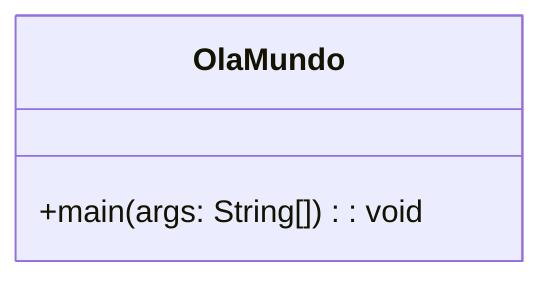

### Mudança de Enfoque: Estruturado → Orientado a Objetos

O paradigma estruturado organiza o software em **funções e dados separados**. Já o paradigma orientado a objetos propõe que **dados e operações** sejam encapsulados em **entidades coesas (objetos)**.

| Enfoque Estruturado | Enfoque OO |
|----------------------|-------------|
| Funções manipulam dados | Objetos manipulam a si mesmos |
| Baixo nível de coesão | Alta coesão e baixo acoplamento |
| Dificuldade de manutenção | Reuso e extensibilidade |

**Estruturado:**
```java
record Cliente(int id, String nome) {}
static void atualizarNome(Cliente c, String novo) { /* ... */ }
```

**Orientado a Objetos:**
```java
public class Cliente {
    private int id;
    private String nome;
    public Cliente(int id, String nome){ this.id = id; this.nome = nome; }
    public void atualizarNome(String novo){ this.nome = novo; }
}
```

### Classes e Objetos

Uma **classe** define a estrutura e o comportamento de um conjunto de objetos semelhantes. Cada **objeto** é uma **instância** da classe, possuindo seus próprios valores de atributos.

```java
public class Cliente {
    private String nome;
    private String email;
    public void exibirDados() {
        System.out.println(nome + " - " + email);
    }
}
```

Diagrama UML

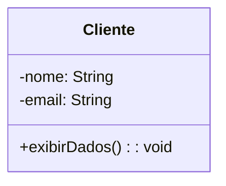

!!! tip "Boas práticas"
    - Nomeie classes com substantivos (`Conta`, `Produto`).
    - Mantenha um único conceito por classe.
    - Prefira alta coesão e baixo acoplamento.


#### Modificadores de Acesso

Controlam quem pode ver ou usar determinado membro (atributo, método ou classe).

| Modificador                 | Aplicável a                 | Acesso permitido a               | Exemplo                   |
| --------------------------- | --------------------------- | -------------------------------- | ------------------------- |
| `public`                    | Classes, métodos, atributos | Todos os pacotes e classes       | `public void sacar()`     |
| `protected`                 | Métodos, atributos          | Mesmo pacote + subclasses        | `protected double saldo;` |
| *sem modificador* (default) | Classes, métodos, atributos | Somente dentro do mesmo pacote   | `String agencia;`         |
| `private`                   | Métodos, atributos          | Somente dentro da própria classe | `private String senha;`   |

```java
public class Conta {
    public String numero;       // acessível em qualquer classe
    private double saldo;       // acessível apenas dentro de Conta
    protected String titular;   // acessível em subclasses
}
```

#### Modificadores de Comportamento

Alteram como atributos e métodos se comportam na execução.

| Modificador    | Aplicável a                 | Efeito                                                                       |
| -------------- | --------------------------- | ---------------------------------------------------------------------------- |
| `static`       | Variáveis, métodos          | Pertence à classe, e não a instâncias.                                       |
| `final`        | Variáveis, métodos, classes | Impede alteração: valor fixo, método não sobrescrito, ou classe não herdada. |
| `abstract`     | Classes, métodos            | Define comportamento genérico; deve ser implementado em subclasses.          |
| `synchronized` | Métodos, blocos             | Controla acesso concorrente (thread-safe).                                   |
| `transient`    | Atributos                   | Impede que o atributo seja serializado.                                      |
| `volatile`     | Variáveis                   | Garante leitura/escrita direta na memória (multithreading).                  |

##### `static`

Usado para criar membros que pertencem à classe, não a uma instância específica, sendo útil para contadores, configurações globais e métodos utilitários.

```java
public class Conta {
    private static int totalContas = 0;

    public Conta() {
        totalContas++;
    }

    public static int getTotalContas() {
        return totalContas;
    }
}
```

##### `final`

- Em **variáveis**: torna o valor imutável;
- Em **métodos**: impede que sejam sobrescritos;
- Em **classes**: impede que sejam herdadas.


```java
public final class Constantes {
    public static final double TAXA_JUROS = 0.05;
}
```

##### `abstract`

Define classes e métodos genéricos, que devem ser implementados por subclasses.

```java
public abstract class Forma {
    public abstract double calcularArea();
}
```

Na `subclasse`

```java
public class Circulo extends Forma {
    private double raio;

    public Circulo(double raio) { this.raio = raio; }

    @Override
    public double calcularArea() {
        return Math.PI * raio * raio;
    }
}
```

O uso de abstract é essencial no polimorfismo e em hierarquias de herança.

| Prática                                                 | Justificativa                                    |
| ------------------------------------------------------- | ------------------------------------------------ |
| Usar `private` e métodos `get/set`                      | Garante **encapsulamento** e controle de acesso. |
| Aplicar `final` em constantes                           | Evita alterações acidentais.                     |
| Evitar uso excessivo de `static`                        | Reduz o acoplamento entre classes.               |
| Utilizar `protected` apenas quando necessário           | Mantém isolamento entre pacotes.                 |
| Usar `abstract` para projetar hierarquias reutilizáveis | Favorece extensibilidade e polimorfismo.         |


### Métodos

Os **métodos** implementam o comportamento dos objetos, sendo definidos por uma **assinatura** (nome + parâmetros) e um **corpo** (código).

Os **métodos** representam os **comportamentos** de uma classe.
São blocos de código **reutilizáveis** que executam uma tarefa específica, podendo **receber dados de entrada (parâmetros)** e **retornar resultados**.

Um método define **o que um objeto sabe fazer** — é através dele que se envia **mensagens** a um objeto, solicitando ações ou cálculos. A estrutura geral de um método em Java é:

```java
<modificadores> <tipo_de_retorno> <nome_do_método>(<parâmetros>) {
    // corpo do método
}

public int somar(int a, int b) {
    return a + b;
}
```

#### Componentes principais:

| Elemento | Descrição |
|-----------|------------|
| **Modificadores** | Controlam acesso e comportamento (`public`, `private`, `static`, `final`, etc.) |
| **Tipo de retorno** | Define o tipo de dado retornado pelo método (ou `void`, se não retorna nada) |
| **Nome do método** | Deve ser **significativo** e seguir o padrão **camelCase** |
| **Parâmetros** | Valores de entrada (opcionais), definidos com tipo e nome |
| **Corpo do método** | Bloco `{}` com as instruções a serem executadas |

```java
public class Calculadora {

    // Método com retorno
    public int somar(int a, int b) {
        return a + b;
    }

    // Método sem retorno
    public void exibirMensagem(String nome) {
        System.out.println("Olá, " + nome + "!");
    }
}
```

Uso:
```java
Calculadora calc = new Calculadora();
int resultado = calc.somar(5, 3);
calc.exibirMensagem("pessoal");
```

Saída:
```
Olá, pessoal!
```

#### Métodos com parâmetros

Os parâmetros são **valores recebidos** pelo método, permitindo reutilização e generalização do comportamento.

```java
public void depositar(double valor) {
    saldo += valor;
}
```

> 💡 Em Java, os parâmetros são **passados por valor** — no caso de objetos, é passada **a referência** (não uma cópia do objeto).


#### Métodos com e sem retorno

Métodos sem retorno (`void`) executam uma ação, mas não devolvem valor.

```java
public void imprimirMensagem() {
    System.out.println("Bem-vindo!");
}
```

Quando métodos possuem retorno de alguma valor ao final da execução, utilizamos a palavra-chave `return`.

```java
public double calcularMedia(double n1, double n2) {
    return (n1 + n2) / 2;
}
```

A instrução `return`:
- Encerra o método;
- Retorna o valor especificado (se o tipo de retorno não for `void`).

```java
public double obterSaldo() {
    return saldo;
}
```

#### Sobrecarga de métodos (*method overloading*)

A **sobrecarga de métodos** ocorre quando existem **vários métodos com o mesmo nome**, mas com **parâmetros diferentes** (quantidade ou tipos).

```java
public class Calculadora {

    public int somar(int a, int b) {
        return a + b;
    }

    public double somar(double a, double b) {
        return a + b;
    }

    public int somar(int a, int b, int c) {
        return a + b + c;
    }
}
```

Uso:
```java
Calculadora calc = new Calculadora();
System.out.println(calc.somar(2, 3));
System.out.println(calc.somar(2.5, 4.3));
System.out.println(calc.somar(1, 2, 3));
```

#### Modificadores aplicáveis a métodos

| Modificador | Efeito |
|--------------|--------|
| `public` | Acessível de qualquer lugar |
| `private` | Acessível apenas na mesma classe |
| `protected` | Acessível em subclasses e no mesmo pacote |
| `static` | Pertence à classe (não ao objeto) |
| `final` | Impede sobrescrita em subclasses |
| `abstract` | Define um método sem implementação (deve ser sobrescrito) |
| `synchronized` | Controla acesso por múltiplas threads |

##### método `static`

```java
public class Conversor {
    public static double celsiusParaFahrenheit(double c) {
        return (c * 1.8) + 32;
    }
}

System.out.println(Conversor.celsiusParaFahrenheit(25));
```

##### método `final`

```java
public class Conta {
    public final void encerrar() {
        System.out.println("Conta encerrada.");
    }
}
```

##### método `abstract`

```java
public abstract class Forma {
    public abstract double calcularArea();
}
```

#### Métodos acessores e modificadores (*Getters* e *Setters*)

São métodos usados para **encapsular atributos privados**, permitindo **controle de acesso**.

```java
public class Conta {
    private double saldo;

    public double getSaldo() {
        return saldo;
    }

    public void setSaldo(double saldo) {
        if (saldo >= 0) {
            this.saldo = saldo;
        }
    }
}
```

#### Métodos construtores

Um **construtor** é um método especial usado para **inicializar objetos** no momento da criação.

```java
public class Conta {
    private String numero;
    private double saldo;

    public Conta(String numero, double saldo) {
        this.numero = numero;
        this.saldo = saldo;
    }
}
```

Uso:
```java
Conta c = new Conta("12345-6", 2500.00);
```

#### Métodos e o polimorfismo

Em POO, métodos podem ser **sobrescritos** (redefinidos) por subclasses, o que permite **polimorfismo**, ou seja, diferentes comportamentos para o mesmo nome de método.

```java
public class Conta {
    public void imprimirExtrato() {
        System.out.println("Extrato da conta comum");
    }
}

public class ContaPoupanca extends Conta {
    @Override
    public void imprimirExtrato() {
        System.out.println("Extrato da conta poupança");
    }
}
```

#### Boas práticas no uso de métodos

| Prática | Justificativa |
|----------|---------------|
| Escolher nomes claros e verbais | Facilita leitura (`calcularMedia`, `depositarValor`) |
| Evitar métodos muito longos | Dividir em métodos menores e coesos |
| Usar `private` para lógica interna | Reduz acoplamento |
| Validar parâmetros de entrada | Evita erros |
| Retornar valores claros | Facilita depuração |

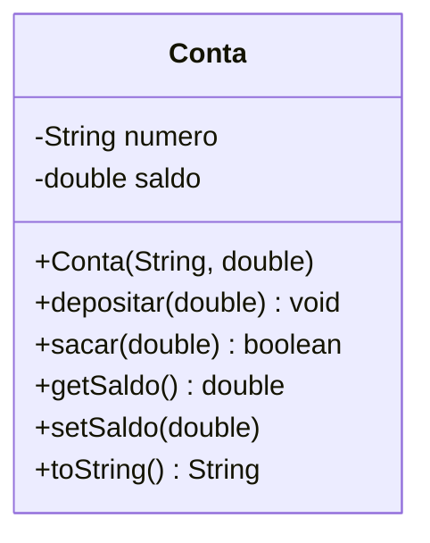

## Parte II — Práticas de Programação OO

### Reuso de Classes e Pacotes

O reuso é uma característica essencial da POO. Classes reutilizáveis devem ser **genéricas**, **coesas** e **independentes** de contexto.

```
br.upf.exemplo
 ├── dominio
 ├── servico
 ├── aplicacao
 └── ui
```

```java
package br.edu.exemplo.dominio;
public class Cliente { /* ... */ }

package br.edu.exemplo.ui;
import br.edu.exemplo.dominio.Cliente;
```

### Encapsulamento e Visibilidade

O encapsulamento é um dos quatro pilares da Programação Orientada a Objetos (POO), junto com herança, polimorfismo e abstração.
Ele representa o princípio de ocultar os detalhes internos de um objeto e restringir o acesso direto aos seus dados, fornecendo meios controlados de interação por meio de métodos públicos.

Em outras palavras, o encapsulamento é a barreira de proteção entre o estado interno de um objeto e o mundo externo, garantindo segurança, integridade e manutenibilidade do código.

```java
public class Conta {
    private double saldo;
    public void depositar(double valor){ saldo += valor; }
    public double getSaldo(){ return saldo; }
}
```

!!! note "Visibilidades em Java"
    - `public`: acesso global
    - `protected`: subclasses e pacote
    - `default`: pacote
    - `private`: somente a classe

### Construtores

Os construtores inicializam objetos garantindo **invariantes** válidos.

```java
public class Usuario {
    private final String login;
    public Usuario(String login){
        if (login.isBlank()) throw new IllegalArgumentException("login inválido");
        this.login = login;
    }
}
```

### Identidade de Objetos (`equals` e `hashCode`)

Em Programação Orientada a Objetos (POO), cada objeto é uma instância única de uma classe.
Mesmo que dois objetos possuam os mesmos valores em seus atributos, eles podem representar entidades diferentes na memória.

A identidade de objetos é o conceito que distingue se duas referências apontam para o mesmo objeto (mesma posição de memória) ou apenas para objetos equivalentes em conteúdo.

Em Java, isso é tratado principalmente por dois métodos herdados da classe Object:

- `equals(Object obj)`
- `hashCode()`

#### O método `equals()`

O método `equals()` é utilizado para comparar o conteúdo lógico de dois objetos. Por padrão, o método `equals()` da classe compara referências de memória.

```bash
Conta c1 = new Conta("001", "12345-6");
Conta c2 = new Conta("001", "12345-6");

System.out.println(c1 == c2);       // false (referências diferentes)
System.out.println(c1.equals(c2));  // false (ainda compara referências, se não for sobrescrito)
```
Nesse caso, c1 e c2 possuem o mesmo conteúdo, mas são objetos diferentes na memória.
Para que equals() considere o conteúdo, precisamos sobrescrevê-lo.

```java
@Override
public boolean equals(Object obj) {
    if (this == obj)
        return true;
    if (obj == null || getClass() != obj.getClass())
        return false;
    Conta conta = (Conta) obj;
    return agencia.equals(conta.agencia) && numero.equals(conta.numero);
}
```

Agora, o método compara os atributos agencia e número, ou seja, o conteúdo lógico que define a igualdade de duas contas.

#### O método `hashCode()`

O método hashCode() retorna um inteiro que representa o código hash do objeto.
Esse código é usado por estruturas de dados baseadas em hash, como:

- HashSet
- HashMap
- HashTable

Essas coleções utilizam o valor de hashCode() para organizar e localizar rapidamente objetos.
Quando equals() é sobrescrito, hashCode() também deve ser sobrescrito.
Isso é obrigatório para manter o contrato de igualdade entre objetos em coleções baseadas em hash.

#### Substituição de `toString()`

O método `toString()` é um dos métodos mais importantes herdados da classe `Object` em Java.
Ele é utilizado para obter uma representação textual de um objeto, geralmente com o objetivo de exibir informações de forma legível ao usuário, registrar logs ou depurar o código.

A implementação padrão de `toString()` na classe Object retorna uma string com `nomeClasse@codigoHexadecimal`.

```java
Conta c1 = new Conta("001", "12345-6");
System.out.println(c1.toString());
```
> Conta@5e2de80c

Para tornar a saída mais significativa, é recomendado sobrescrever o método `toString()` em suas classes.

A sobrescrita deve retornar uma representação textual contendo os principais atributos do objeto, de forma legível e contextualizada.

```java
public class Conta {
    private String agencia;
    private String numero;
    private double saldo;

    public Conta(String agencia, String numero, double saldo) {
        this.agencia = agencia;
        this.numero = numero;
        this.saldo = saldo;
    }

    @Override
    public String toString() {
        return "Conta [agencia=" + agencia + ", numero=" + numero + ", saldo=" + saldo + "]";
    }
}
```

A classe acima funciona da seguinte forma:

```java
Conta c1 = new Conta("001", "12345-6", 2500.00);
System.out.println(c1.toString());
```

> Conta [agencia=001, numero=12345-6, saldo=2500.0]

Tente também utilizando `String.format`

```java
@Override
public String toString() {
    return String.format("Conta: Agência %s | Número %s | Saldo: R$ %.2f",
                          agencia, numero, saldo);
}
```

### Coleções de objetos

Em aplicações orientadas a objetos, é comum precisar manter vários objetos do mesmo tipo, por exemplo, várias contas bancárias, produtos, alunos, ou clientes.
Para isso, o Java oferece a API de Collections, que contém classes e interfaces para manipulação de conjuntos dinâmicos de dados.

A classe mais utilizada é ArrayList, que faz parte do pacote java.util.

#### ArrayList

O ArrayList é uma lista dinâmica que armazena objetos de forma sequencial, permitindo inserir, remover, acessar, alterar e percorrer elementos da lista.

Ao contrário de um array tradicional, o ArrayList ajusta automaticamente o tamanho conforme novos elementos são adicionados facilitando operações de busca, filtragem e iteração.

```java
import java.util.ArrayList;

ArrayList<Conta> contas = new ArrayList<>();
```

!!! tip
    A sintaxe <Conta> é um parâmetro genérico, garantindo que apenas objetos Conta possam ser inseridos na lista.

#### Incluir objetos

Para adicionar um objeto à lista, utilizamos o método add().

```java
Conta c1 = new Conta("001", "12345-6", 3500.00);
contas.add(c1);

contas.add(new Conta("001", "65432-1", 1200.00));
```

Também é comum implementar um método auxiliar que encapsula essa inclusão:

```java
public void incluirConta(Conta conta) {
    contas.add(conta);
    System.out.println("Conta adicionada com sucesso!");
}
```

#### Listar objetos

Para exibir todos os elementos, utiliza-se o loop for-each, que percorre toda a lista.

```java
for (Conta c : contas) {
    System.out.println(c);
}
```

Se a classe `Conta` tiver o método `toString()` sobrescrito... ele será exibido de forma automática.


#### Remover objetos

Podemos remover um objeto de uma lista utilizando seu índice ou removendo o objeto.

```java
contas.remove(0); // remove o primeiro elemento da lista
```

Para que a remoção por objeto funcione corretamente, é necessário que a classe Conta tenha os métodos equals() e hashCode() sobrescritos.

```java
Conta c = new Conta("001", "65432-1", 1200.00);
contas.remove(c);
```

#### Alterar objetos

Para modificar um objeto armazenado, primeiro localizamos sua posição (índice) e depois usamos o método `set()`.

```java
Conta c = contas.get(1);  // obtém o objeto no índice 1
c.setSaldo(5000.00);      // altera um atributo
contas.set(1, c);         // atualiza o objeto na lista
```

Ou, usando um loop para localizar uma conta específica:

```java
for (Conta c : contas) {
    if (c.getNumero().equals("12345-6")) {
        c.setSaldo(7000.00);
        System.out.println("Saldo atualizado com sucesso!");
        break;
    }
}
```

### Exemplo classe Banco

```java
import java.util.ArrayList;

public class Banco {
    private ArrayList<Conta> contas = new ArrayList<>();

    public void incluir(Conta c) {
        contas.add(c);
        System.out.println("Conta incluída!");
    }

    public void listar() {
        for (Conta c : contas) {
            System.out.println(c);
        }
    }

    public void excluir(String numero) {
        Conta encontrada = null;
        for (Conta c : contas) {
            if (c.getNumero().equals(numero)) {
                encontrada = c;
                break;
            }
        }
        if (encontrada != null) {
            contas.remove(encontrada);
            System.out.println("Conta removida!");
        } else {
            System.out.println("Conta não encontrada!");
        }
    }

    public void alterar(String numero, double novoSaldo) {
        for (Conta c : contas) {
            if (c.getNumero().equals(numero)) {
                c.setSaldo(novoSaldo);
                System.out.println("Saldo alterado!");
                return;
            }
        }
        System.out.println("Conta não encontrada!");
    }
}
```

### Classe main

```java
public class TesteBanco {
    public static void main(String[] args) {
        Banco banco = new Banco();
        banco.incluir(new Conta("001", "12345-6", 2500.0));
        banco.incluir(new Conta("001", "65432-1", 1000.0));

        System.out.println("Listando contas:");
        banco.listar();

        banco.alterar("12345-6", 5000.0);
        banco.excluir("65432-1");

        System.out.println("Após alterações:");
        banco.listar();
    }
}
```

Diagrama UML

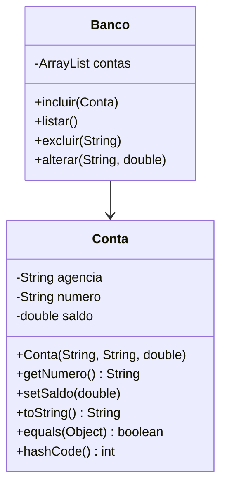

## Parte III — Relacionamentos entre Classes

As classes **não coexistem isoladamente** em uma aplicação, os principais relacionamentos entre classes são:

- **Herança**
  - Generalização / Especialização
- **Agregação**
- **Agregação por Composição**
- **Associação**

### Herança

Define que uma classe é uma **especialização** de outra classe.

- Classes: `Pessoa`, `Estudante`, `Funcionário`, `Professor`
  - `Estudante`, `Funcionário` e `Professor` **são tipos de** `Pessoa`.

> Dica: pense nas expressões **"é um"** ou **"é um tipo de"**.

- **Superclasse** → representa a generalização
- **Subclasse** → representa a especialização

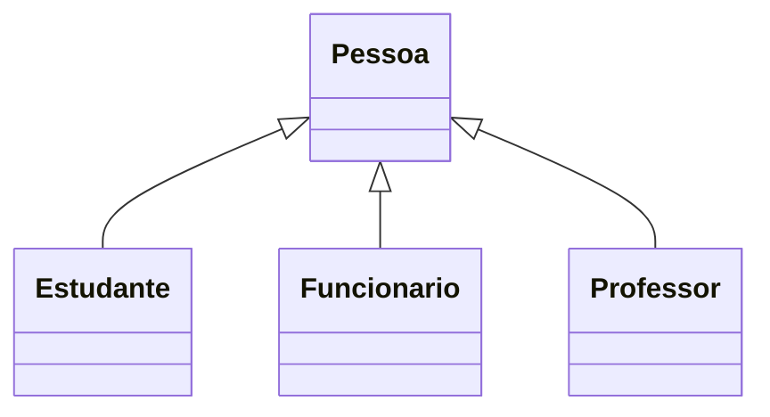

- Economia de descrição
- Facilidade de gerenciamento da estrutura
- Reutilização de código

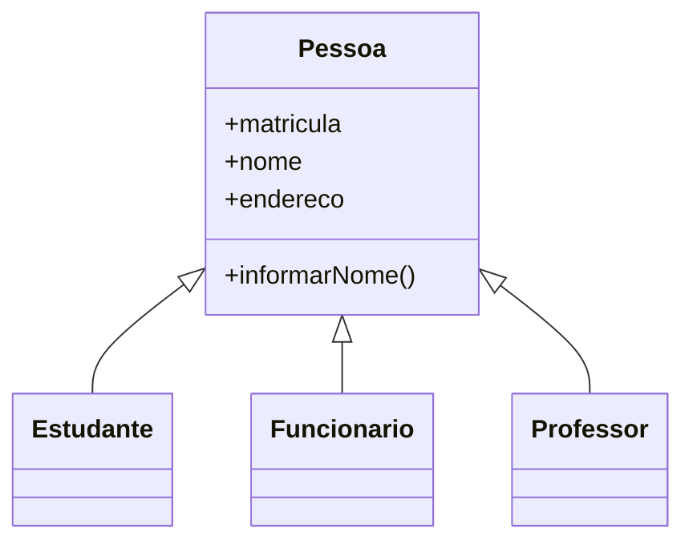

!!! info "Subclasses"
    === "Pessoa"
        ```java
        public class Pessoa {
            protected String matricula;
            protected String nome;
            protected String endereco;

            public Pessoa(String matricula, String nome, String endereco) {
                this.matricula = matricula;
                this.nome = nome;
                this.endereco = endereco;
            }

            public void informarNome() {
                System.out.println("Nome: " + nome);
            }

            // Getters e Setters
            public String getMatricula() {
                return matricula;
            }

            public String getNome() {
                return nome;
            }

            public String getEndereco() {
                return endereco;
            }
        }
        ```

    === "Estudante"
        ```java
        public class Estudante extends Pessoa {
            private String curso;

            public Estudante(String matricula, String nome, String endereco, String curso) {
                super(matricula, nome, endereco);
                this.curso = curso;
            }

            public void exibirCurso() {
                System.out.println("Curso: " + curso);
            }
        }
        ```

    === "Funcionario"
        ```java
        public class Funcionario extends Pessoa {
            private String cargo;
            private double salario;

            public Funcionario(String matricula, String nome, String endereco, String cargo, double salario) {
                super(matricula, nome, endereco);
                this.cargo = cargo;
                this.salario = salario;
            }

            public void exibirDadosFuncionario() {
                System.out.println("Cargo: " + cargo);
                System.out.println("Salário: R$ " + salario);
            }
        }
        ```

    === "Professor"
        ```java
        public class Professor extends Funcionario {
            private String areaDeAtuacao;

            public Professor(String matricula, String nome, String endereco, String cargo, double salario, String areaDeAtuacao) {
                super(matricula, nome, endereco, cargo, salario);
                this.areaDeAtuacao = areaDeAtuacao;
            }

            public void exibirArea() {
                System.out.println("Área de Atuação: " + areaDeAtuacao);
            }
        }
        ```
    === "Main"
        ```java
        public class Principal {
            public static void main(String[] args) {
                Estudante e = new Estudante("2023001", "Maria Silva", "Rua das Flores, 100", "Ciência da Computação");
                Funcionario f = new Funcionario("F123", "João Pereira", "Av. Central, 200", "Técnico de Laboratório", 4500.00);
                Professor p = new Professor("P456", "Carlos Lima", "Rua A, 50", "Docente", 7500.00, "Programação Orientada a Objetos");

                e.informarNome();
                e.exibirCurso();

                System.out.println();

                f.informarNome();
                f.exibirDadosFuncionario();

                System.out.println();

                p.informarNome();
                p.exibirDadosFuncionario();
                p.exibirArea();
            }
        }
        ```

#### Funcionamento

Os atributos e métodos da **superclasse** são **herdados** pelas subclasses.

  - `Pessoa` possui o atributo `nome`.
  - Logo, `Estudante`, `Funcionário` e `Professor` também possuem `nome`.

- A superclasse implementa **atributos e métodos genéricos**.
- As subclasses implementam **atributos e métodos específicos**.

> É um dos pilares do **reuso de software**.

Cada instância da subclasse contém os atributos e métodos da superclasse acrescidos de seus próprios, isso é chamado de generalização. A generalização ocorre entre **classes**, não entre **objetos**.

---

#### Herança Múltipla

Quando uma subclasse **herda de duas ou mais superclasses**.

Pode gerar problemas se mal utilizada:
- Colisão de nomes de atributos
- Colisão de métodos

> Java e Smalltalk **não** implementam herança múltipla.
> Eiffel e C++ **implementam**.

---

#### Polimorfismo

Palavra originária do grego.

- Poli = Muitas
- Morphos = Formas

> Um mesmo método pode apresentar várias formas, de acordo com seu contexto. Isso permite que a semântica de uma interface seja efetivamente separada da implementação que a
representa.

---

#### Diferença de sobrecarga e substituição

A sobrecarga(*overloading ou sobreposição*) que vimos anteriormente, são métodos podem ser sobrecarregados, ou seja, podem-se criar métodos com o mesmo nome, mas com diferentes assinaturas e
diferentes definições. Como são métodos distintos, cada um pode ter um modificador de acesso diferente.

A substituição(*superação, redefinição ou Overriding*) ocorre quando um método é substituído por outro. A assinatura do método é a mesma (nome + argumentos).

- Mesmo nome, número, tipos de argumentos e tipo de retorno.
- Utilizado entre superclasse e subclasses, na herança.
- O algoritmo é substituído por outro.


### Interfaces

Uma **interface** define operações que outras classes devem implementar, uUsada para **contornar a falta de herança múltipla**.

> - Não é uma classe.
> - Não possui atributos.
> - Define apenas operações (sem implementação).
> - Não podem ser instanciadas.
> - São **public** e **abstract** por padrão.
> - Não podem ser **private** ou **protected**.

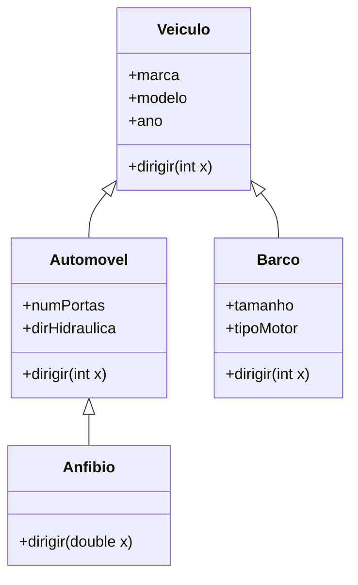

!!! info "Interfaces"
    === "Veiculo"

        ```java
        public class Veiculo {
            protected String marca;
            protected String modelo;
            protected int ano;

            public Veiculo(String marca, String modelo, int ano) {
                this.marca = marca;
                this.modelo = modelo;
                this.ano = ano;
            }

            public void dirigir(int x) {
                System.out.println("Veículo genérico dirigindo a " + x + " km/h.");
            }
        }
        ```

    === "Automovel"

        ```java
        public interface Automovel {
            void dirigirEmTerra(int x);
        }
        ```
    === "Barco"

        ```java
        public interface Barco {
            void dirigirNaAgua(int x);
        }
        ```
    === "Anfibio"

        ```java
        // Classe que combina as duas interfaces
        public class Anfibio extends Veiculo implements Automovel, Barco {

            private int numPortas;
            private boolean dirHidraulica;
            private double tamanho;
            private String tipoMotor;
            private boolean modoAgua = false;

            public Anfibio(String marca, String modelo, int ano, int numPortas, boolean dirHidraulica, double tamanho, String tipoMotor) {
                super(marca, modelo, ano);
                this.numPortas = numPortas;
                this.dirHidraulica = dirHidraulica;
                this.tamanho = tamanho;
                this.tipoMotor = tipoMotor;
            }

            @Override
            public void dirigirEmTerra(int x) {
                modoAgua = false;
                System.out.println("Anfíbio dirigindo em terra (" + x + " km/h) com "
                        + numPortas + " portas e direção "
                        + (dirHidraulica ? "hidráulica" : "mecânica") + ".");
            }

            @Override
            public void dirigirNaAgua(int x) {
                modoAgua = true;
                System.out.println("Anfíbio navegando a " + x + " nós com motor " + tipoMotor + ".");
            }

            // Sobrecarga — usa double para velocidade fracionada
            public void dirigir(double x) {
                if (modoAgua)
                    System.out.println("Anfíbio navegando suavemente a " + x + " nós.");
                else
                    System.out.println("Anfíbio rodando em baixa velocidade (" + x + " km/h).");
            }

            // Método sobrescrito da superclasse
            @Override
            public void dirigir(int x) {
                System.out.println("Anfíbio híbrido operando em modo " + (modoAgua ? "aquático" : "terrestre") + " a " + x + " unidades de velocidade.");
            }
        }
        ```
    === "Main"

        ```java
        public class Principal {
            public static void main(String[] args) {
                Anfibio anfibio = new Anfibio("Gibbs", "Humdinga", 2025, 4, true, 3.5, "Turbo Aquático");

                System.out.println("\n--- Teste de modos do Anfíbio ---");
                anfibio.dirigirEmTerra(80);
                anfibio.dirigir(20);        // método da superclasse
                anfibio.dirigirNaAgua(30);
                anfibio.dirigir(12.5);      // sobrecarga com double
            }
        }
        ```

> Métodos podem ter **assinaturas diferentes** (sobrecarga).


### Agregação

Agregação representa uma relação "todo–parte" entre duas classes, em que uma classe (todo) contém outra classe (parte), mas sem dependência vital.
- O objeto parte pode existir independentemente do objeto todo.
- O ciclo de vida dos objetos é independente.
- É uma ligação fraca (relações “tem-um”).

Um Carro possui Rodas, mas as rodas podem existir sem o carro. Se o carro for destruído, as rodas ainda podem ser usadas em outro veículo.

Logo, trata-se de uma agregação, e não de uma composição, relação **“todo–parte”** entre classes.

`Carro` possui `Rodas`.

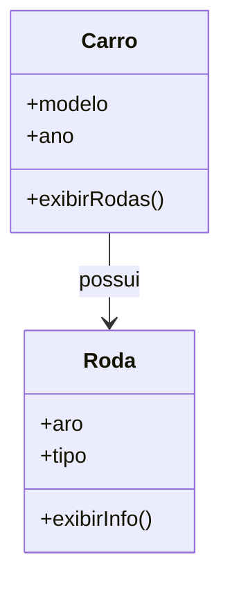

- **Classe Todo (Agregada)** → `Carro`
- **Classe Parte** → `Roda`

> Como Identificar
> Frases como “Consiste em”, “Contém”, “É parte de”.
> Perguntas úteis:
> - Um objeto vive sem o outro?
> - X tem um ou mais Y?
> - Y é parte de X?


!!! info "Agregação"
    === "Roda"

        ```java
        public class Roda {
            private int aro;
            private String tipo;

            public Roda(int aro, String tipo) {
                this.aro = aro;
                this.tipo = tipo;
            }

            public void exibirInfo() {
                System.out.println("Roda aro " + aro + " - tipo: " + tipo);
            }
        }
        ```

    === "Carro"

        ```java
        import java.util.List;

        public class Carro {
            private String modelo;
            private int ano;
            private List<Roda> rodas;  // agregação: o carro tem rodas, mas não as "possui" vitalmente

            public Carro(String modelo, int ano, List<Roda> rodas) {
                this.modelo = modelo;
                this.ano = ano;
                this.rodas = rodas;
            }

            public void exibirRodas() {
                System.out.println("Carro: " + modelo + " (" + ano + ")");
                for (Roda r : rodas) {
                    r.exibirInfo();
                }
            }
        }
        ```

    === "Main"

        ```java
        import java.util.ArrayList;
        import java.util.List;

        public class Principal {
            public static void main(String[] args) {
                // As rodas são criadas independentemente do carro
                Roda r1 = new Roda(17, "Liga leve");
                Roda r2 = new Roda(17, "Liga leve");
                Roda r3 = new Roda(17, "Liga leve");
                Roda r4 = new Roda(17, "Liga leve");

                List<Roda> rodas = new ArrayList<>();
                rodas.add(r1);
                rodas.add(r2);
                rodas.add(r3);
                rodas.add(r4);

                // Carro é criado recebendo a lista de rodas (agregação)
                Carro c = new Carro("Civic", 2024, rodas);

                c.exibirRodas();

                // Mesmo se o carro "sumir", as rodas ainda existem:
                c = null;
                System.out.println("\nO carro foi destruído, mas as rodas ainda existem:");
                r1.exibirInfo();
            }
        }
        ```


### Agregação por Composição

Semelhante à agregação, mas com **ligação forte**.

- As classes **vivem unidas**.
- O “todo” é **responsável** pela vida das partes.
- A “parte” **não tem vida independente**.

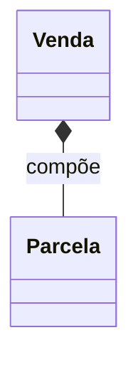

> As parcelas são destruídas quando a venda é excluída.


#### Diferença: Agregação × Composição

| Aspecto | Agregação | Composição |
|----------|------------|-------------|
| Ligação | Fraca | Forte |
| Existência independente | Sim | Não |
| Parte em múltiplos todos | Sim | Não |
| Vida da parte | Independente | Dependente |


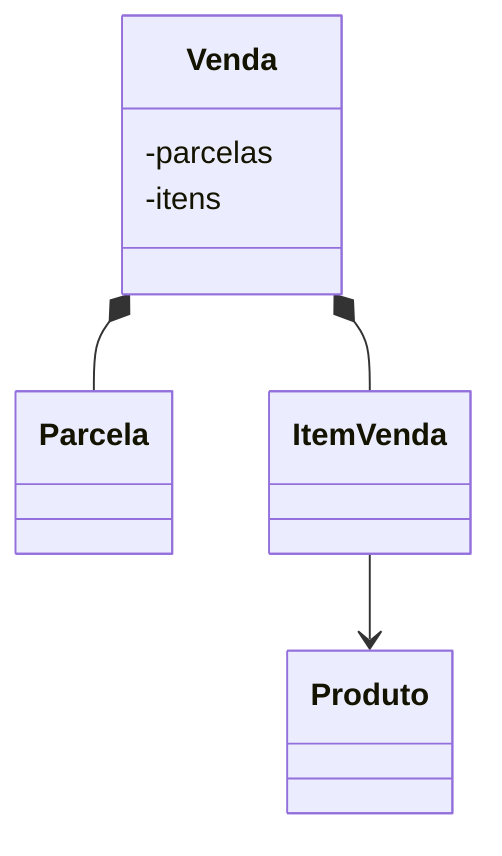

!!! info "Agregação por composição"
    === "Produto"

        ```java
        import java.util.ArrayList;
        import java.util.List;

        class Produto {
            private String nome;
            private double preco;

            public Produto(String nome, double preco) {
                this.nome = nome;
                this.preco = preco;
            }

            public String getNome() {
                return nome;
            }

            public double getPreco() {
                return preco;
            }
        }
        ```

    === "ItemVenda"

        ```java
        class ItemVenda {
            private Produto produto;
            private int quantidade;

            public ItemVenda(Produto produto, int quantidade) {
                this.produto = produto;
                this.quantidade = quantidade;
            }

            public double getTotal() {
                return produto.getPreco() * quantidade;
            }

            public void exibirItem() {
                System.out.println("- " + produto.getNome() + " x " + quantidade + " = R$ " + getTotal());
            }
        }
        ```

    === "Parcela"

        ```java
        class Parcela {
            private int numero;
            private double valor;

            public Parcela(int numero, double valor) {
                this.numero = numero;
                this.valor = valor;
            }

            public void exibirParcela() {
                System.out.println("Parcela " + numero + ": R$ " + valor);
            }
        }
        ```

    === "Venda"

        ```java
        class Venda {
            private List<ItemVenda> itens = new ArrayList<>();
            private List<Parcela> parcelas = new ArrayList<>();

            public void adicionarItem(Produto produto, int quantidade) {
                itens.add(new ItemVenda(produto, quantidade));
            }

            public void gerarParcelas(int numParcelas) {
                double total = getTotal();
                double valorParcela = total / numParcelas;
                for (int i = 1; i <= numParcelas; i++) {
                    parcelas.add(new Parcela(i, valorParcela));
                }
            }

            public double getTotal() {
                double total = 0;
                for (ItemVenda item : itens) {
                    total += item.getTotal();
                }
                return total;
            }

            public void exibirResumo() {
                System.out.println("=== Itens da Venda ===");
                for (ItemVenda item : itens) {
                    item.exibirItem();
                }
                System.out.println("\nTotal: R$ " + getTotal());

                System.out.println("\n=== Parcelas ===");
                for (Parcela p : parcelas) {
                    p.exibirParcela();
                }
            }
        }
        ```

    === "Main"

        ```java
        public class Principal {
            public static void main(String[] args) {
                Produto p1 = new Produto("Notebook", 4500.00);
                Produto p2 = new Produto("Mouse", 150.00);

                Venda venda = new Venda();
                venda.adicionarItem(p1, 1);
                venda.adicionarItem(p2, 2);
                venda.gerarParcelas(3);

                venda.exibirResumo();
            }
        }
        ```

- `Venda` é a **classe todo** e controla o **ciclo de vida** de `ItemVenda` e `Parcela`.
- `ItemVenda` e `Parcela` **existem apenas dentro** da `Venda` → **composição** (`*--`).
- `Produto` é **independente** — existe fora do ciclo de vida da venda.
- Quando uma `Venda` é removida, **suas parcelas e itens também são destruídos**, mas **os produtos permanecem**.


### Associação

Relacionamento **sem significado estrutural forte** (não é herança, nem agregação, nem composição).

> Muito comum em sistemas de **comércio e serviços**.

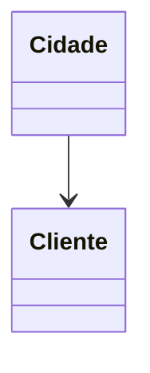

### Como Escolher o Tipo de Relacionamento

1. Existe **herança**?
   - Subclasse “é do tipo” da superclasse?
     - Sim → **Herança**
2. Não? Há relação **todo-parte**?
   - Parte vive sem o todo?
     - Sim → **Agregação**
     - Não → **Composição**
3. Nenhum dos anteriores → **Associação**

### Persistência

- Capacidade de um objeto **existir além da execução** que o criou.
- Objetos não persistentes são chamados de **transientes**.


---

## Referências

- DEITEL, H.; DEITEL, P. *Java: Como Programar.* Prentice Hall, 2006.
- HORSTMANN, C.; CORNELL, G. *Core Java 2 — Fundamentos.* Makron Books, 2001.
- PRESSMAN, R. *Engenharia de Software.* McGraw-Hill, 2002.
- SANTOS, R. *Introdução à Programação Orientada a Objetos Usando Java.* Campus, 2003.
