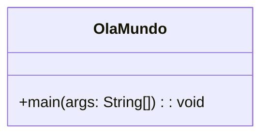
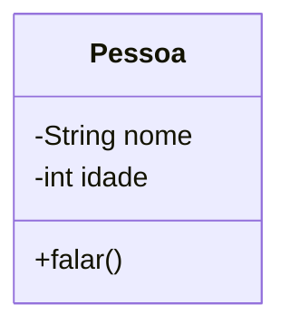
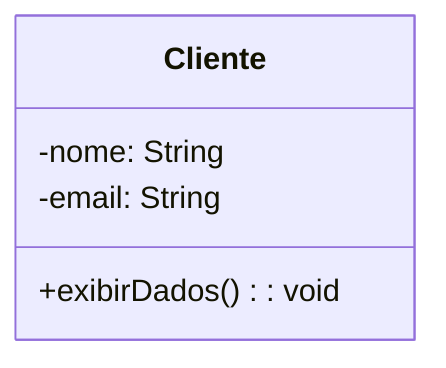
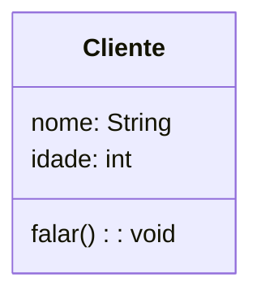
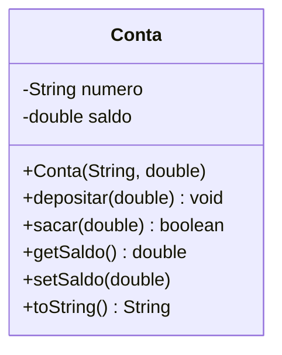

---

## Fundamentos de Paradigmas de Programação

Um paradigma de programação é um modelo ou estilo de desenvolvimento de software, que define a forma como os programas são estruturados e como os problemas são resolvidos utilizando uma linguagem de programação.

- Como representar dados
- Como estruturar o controle do programa
- Como modelar problemas
- Como os elementos interagem entre si

---
layout: two-cols
---

### Paradigma Imperativo

Criado a partir do princípio que o programa é uma sequência de instruções que alteram o estado do sistema. O foco está em fazer algo, passo a passo, alterando o estado do programa (*variáveis em memória*) para atingir um resultado.

Uso de variáveis
Comandos de atribuição
Estruturas de controle (if, for, while)
Mudança de estado

::right::

**Exemplos**

- C, Basic
- Pascal, Fortran, Python
- Assembly, Lua, Java

```c
int soma = 0;
for(int i = 0; i < 10; i++) {
  soma += i;
}
```

---
layout: two-cols
---

### Paradigma Procedural

É uma especialização do paradigma imperativo, onde o programa é organizado em procedimentos ou funções. Estrutura o software em uma sequência de passos lógicos, ideal para tarefas lineares e com alto reaproveitamento de código sem encapsulamento de dados.

- Modularização por funções
- Reutilização de código
- Estrutura hierárquica

::right::

**Exemplos**

- C, PHP, Javascript,
- Pascal, Fortran, Cobol

```c
#include <stdio.h>
// Procedimento para calcular média
float calcularMedia(float a, float b) {
  return (a + b ) / 2.0;
}
// Procedimento principal
int main() {
  float n1, n2, media;

  printf("Digite dois números: ");
  scanf("%f %f", &n1, &n2);
  media = calcularMedia(n1, n2);
  printf("Media = %.2f\n", media);
  return 0;
}
```

---
layout: two-cols
---

### Paradigma Funcional

Baseia-se no conceito matemático de funções puras. O programa é composto por funções que não alteram estado e não possuem efeitos colaterais.

- Funções puras
- Imutabilidade
- Funções de alta ordem
- Recursividade
- Ausência de variáveis mutáveis

::right::

**Exemplos**

- Haskell, Elixir
- Lisp, Scala

```haskell
somaLista [] = 0
somaLista (x:xs) = x + somaLista xs
```
---

### Fundamentos do Paradigma Orientado a Objetos

A Programação Orientada a Objetos (POO) é um paradigma de programação, um padrão de desenvolvimento que é utilizado por por muitas linguagens, como Java, Python e C#.


Esse paradigma consiste na programação baseado na modelagem de sistemas como um conjunto de objetos que interagem entre si.

O objetivo da POO é aproximar o código da forma como pensamos e organizamos o mundo real, promovendo reutilização, modularidade, flexibilidade e manutenção facilitada.

A origem do paradigma remonta à linguagem **Simula 67**, que introduziu o conceito de *classe* e *objeto*, evoluindo posteriormente com **Smalltalk**, **C++**, **Python** e **Java**. Atualmente, a POO é amplamente adotada em diversos contextos de software, desde sistemas embarcados até aplicações distribuídas.

---

### Princípios fundamentais
  - **Abstração:** representação dos aspectos essenciais de um domínio, ignorando detalhes irrelevantes.
  - **Encapsulamento:** ocultação de informações internas e controle de acesso.
  - **Herança:** reutilização e especialização de classes.
  - **Polimorfismo:** múltiplas formas de execução associadas a uma interface comum.

```java
public class OlaMundo {
    public static void main(String[] args) {
        System.out.println("Olá, Mundo Orientado a Objetos!");
    }
}
```

Diagrama UML



---

### Mudança de Enfoque: Estruturado → Orientado a Objetos

O paradigma estruturado organiza o software em **funções e dados separados**. Já o paradigma orientado a objetos propõe que **dados e operações** sejam encapsulados em **entidades coesas (objetos)**.

| Enfoque Estruturado | Enfoque OO |
|----------------------|-------------|
| Funções manipulam dados | Objetos manipulam a si mesmos |
| Baixo nível de coesão | Alta coesão e baixo acoplamento |
| Dificuldade de manutenção | Reuso e extensibilidade |

---

**Estruturado:**
```java
record Cliente(int id, String nome) {}
static void atualizarNome(Cliente c, String novo) { /* ... */ }
```

**Orientado a Objetos:**
```java
public class Cliente {
    private int id;
    private String nome;
    public Cliente(int id, String nome){ this.id = id; this.nome = nome; }
    public void atualizarNome(String novo){ this.nome = novo; }
}
```

---

C++


---

C#


---

Kotlin


---

Ruby


---

Typescript


---
layout: two-cols
---

## UML

[UML](https://www.omg.org/uml/) (*Unified Modeling Language*) é uma linguagem padrão para modelagem visual de sistemas orientados a objetos.
Ela não é linguagem de programação, mas sim uma notação gráfica para

- Especificar
- Visualizar
- Documentar
- Projetar sistemas

::right::


A UML é composta por diversos diagramas. Dentre eles está o diagrama de classes.

---
layout: two-cols
---

O Diagrama de Classes é o principal diagrama estrutural da UML.  É amplamente usado para documentação e projeto de software Orientado a Objetos, esse diagrama é utilizado para estruturar classes, seus atributos e métodos.
É a base da modelagem em POO.

Uma classe é representada por um retângulo dividido em três partes:

```
+----------------------+
|       Pessoa         | -> Nome da classe
+----------------------+
| - nome: String       | -> Atributos
| - idade: int         |
+----------------------+
| + falar(): void      | -> Métodos
+----------------------+
```

::right::


O símbolo na frente dos atributos e métodos identificam a visibilidade:

| Símbolo | Visibilidade |
| ------- | ------------ |
| `+`     | public      |
| `-`     | private      |
| `#`     | protected    |




---

## Introdução ao Java

A linguagem **Java** foi criada em **1995** pela equipe da **Sun Microsystems**, em uma equipe liderada por **James Gosling**. Seu objetivo inicial era desenvolver aplicações portáteis para dispositivos eletrônicos, sua principal inovação foi a **portabilidade**, o que rapidamente a tornou uma das linguagens mais populares para desenvolvimento de sistemas corporativos, web e móveis.


<br>

Em **2009**, a **Oracle Corporation** adquiriu a **Sun Microsystems**, tornando-se a principal mantenedora da linguagem e de seu ecossistema.


> **Slogan histórico:** *"Write once, run anywhere"* — “Escreva uma vez, execute em qualquer lugar”.

---

## Funcionamento do Java

O Java é uma linguagem **compilada e interpretada**.
O processo de execução de um programa Java ocorre em **duas etapas principais**:


1. **Compilação:**
   O código-fonte `.java` é compilado pelo compilador `javac`, que gera um **bytecode** armazenado em um arquivo `.class`.

2. **Execução:**
   O **bytecode** é interpretado e executado pela **Java Virtual Machine (JVM)**, tornando o programa **independente do sistema operacional**.

---

## Componentes Principais do Ecossistema Java

O ecossistema Java é composto por três partes principais:

| Componente | Descrição |
|-------------|------------|
| **JVM (Java Virtual Machine)** | Responsável por executar o bytecode. É a “máquina virtual” que abstrai o hardware e o sistema operacional. |
| **JRE (Java Runtime Environment)** | Inclui a JVM + bibliotecas padrões e arquivos necessários para executar aplicações Java. |
| **JDK (Java Development Kit)** | Inclui o JRE + ferramentas de desenvolvimento (como `javac`, `jar`, `javadoc`). Usado por desenvolvedores. |

---

## OpenJDK e Versões Atuais

O **OpenJDK (Open Java Development Kit)** é a **implementação oficial de código aberto** da plataforma Java, mantida pela comunidade e pela Oracle.
Ele serve como base para outras distribuições (como Amazon Corretto, Eclipse Temurin, Azul Zulu, entre outras).

A versão **OpenJDK 21.0.2** é uma das versões **LTS (Long-Term Support)** mais recentes (lançada em 2024).
Ela traz melhorias significativas em:

- **Desempenho** da JVM e do Garbage Collector
- **Recursos de linguagem**, como *record classes*, *pattern matching*, e *sealed classes*
- **Segurança e compatibilidade** de bibliotecas

> **LTS (Long-Term Support)** significa que a versão recebe atualizações e correções por um período estendido — ideal para ambientes de produção e ensino.

---

## Hello World

```java
public class OlaMundo {
    public static void main(String[] args) {
        System.out.println("Olá, mundo!");
    }
}
```

Ao compilar e executar:
```bash
javac OlaMundo.java
java OlaMundo
```

<br>

> Saída:
> ```
> Olá, mundo!
> ```

---

## Método Main


O método main é o **ponto de entrada** de qualquer aplicação Java, ou seja, é onde a execução começa.
Quando você executa:

```bash
java NomeDaClasse
```

a **JVM** procura exatamente por esse método para iniciar o programa.

```java
public static void main(String[] args)
```

---

Sendo que...

| Palavra-chave / elemento | Significado |
|---------------------------|-------------|
| `public` | O método é **público**, ou seja, pode ser acessado por qualquer classe. A JVM precisa conseguir chamá-lo de fora da classe, então ele **deve** ser público. |
| `static` | O método pertence à **classe** e não a uma instância. Isso significa que a JVM pode chamá-lo **sem criar um objeto** da classe. |
| `void` | O método **não retorna nenhum valor**. Ele apenas executa comandos. |
| `main` | Nome fixo do método que serve como ponto de entrada da aplicação Java. É **obrigatório** ter exatamente esse nome (minúsculo). |
| `String[] args` | Parâmetro que recebe **argumentos de linha de comando**. É um **vetor de strings** passado ao programa na execução. |

---

### Código:

```java
public class Exemplo {
    public static void main(String[] args) {
        System.out.println("Primeiro argumento: " + args[0]);
    }
}
```

A classe acima mostra uma mensagem concatenando um parâmetro enviado na chamada do programa.

```bash
javac Exemplo.java
java Exemplo Olá
```

> Primeiro argumento: Olá

Onde `args[0]` contém o primeiro argumento digitado após o nome da classe.


---

## Variáveis

Em Java, **variáveis** são espaços na memória usados para armazenar valores que podem ser manipulados durante a execução do programa.
Cada variável possui um **tipo**, um **nome** e um **valor** (que pode mudar ao longo do tempo, dependendo do escopo).

```java
int idade = 20;
double salario = 3500.50;
String nome = "Maria";
```

### Declaração de Variáveis

A sintaxe básica é:

```java
tipo nomeDaVariavel = valorInicial;
```

Exemplo:

```java
int numero;
char letra = 'A';
boolean ativo = true;
```

---

### Tipos de Dados em Java

Java é uma **linguagem fortemente tipada**, ou seja, **toda variável deve ter um tipo definido**, os tipos de dados se dividem em:

### Tipos Primitivos

| Tipo     | Tamanho (bits) | Valor padrão | Exemplo          |
|-----------|----------------|---------------|------------------|
| `byte`    | 8              | 0             | `byte idade = 25;` |
| `short`   | 16             | 0             | `short ano = 2025;` |
| `int`     | 32             | 0             | `int numero = 100;` |
| `long`    | 64             | 0L            | `long populacao = 8000000L;` |
| `float`   | 32             | 0.0f          | `float peso = 75.5f;` |
| `double`  | 64             | 0.0d          | `double altura = 1.75;` |
| `char`    | 16             | '\u0000'     | `char letra = 'A';` |
| `boolean` | 1 (teórico)    | false         | `boolean ativo = true;` |

---

> O `float` deve terminar com **`f`** e o `long` com **`L`**.

### Tipos de Referência

Usados para armazenar **objetos** ou **arrays**.
Exemplos: `String`, `ArrayList`, `Scanner`, `Pessoa` (classe criada pelo usuário).

```java
String nome = "João";
Pessoa p = new Pessoa();
int[] numeros = {1, 2, 3};
```

### Conversão de Tipos

A Conversão Implícita (Widening Casting), ocorre automaticamente quando um tipo menor é atribuído a um tipo maior.

```java
int x = 10;
double y = x; // conversão automática (int → double)
```

---

Já a conversão Explícita (Narrowing Casting) necessita de **casting** manual, pois pode haver perda de dados.

```java
double valor = 9.78;
int inteiro = (int) valor; // conversão manual
```

### Constantes

Usam o modificador `final` e **não podem ser alteradas** após a inicialização.

```java
final double PI = 3.14159;
```

Por convenção, constantes são escritas em **letras maiúsculas**.

---

## Entrada e Saída de Dados em Java

A **entrada e saída de dados** (I/O – *Input/Output*) permite **interação entre o programa, o usuário e o sistema**.

### Saída de Dados

O objeto `System.out.` é usado para **exibir informações** no console.

| Método | Descrição |
|---------|------------|
| `print()` | Exibe texto sem quebrar linha |
| `println()` | Exibe texto e adiciona uma quebra de linha |
| `printf()` | Exibe texto formatado, semelhante ao `printf` da linguagem C |

---

```java
public class Saida {
    public static void main(String[] args) {
        System.out.print("Sem quebra de linha ");
        System.out.println("Com quebra de linha" + "5");
        System.out.printf("Valor formatado: %.2f%n", 3.14159);
    }
}
```

>Sem quebra de linha Com quebra de linha 5
>Valor formatado: 3.14

O método `printf()` permite formatação avançada, útil para exibir números, textos e alinhamentos.

```java
double valor = 1234.56789;
System.out.printf("Valor com duas casas decimais: %.2f%n", valor);
System.out.printf("Valor em notação científica: %e%n", valor);
```

>Valor com duas casas decimais: 1234.57
>Valor em notação científica: 1.234568e+03

---

### Entrada de Dados

Para capturar dados digitados pelo usuário, utiliza-se a classe **`Scanner`**, que pertence ao pacote `java.util`.


```java
import java.util.Scanner;

public class Entrada {
    public static void main(String[] args) {
        Scanner entrada = new Scanner(System.in);

        System.out.print("Digite seu nome: ");
        String nome = entrada.nextLine();

        System.out.print("Digite sua idade: ");
        int idade = entrada.nextInt();

        System.out.println("Olá, " + nome + "! Você tem " + idade + " anos.");

        entrada.close();
    }
}
```

---

> Digite seu nome: Ana
> Digite sua idade: 22
> Olá, Ana! Você tem 22 anos.

| Método | Tipo de dado | Exemplo de uso |
|---------|---------------|----------------|
| `nextLine()` | String (linha completa) | `String nome = entrada.nextLine();` |
| `next()` | String (até o espaço) | `String palavra = entrada.next();` |
| `nextInt()` | Inteiro | `int idade = entrada.nextInt();` |
| `nextDouble()` | Decimal (double) | `double salario = entrada.nextDouble();` |
| `nextBoolean()` | Lógico | `boolean ativo = entrada.nextBoolean();` |


Sempre feche o objeto `Scanner` com `entrada.close()` para liberar o recurso de entrada.

---

### JOptionPane

O `JOptionPane` é uma **classe** da biblioteca **Swing** do Java, usada para criar **caixas de diálogo (pop-ups)** simples e interativas.
Ela permite exibir **mensagens**, **pedir entrada de dados** e **obter confirmações** de maneira fácil e rápida.

Está localizada no pacote:

```java
import javax.swing.JOptionPane;
```

#### Tipos de Caixas de Diálogo

O `JOptionPane` possui **quatro tipos principais de janelas**:

1. **Mensagens (`showMessageDialog`)**
2. **Entrada de dados (`showInputDialog`)**
3. **Confirmação (`showConfirmDialog`)**
4. **Opções personalizadas (`showOptionDialog`)**

---

#### `showMessageDialog` — Exibir Mensagens

Usado para mostrar uma **mensagem informativa** ao usuário.

```java
import javax.swing.JOptionPane;

public class ExemploMensagem {
    public static void main(String[] args) {
        JOptionPane.showMessageDialog(null, "Bem-vindo ao sistema!");
    }
}
```

- O primeiro parâmetro (`null`) indica que a janela não está vinculada a nenhum frame principal.
- O segundo é a **mensagem** que será exibida.

---

#### Tipos de ícones disponíveis:

| Tipo | Constante | Exemplo |
|------|------------|---------|
| Informação | `JOptionPane.INFORMATION_MESSAGE` | ℹ️ |
| Aviso | `JOptionPane.WARNING_MESSAGE` | ⚠️ |
| Erro | `JOptionPane.ERROR_MESSAGE` | ❌ |
| Pergunta | `JOptionPane.QUESTION_MESSAGE` | ❓ |
| Sem ícone | `JOptionPane.PLAIN_MESSAGE` | — |

---

```java
JOptionPane.showMessageDialog(null, "Sucesso!", "lalala", JOptionPane.INFORMATION_MESSAGE);
```

#### `showInputDialog` — Entrada de Dados

Permite **coletar uma entrada** do usuário por meio de um campo de texto.

```java
String nome = JOptionPane.showInputDialog("Digite seu nome:");
JOptionPane.showMessageDialog(null, "Olá, " + nome + "!");
```

Você também pode solicitar **números**, convertendo o texto:

```java
String idadeStr = JOptionPane.showInputDialog("Digite sua idade:");
int idade = Integer.parseInt(idadeStr);
JOptionPane.showMessageDialog(null, "Você tem " + idade + " anos.");
```

---

#### `showConfirmDialog` — Confirmações

Usado para perguntar ao usuário **sim/não/cancelar** e obter o resultado.

```java
int resposta = JOptionPane.showConfirmDialog(null, "Deseja continuar?");

if (resposta == JOptionPane.YES_OPTION) {
    JOptionPane.showMessageDialog(null, "Você escolheu SIM.");
} else if (resposta == JOptionPane.NO_OPTION) {
    JOptionPane.showMessageDialog(null, "Você escolheu NÃO.");
} else {
    JOptionPane.showMessageDialog(null, "Operação cancelada.");
}
```

---

#### Retornos possíveis

| Constante | Valor | Significado |
|------------|--------|-------------|
| `JOptionPane.YES_OPTION` | 0 | Usuário clicou **Sim** |
| `JOptionPane.NO_OPTION` | 1 | Usuário clicou **Não** |
| `JOptionPane.CANCEL_OPTION` | 2 | Usuário clicou **Cancelar** |
| `JOptionPane.CLOSED_OPTION` | -1 | Usuário fechou a janela |

---

#### `showOptionDialog` — Opções Personalizadas

Permite criar uma janela com **botões personalizados**.

```java
Object[] opcoes = {"Salvar", "Não salvar", "Cancelar"};

int escolha = JOptionPane.showOptionDialog(
    null,
    "Deseja salvar as alterações?",
    "Confirmação",
    JOptionPane.YES_NO_CANCEL_OPTION,
    JOptionPane.QUESTION_MESSAGE,
    null,
    opcoes,
    opcoes[0]
);

JOptionPane.showMessageDialog(null, "Você escolheu: " + opcoes[escolha]);
```

---

#### Exemplo Completo

```java
import javax.swing.JOptionPane;

public class SistemaLogin {
    public static void main(String[] args) {
        String usuario = JOptionPane.showInputDialog("Usuário:");
        String senha = JOptionPane.showInputDialog("Senha:");

        if (usuario.equals("admin") && senha.equals("1234")) {
            JOptionPane.showMessageDialog(null, "Acesso permitido!", "Login", JOptionPane.INFORMATION_MESSAGE);
        } else {
            JOptionPane.showMessageDialog(null, "Usuário ou senha inválidos!", "Erro", JOptionPane.ERROR_MESSAGE);
        }
    }
}
```

---

## Operadores Lógicos

Operadores lógicos são utilizados para comparar valores de variáveis.

| Operador | Nome | Exemplo | Descrição |
|-----------|------|----------|------------|
| `&&` | **E lógico (AND)** | `(a > 0 && b < 10)` | Retorna `true` **somente se ambas** as expressões forem verdadeiras. |
| `\|\|` | **OU lógico (OR)** | `(x == 5 \|\| y == 10)` | Retorna `true` se **pelo menos uma** das expressões for verdadeira. |
| `!` | **NÃO lógico (NOT)** | `!(idade > 18)` | Inverte o valor lógico da expressão. Se for `true`, torna-se `false`, e vice-versa. |

---

```java
public class OperadoresLogicos {
    public static void main(String[] args) {
        int idade = 20;
        boolean possuiCarteira = true;

        if (idade >= 18 && possuiCarteira) {
            System.out.println("Pode dirigir!");
        } else {
            System.out.println("Não pode dirigir!");
        }
    }
}
```

---

## Estruturas Condicionais

As estruturas condicionais na programação visam oferecer ao programador maneiras de tomar decisões dentro de um programa, executando diferentes blocos de código com base em condições específicas.

Elas permitem que o fluxo de execução do programa seja alterado de acordo com a avaliação de condições lógicas, cujo valor poder ser verdadeiro ou falso, a depender do estado da execução.

> Uma condição lógica é uma expressão cujo resultado de sua avaliação será verdadeiro (True) ou falso (False). Utilizam-se operadores de comparação e operadores lógicos na composição das expressões.

---
layout: two-cols
---


::right::

### `if` e `else`

O comando condicional mais básico em Java é o if, que permite verificar se uma condição lógica é verdadeira e então executar um bloco de código associado a ela.

```java
if (condicao) {
    // se a condição for verdadeira
} else {
    // se a condição for falsa
}
```

Ao utilizar o comando o if, temos a disposição o else, utilizado para executar um bloco de código quando a condição especificada NÃO é verdadeira.

---

```java
int nota = 85;

if (nota >= 90) {
    System.out.println("A");
} else if (nota >= 80) {
    System.out.println("B");
} else if (nota >= 70) {
    System.out.println("C");
} else {
    System.out.println("D");
}
```

---

### `switch`

O `switch` é uma estrutura usada para **testar o valor exato de uma variável**.

```java
int opcao = 2;

switch (opcao) {
    case 1:
        System.out.println("Opção 1 selecionada");
        break;
    case 2:
        System.out.println("Opção 2 selecionada");
        break;
    case 3:
        System.out.println("Opção 3 selecionada");
        break;
    default:
        System.out.println("Opção inválida");
        break;
}
```

---

## Estruturas de Repetição

Laços de repetição são estruturas de controle que permitem criar iterações, ou seja, repetição de uma ou mais intruções.

As estruturas de repetição (ou laços, ou loops) servem para executar um bloco de código várias vezes, sem que você precise repetir o código manualmente.

Imagine que você precisa imprimir “Olá!” 10 vezes. Em vez de escrever print("Olá!") dez vezes, você usa um loop para automatizar isso.

### `while`

Repete **enquanto** a condição for verdadeira.

```java
int contador = 1;

while (contador <= 5) {
    System.out.println("Contagem: " + contador);
    contador++;
}
```

---

> Cuidado com **loops infinitos**!
Se a condição nunca se tornar falsa, o programa não terminará.

### `do... while`

Semelhante ao `while`, mas **executa pelo menos uma vez**, pois a condição é testada **após** o bloco.

```java
int numero = 1;

do {
    System.out.println("Número: " + numero);
    numero++;
} while (numero <= 3);
```

### `for`

Usado quando se conhece **previamente o número de repetições**.

```java
for (int i = 0; i < 5; i++) {
    System.out.println("i = " + i);
}
```

---

### `for-each`

Usado para percorrer coleções ou arrays.

```java
String[] nomes = {"Ana", "Bruno", "Carlos"};

for (String nome : nomes) {
    System.out.println("Nome: " + nome);
}
```

### `break`
Interrompe a execução do loop.

```java
for (int i = 1; i <= 10; i++) {
    if (i == 5) break;
    System.out.println(i);
}
```

---

### `continue`
Pula a iteração atual e vai para a próxima.

```java
for (int i = 1; i <= 5; i++) {
    if (i == 3) continue;
    System.out.println(i);
}
```


---
layout: two-cols
---

### Classes e Objetos

Uma **classe** define a estrutura e o comportamento de um conjunto de objetos semelhantes. Cada **objeto** é uma **instância** da classe, possuindo seus próprios valores de atributos.

```java
public class Cliente {
  private String nome;
  private String email;
  public void exibirDados() {
    System.out.println("Nome: " + nome);
    System.out.println("Email: " + email);
  }
}
```

::right::

Diagrama UML



A partir de uma classe podemos instanciar quantos objetos desejarmos. Cada objetos ocupará um espaço em memória e terá seus dados tratados de forma individual.

---

Um objeto representa uma entidade do mundo real (ou conceitual) que possui:

- Estado → definido pelos atributos
- Comportamento → definido pelos métodos
- Identidade → referência única na memória

**Boas práticas**

O POO  busca melhorar legibilidade, facilitar manutenção do código, promover reuso de código, reduzir acoplamento entre componentes e aumentar a coesão do programa.

  - Nomeie classes com substantivos (`Conta`, `Produto`).
  - Mantenha um único conceito por classe.
  - Prefira alta coesão e baixo acoplamento.

---

| Classe                     | Objeto                     |
| -------------------------- | -------------------------- |
| Modelo / Molde             | Instância concreta         |
| Estrutura                  | Representação real         |
| Define atributos e métodos | Possui valores específicos |

---
layout: two-cols
---

```java
class Pessoa {
    String nome;
    int idade;

    void falar() {
        System.out.println("Olá!");
    }
}
```

::right::

```
Pessoa p1 = new Pessoa();
p1.nome = "Maria";
p1.idade = 20;
p1.falar();
```

Diagrama UML



---

#### Modificadores de Acesso

Controlam quem pode ver ou usar determinado membro (atributo, método ou classe).

| Modificador                 | Aplicável a                 | Acesso permitido a               | Exemplo                   |
| --------------------------- | --------------------------- | -------------------------------- | ------------------------- |
| `public`                    | Classes, métodos, atributos | Todos os pacotes e classes       | `public void sacar()`     |
| `protected`                 | Métodos, atributos          | Mesmo pacote + subclasses        | `protected double saldo;` |
| *sem modificador* (default) | Classes, métodos, atributos | Somente dentro do mesmo pacote   | `String agencia;`         |
| `private`                   | Métodos, atributos          | Somente dentro da própria classe | `private String senha;`   |

---

```java
public class Conta {
    public String numero;       // acessível em qualquer classe
    private double saldo;       // acessível apenas dentro de Conta
    protected String titular;   // acessível em subclasses
}
```

### Atributos (*Estado*)

Os atributos são responsáveis por armazenar os dados de um objeto.

```java
String nome;
int idade;
```

---

#### Modificadores de Comportamento

Alteram como atributos e métodos se comportam na execução.

| Modificador    | Aplicável a                 | Efeito                                                                       |
| -------------- | --------------------------- | ---------------------------------------------------------------------------- |
| `static`       | Variáveis, métodos          | Pertence à classe, e não a instâncias.                                       |
| `final`        | Variáveis, métodos, classes | Impede alteração: valor fixo, método não sobrescrito, ou classe não herdada. |
| `abstract`     | Classes, métodos            | Define comportamento genérico; deve ser implementado em subclasses.          |
| `synchronized` | Métodos, blocos             | Controla acesso concorrente (thread-safe).                                   |
| `transient`    | Atributos                   | Impede que o atributo seja serializado.                                      |
| `volatile`     | Variáveis                   | Garante leitura/escrita direta na memória (multithreading).                  |

---

##### `static`

Usado para criar membros que pertencem à classe, não a uma instância específica, sendo útil para contadores, configurações globais e métodos utilitários.

```java
public class Conta {
    private static int totalContas = 0;

    public Conta() {
        totalContas++;
    }

    public static int getTotalContas() {
        return totalContas;
    }
}
```

---

##### `final`

- Em **variáveis**: torna o valor imutável;
- Em **métodos**: impede que sejam sobrescritos;
- Em **classes**: impede que sejam herdadas.


```java
public final class Constantes {
    public static final double TAXA_JUROS = 0.05;
}
```

---

##### `abstract`

Define classes e métodos genéricos, que devem ser implementados por subclasses.

```java
public abstract class Forma {
    public abstract double calcularArea();
}
```

Na `subclasse`

```java
public class Circulo extends Forma {
    private double raio;

    public Circulo(double raio) { this.raio = raio; }

    @Override
    public double calcularArea() {
        return Math.PI * raio * raio;
    }
}
```

---

O uso de abstract é essencial no polimorfismo e em hierarquias de herança.

| Prática                                                 | Justificativa                                    |
| ------------------------------------------------------- | ------------------------------------------------ |
| Usar `private` e métodos `get/set`                      | Garante **encapsulamento** e controle de acesso. |
| Aplicar `final` em constantes                           | Evita alterações acidentais.                     |
| Evitar uso excessivo de `static`                        | Reduz o acoplamento entre classes.               |
| Utilizar `protected` apenas quando necessário           | Mantém isolamento entre pacotes.                 |
| Usar `abstract` para projetar hierarquias reutilizáveis | Favorece extensibilidade e polimorfismo.         |

---

### Métodos

Os **métodos** implementam o comportamento dos objetos, sendo definidos por uma **assinatura** (nome + parâmetros) e um **corpo** (código).

Os **métodos** representam os **comportamentos** de uma classe.
São blocos de código **reutilizáveis** que executam uma tarefa específica, podendo **receber dados de entrada (parâmetros)** e **retornar resultados**.

Um método define **o que um objeto sabe fazer** é através dele que se envia **mensagens** a um objeto, solicitando ações ou cálculos. A estrutura geral de um método em Java é:

```java
<modificadores> <tipo_de_retorno> <nome_do_método>(<parâmetros>) {
    // corpo do método
}

public int somar(int a, int b) {
    return a + b;
}
```

---

#### Componentes principais:

| Elemento | Descrição |
|-----------|------------|
| **Modificadores** | Controlam acesso e comportamento (`public`, `private`, `static`, `final`, etc.) |
| **Tipo de retorno** | Define o tipo de dado retornado pelo método (ou `void`, se não retorna nada) |
| **Nome do método** | Deve ser **significativo** e seguir o padrão **camelCase** |
| **Parâmetros** | Valores de entrada (opcionais), definidos com tipo e nome |
| **Corpo do método** | Bloco `{}` com as instruções a serem executadas |

---

```java
public class Calculadora {
    // Método com retorno
    public int somar(int a, int b) {
        return a + b;
    }
    // Método sem retorno
    public void exibirMensagem(String nome) {
        System.out.println("Olá, " + nome + "!");
    }
}
```
---

Uso:
```java
Calculadora calc = new Calculadora();
int resultado = calc.somar(5, 3);
calc.exibirMensagem("pessoal");
```

Saída:
```
Olá, pessoal!
```

---

#### Métodos com parâmetros

Os parâmetros são **valores recebidos** pelo método, permitindo reutilização e generalização do comportamento.

```java
public void depositar(double valor) {
    saldo += valor;
}
```

Em Java, os parâmetros são **passados por valor** no caso de objetos, é passada **a referência** (não uma cópia do objeto).

---

#### Métodos com e sem retorno

Métodos sem retorno (`void`) executam uma ação, mas não devolvem valor.

```java
public void imprimirMensagem() {
    System.out.println("Bem-vindo!");
}
```

Quando métodos possuem retorno de alguma valor ao final da execução, utilizamos a palavra-chave `return`.

```java
public double calcularMedia(double n1, double n2) {
    return (n1 + n2) / 2;
}
```

A instrução `return`:
- Encerra o método e retorna o valor especificado (se o tipo de retorno não for `void`).

```java
public double obterSaldo() {
    return saldo;
}
```

---

#### Sobrecarga de métodos (*method overloading*)

A **sobrecarga de métodos** ocorre quando existem **vários métodos com o mesmo nome**, mas com **parâmetros diferentes** (quantidade ou tipos).

```java
public class Calculadora {

    public int somar(int a, int b) {
        return a + b;
    }

    public double somar(double a, double b) {
        return a + b;
    }

    public int somar(int a, int b, int c) {
        return a + b + c;
    }
}
```

---

Uso:
```java
Calculadora calc = new Calculadora();
System.out.println(calc.somar(2, 3));
System.out.println(calc.somar(2.5, 4.3));
System.out.println(calc.somar(1, 2, 3));
```

---

#### Modificadores aplicáveis a métodos

| Modificador | Efeito |
|--------------|--------|
| `public` | Acessível de qualquer lugar |
| `private` | Acessível apenas na mesma classe |
| `protected` | Acessível em subclasses e no mesmo pacote |
| `static` | Pertence à classe (não ao objeto) |
| `final` | Impede sobrescrita em subclasses |
| `abstract` | Define um método sem implementação (deve ser sobrescrito) |
| `synchronized` | Controla acesso por múltiplas threads |

---

##### método `static`

```java
public class Conversor {
    public static double celsiusParaFahrenheit(double c) {
        return (c * 1.8) + 32;
    }
}

System.out.println(Conversor.celsiusParaFahrenheit(25));
```

---

##### método `final`

```java
public class Conta {
    public final void encerrar() {
        System.out.println("Conta encerrada.");
    }
}
```

---

##### método `abstract`

```java
public abstract class Forma {
    public abstract double calcularArea();
}
```

---

#### Métodos acessores e modificadores (*Getters* e *Setters*)

São métodos usados para **encapsular atributos privados**, permitindo **controle de acesso**.

```java
public class Conta {
    private double saldo;

    public double getSaldo() {
        return saldo;
    }

    public void setSaldo(double saldo) {
        if (saldo >= 0) {
            this.saldo = saldo;
        }
    }
}
```

---

#### Métodos construtores

Um **construtor** é um método especial usado para **inicializar objetos** no momento da criação.

```java
public class Conta {
    private String numero;
    private double saldo;

    public Conta(String numero, double saldo) {
        this.numero = numero;
        this.saldo = saldo;
    }
}
```

Uso:
```java
Conta c = new Conta("12345-6", 2500.00);
```

---

#### Métodos e o polimorfismo

Em POO, métodos podem ser **sobrescritos** (redefinidos) por subclasses, o que permite **polimorfismo**, ou seja, diferentes comportamentos para o mesmo nome de método.

```java
public class Conta {
    public void imprimirExtrato() {
        System.out.println("Extrato da conta comum");
    }
}

public class ContaPoupanca extends Conta {
    @Override
    public void imprimirExtrato() {
        System.out.println("Extrato da conta poupança");
    }
}
```

---

#### Boas práticas no uso de métodos

| Prática | Justificativa |
|----------|---------------|
| Escolher nomes claros e verbais | Facilita leitura (`calcularMedia`, `depositarValor`) |
| Evitar métodos muito longos | Dividir em métodos menores e coesos |
| Usar `private` para lógica interna | Reduz acoplamento |
| Validar parâmetros de entrada | Evita erros |
| Retornar valores claros | Facilita depuração |



---


---

## Referências

- DEITEL, H.; DEITEL, P. *Java: Como Programar.* Prentice Hall, 2006.
- HORSTMANN, C.; CORNELL, G. *Core Java 2 Fundamentos.* Makron Books, 2001.
- PRESSMAN, R. *Engenharia de Software.* McGraw-Hill, 2002.
- SANTOS, R. *Introdução à Programação Orientada a Objetos Usando Java.* Campus, 2003.
