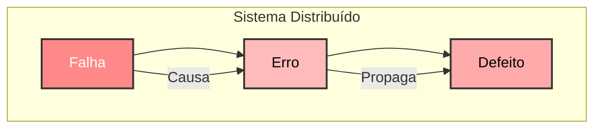
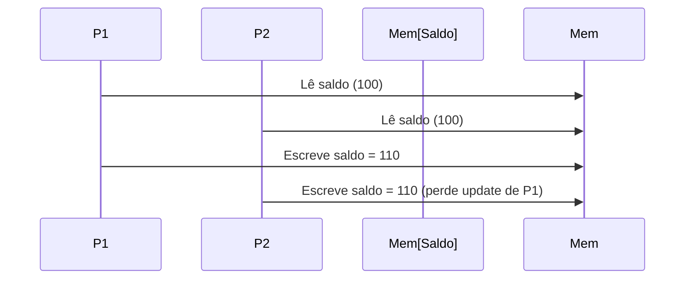
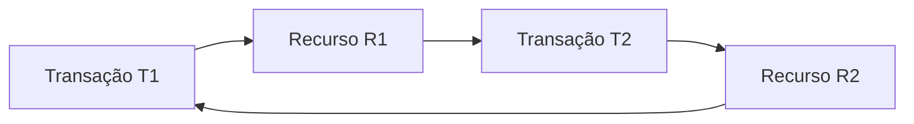
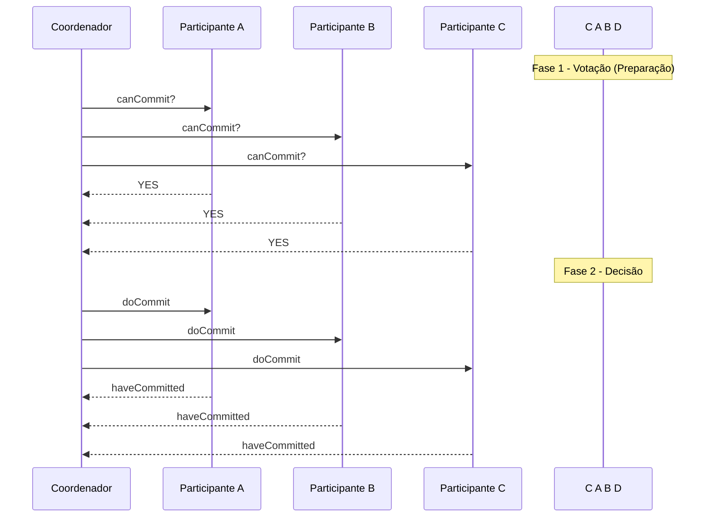
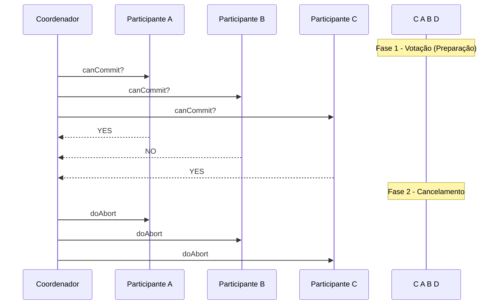

---

<Toc columns="1" maxDepth="1"></Toc>

---
layout: image-right
image: /intro.png
alt: Introdução
background-size: 100%
---

# Introdução

[Ubiquitous](https://translate.google.com/?sl=pt&tl=en&text=Computa%C3%A7%C3%A3o%20Ub%C3%ADqua%3A%0ANuvens%2C%20IoT%20e%20Ambientes%20Inteligentes&op=translate) Computing, Clouds, IoT e Smart Environments

A disciplina Ubiquitous Computing: Clouds, IoT e Smart Environments investiga os fundamentos, arquiteturas e desafios dos sistemas distribuídos modernos que integram computação em nuvem, dispositivos inteligentes e ambientes pervasivos. A proposta é entender como tecnologias invisíveis mas onipresentes moldam a maneira como interagimos com o mundo digital, proporcionando conectividade contínua, processamento descentralizado e ambientes responsivos que se adaptam às necessidades dos usuários de forma dinâmica e inteligente.

---
layout: image-right
image: /markweiser.jpg
alt: Mark Weiser
---

## Ubiquitous Computing (Computação Ubíqua) {style="color: green;"}

O conceito definido por Mark Weiser nos anos 1990 de computação ubíqua se refere a uma visão onde a tecnologia está presente em todos os lugares de forma invisível e integrada ao ambiente, sendo que a interação entre usuários e dispositivos é fluida, intuitiva e contextual.

  - Dispositivos pequenos e integrados no ambiente (ex.: sensores, atuadores).
  - Processamento distribuído e descentralizado.
  - Sem a necessidade de interação explícita com dispositivos.
  - Assistentes virtuais. Tecnologias vestíveis.


<!--
How did Mark Weiser define ubiquitous computing?
He is often referred to as the father of ubiquitous computing. He coined the term in 1988 to describe a future in which invisible computers,
embedded in everyday objects, replace PCs. Other research interests included garbage collection, operating sys- tems, and user interface design.
-->

---
layout: two-cols
---

## Cloud Computing (Computação em Nuvem) {style="color: green;"}

É um modelo de computação que fornece acesso sob demanda a recursos de TI, como hardware e software, através da Internet.

- Elasticidade: Recursos são alocados e liberados dinamicamente.
- Pagamento por uso: Custos são proporcionais ao consumo.
- Escalabilidade: Suporte a cargas de trabalho variáveis.

::right::

E podem ser definidos como modelos de Serviço:

- IaaS (Infraestrutura como Serviço): Amazon EC2.
- PaaS (Plataforma como Serviço): Google App Engine.
- SaaS (Software como Serviço): Gmail, Microsoft 365.

Futuramente AIS (Artificial Intelligence Services?)


---
layout: two-cols
---

## Internet of Things (IoT) {style="color: green;"}

A IoT conecta objetos físicos à Internet, permitindo que coletem, processem e troquem dados automaticamente. Cada dispositivo na IoT possui um identificador único e está equipado com sensores e atuadores.

- Conectividade: Integração de dispositivos através de redes.
- Sensores: Coleta de dados em tempo real.
- Automação: Respostas baseadas em eventos, sem intervenção humana.

::right::


<!--
#IOT

Casas inteligentes (lâmpadas e termostatos conectados).
Agricultura de precisão (sensores para monitorar umidade e nutrientes do solo).
Saúde conectada (dispositivos médicos inteligentes).
-->

---
layout: two-cols
---

## Smart Environments (Ambientes Inteligentes) {style="color: green;"}

São ambientes físicos equipados com tecnologia IoT e computação ubíqua, projetados para melhorar a qualidade de vida e a eficiência por meio de automação e interatividade.

- Integração: Sensores, dispositivos e softwares atuando juntos.
- Inteligência: Capacidade de aprender com dados e adaptar-se ao comportamento dos usuários.
- Automação: Controle automático de dispositivos para otimizar recursos e facilitar tarefas.


::right::


<!--
#Environments

Smart Homes: Casas que ajustam automaticamente luz, temperatura e segurança.
Cidades Inteligentes (Smart Cities): Gerenciamento eficiente de tráfego, energia e resíduos.
Hospitais Inteligentes: Monitoramento remoto de pacientes e gestão automatizada de medicamentos.
-->


---
layout: image-right
image: /einica.webp
alt: Eniac 1946
---

# Um pouco de história

- 1945 ... ~1985
- Computação centralizada
- Computadores grandes e caros
- Já existiam sistemas com distribuição de
processamento
  - Múltiplos processadores
  - Basicamente de controle centralizado
- Baixa (nenhuma) interação e conectividade

<!--
Criado pelos engenheiros John Eckert e John Mauchly na Universidade da Pensilvânia durante os anos de 1937-1943, o ENIAC tinha como objetivo principal computar dados balísticos de artilharia em altas velocidades para ajudar as tropas aliadas na Segunda Guerra Mundial. No entanto, o ENIAC só foi concluído após o fim da guerra, sendo então utilizado nos primeiros anos da Guerra Fria, tendo contribuído para o projeto da bomba de hidrogênio.[6]

O ENIAC pesava cerca de 30 toneladas e ocupava cerca de 180m², ele era tão grande que tinha de ser disposto em U com três painéis sobre rodas, para que os operadores pudessem se mover em torno dele. Foram gastos cerca de US$ 500 000,00 em sua construção.
-->

---
layout: two-cols
---

## Evolução

Durante esse período aconteceu uma evolução tecnológica sem precedentes com mudanças radicais
- ↑ capacidade de processamento
- ↓ Custo ($)

O que gerou uma evolução continua
- ↑ Capacidade de processamento e desempenho
de redes
- ↓ Custos

::right::

Durante a década de 1980 um novo conceito surgiu.
- Redes de computadores (locais)
  - Facilitar a comunicação entre computadores
- Microprocessadores → PC
  - Aumento no número de computadores

Já no início dos anos 90
- Sistemas abertos
- Interoperabilidade

<!--
Sistemas abertos são aqueles projetados com base em padrões abertos e interoperáveis, permitindo que diferentes componentes, desenvolvidos por fornecedores distintos, trabalhem juntos de maneira integrada.
POSIX, TCP/IP, HTTP, LDAP, HTML, APIS

Ainda nos anos 90 teve início uma evolução das redes de larga escala.
- Redes públicas (governamentais)
- Internet
- Custo de conexão ↓
impulsionado pelos computadores pessoais.

| Finance and commerce              | eCommerce e.g. Amazon and eBay, PayPal, online banking and trading                              |
|-----------------------------------|-------------------------------------------------------------------------------------------------|
| The information society           | Web information and search engines, ebooks, Wikipedia; social networking: Facebook and MySpace. |
| Creative industries and education | online gaming, music and film in the home, user-generated content, e.g. YouTube, Flickr         |
| Healthcare                        | health informatics, on online patient records, monitoring patients                              |
| Education                         | e-learning, virtual learning environments; distance learning                                    |
| Transport and logistics           | GPS in route finding systems, map services: Google Maps, Google Earth                           |
| Science                           | The Grid as an enabling technology for collaboration between scientists                         |
| Environmental management          | sensor technology to monitor earthquakes, floods or tsunamis                                    |
-->

---


<Youtube id="b0b8YLRdUqw" width="100%" height="100%"/>

<!--
Desenhar arquitetura
clientes > patch server
clientes > login server
login server > proxy servers
proxy servers > world server
world server > synch server
world server > game servers
proxy servers > game servers
synch server >  database
-->


---
layout: two-cols-header
---

::left::

Coulouris
COULOURIS, G.; DOLLIMORE, J.; KINDBERG, T.; BLAIR, G. Sistemas Distribuídos: Conceitos e Projeto. 5. ed. São Paulo: Pearson, 2013.


::right::

Tanenbaum
TANENBAUM, A. S.; VAN STEEN, M. Distributed Systems: Principles and Paradigms. 4. ed. Upper Saddle River: Pearson Prentice Hall, 2023.


---
layout: two-cols
---

# Definição de Sistemas distribuídos

-  Tanembaum
> “... is a collection of independent computers
  that appear to the users of the system as a
  single computer.”

-  Coulouris
> “... hardware or software components located
  at networked computers communicate and
  coordinate their actions only by passing
  messages.”

::right::

Os principais desafios dos sistemas distribuídos atuais estão:

- Sistemas abertos
- Heterogeneidade
- Segurança
- Escalabilidade
- Tratamento de falhas
- Concorrência
- Transparência
- Qualidade de serviço


---
layout: two-cols
---

## Concorrência

- É a regra, serialização é exceção
- Vários usuários em múltiplos processadores
- Deve-se manipular recursos compartilhados
- Inexistência de relógio global
- Para cooperar é necessário coordenação
- Limites relacionados a precisão da sincronização
- Não há noção única e global do tempo
- Falhas independentes
  - Falhas são inevitáveis. Responsabilidade dos programadores
  - Falhas em rede: isolamento, dificuldade de diferenciação

::right::

## Qualidade

- Principais propriedades não funcionais
  - Confiabilidade
  - Segurança
  - Desempenho
- Aspectos importantes na qualidade de serviço
  - Adaptatividade: atender sistemas variáveis
  - Disponibilidade: de recursos
- Aplicativos manipulam informações em relação ao tempo
  - QoS → satisfazer os prazos finais

---
layout: two-cols
---

## Compartilhamento de recursos

- Usuários estão acostumados com o
compartilhamento de recursos
  - Impressoras, arquivos, mecanismos de busca, …
- Hardware: redução de custos
- O foco maior são nas abstrações de mais alto nível
  - Informações necessárias ao trabalho, aplicações ou atividades sociais
- Padrões de compartilhamento variam
  - Acesso a busca na web
  - Trabalho colaborativo apoiado por computadores

::right::

- O termo “serviço” utilizado como parte um sistema computacional que gerencia recursos
  - Serviço de sistema de arquivos
  - Serviço de impressão
  - Serviço de pagamento eletrônico

- Acesso ao serviço:
  - Operações que ele fornece (exporta)
  - Leitura, escrita, exclusão (caso de arquivos)
  - Recursos ficam encapsulados dentro de computadores
    - Acessíveis de outros
    - Por uma interface de comunicação

---

## Sistemas abertos

- Pode ser estendido ou reimplementado
- Compartilhamento de recursos
  - Disponibilizados a vários clientes
- Especificação das interfaces publicadas
  - Disponíveis
  - RFC (ietf), W3C ...
- Sistemas distribuídos abertos
  - Projetados com padrões públicos
  - Comunicação uniforme
- Uso de hardware ou software heterogêneo
  - Independência de fornecedores


---
layout: two-cols
---

## Heterogeneidade

- Rede
- Hardware
- Sistemas
- Operacionais
- Linguagem de programação
- Implementações
- Representação de dados

::right::

- Middleware:
  - Camada de software
  - Mascara heterogeneidade
  - Modelo computacional uniforme
- Migração/mobilidade código
  - Programas transferidos, executados em outro local
  - Máquinas virtuais de processo (JVM, CLR)
  - Javascript

---
layout: two-cols
---

## Segurança

- Enviar dados sigilosos, em uma ou mais mensagens de forma segura
- Informações compartilhadas de alto valor
  - Confidencialidade: acessos autorizados
  - Integridade: alteração dos dados
  - Disponibilidade: interferência de acesso
  - Autenticidade: é realmente quem diz ser
- Desafios em aberto
  - Deny of services (ataque)
  - Segurança de código móvel

::right::

## Escalabilidade

- Funcionamento efetivo e eficaz em escalas diferentes de componentes
  - Rede local, Intranet, Internet …
- Escalável: permanece eficiente
  - Aumento significativo de recursos ou usuários
- Desafios de projeto: para crescer
  - Controlar o custo de acesso aos recursos: replicação
  - Controlar a perda (gargalo) de desempenho
    - Estruturas e algoritmos hierárquicos ou descentralizados
  - Impedir que os recursos se esgotem: IPv6

---


<!--
https://growthchart.weebly.com/
-->

---
layout: two-cols
---

## Tratamento de Falhas

- Falhas em sistemas distribuídos: parciais
  - Particularmente difíceis
- Detecção de falhas
  - Gerenciar a ocorrência de falhas que não podem ser detectadas, Algumas podem ser detectadas: checksum
- Mascaramento de falhas: Retransmissão de mensagem ou armazenamento replicado
- Tolerância a falhas: fornecer o serviço na presença de falhas
  - Timeout de webserver
- Recuperação de falhas: projetar software que possa
  - Recuperar o estado de dados permanentes: rollback

::right::

## Redundância

- Regra para tornar serviços tolerantes a falhas
  - Existir mais de uma rota para comunicação
  - Replicação de tabelas, componentes de hardware ou bancos de dados
- Sistemas distribuídos: alto grau de disponibilidade em falhas de hardware
  - Grande redundância


---
layout: two-cols
---

## Concorrência

- Suporte a concorrência por meio de processos ou threads concorrentes
- Acesso compartilhado a vários recursos
  - Controle de acesso e conteúdo?
- Recursos num SD devem ser projetados para operarem de forma segura
  - Prever os casos
  - Impedir perda de recursos por acessos compartilhado

::right::

## Transparência

- Ocultar a separação dos componentes de um sistema distribuído
  - Sistema deve ser percebido como um todo e não uma coleção de recursos
  - Usuários finais ou programadores de aplicativos
- A transparência possui grande influência sobre o projeto do software num sistema distribuído

---

# Modelos Físicos

Segunda Aula

No contexto de Sistemas Distribuídos, os modelos físicos representam a base concreta sobre a qual os sistemas são implementados. os modelos físicos descrevem explicitamente os componentes físicos envolvidos, computadores, servidores, dispositivos móveis, sensores embarcados e outros hardwares bem como os meios de comunicação que interconectam esses elementos, por exemplo redes locais (LANs), redes geograficamente distribuídas (WANs), redes sem fio e a própria Internet.

- Descrição explícita do sistema: **hardware**, computadores, dispositivos móveis e embarcados
- Redes de interconexão para troca de mensagens
- Busca abstrair detalhes específicos, definindo um modelo físico mínimo
- **Classificações:**
  - Sistemas Distribuídos Primitivos
  - Sistemas Distribuídos Adaptados para a Internet
  - Sistemas Distribuídos Contemporâneos
  - Sistemas Distribuídos de Sistemas

---

## Sistemas Distribuídos Primitivos

- Surgiram no final dos anos 70 e início dos 80
- Redes locais (Ethernet) com conectividade limitada com a Internet
- Serviços básicos: compartilhamento de impressoras, arquivos, e-mail e transferência de arquivos
- Geralmente sistemas homogêneos com qualidade de serviço primitiva

---

## Sistemas Distribuídos Adaptados para a Internet

- Evolução dos modelos primitivos (anos 90)
- Expansão com o crescimento da Internet (ex.: Google em 1996)
- Sistemas em maior escala, com nós interconectados globalmente
- Aumento da heterogeneidade: hardware, SO, linguagens e middleware
- Ênfase em padrões abertos e serviços web


---

## Sistemas Distribuídos Contemporâneos

- Evolução dos modelos anteriores
- Impulsionados pela computação móvel e pervasiva/ubíqua e em nuvem
  - Computação Móvel
  - Computação Pervasiva/Ubíqua
  - Computação em Nuvem
- Sistemas distribuídos verdadeiramente globais e heterogêneos
- Smart Environment

---

### Computação Móvel

Acesso a informações de todos os lugares e a qualquer momento com “Computadores” compactos portados de forma prática pelo usuário.
Parciptíveis ao usuário, sempre presente algumas vezes coletando informações do ambiente relevantes ao usuário.


---

### Computação Pervasiva

É um paradigma de sistemas distribuídos no qual os dispositivos computacionais se integram de maneira invisível e
onipresente ao ambiente, permitindo que serviços e informações estejam disponíveis a qualquer hora e em qualquer lugar.

Em outras palavras, essa abordagem busca tornar a tecnologia parte do cotidiano, com uma rede heterogênea de sensores
 e dispositivos que se comunicam de forma transparente, suportando mobilidade, escalabilidade e interoperabilidade
 sem que o usuário precise gerenciar explicitamente os recursos computacionais.

- Meios de computação estão distribuídos pelo ambiente
  - Perceptíveis ou não aos usuários
  - Extração de informações detalhadas do ambiente
- Utiliza as informações para construir modelos computacionais
  - Configurar, controlar e ajustar aplicações
  - Atender as necessidades de um dispositivo ou usuário
- Ambiente povoado de sensores, computação e aplicações
  - Detectar a existência e interagir com outros integrantes

---
layout: image
image: /comp_pervasiva.png
background-size: contain
---

---

### Computação Ubíqua

Com ideia de tornar a interação homem computador invisível e ou imperceptível, sendo uma união da computação móvel com a pervasiva {style="color: green;"}.

Termo criado por Mark Wiser (1998) Artigo: “The Computer for 21 Century” para a Scientifc American (1991)

> “The most profound technologies are those that disappear. They weave themselves into the fabric of everyday life until they are indistinguishable from it.”

<br>

- Mobilidade
- Presença distribuída
- Imperceptível
- Inteligente
- Altamente integrada fisicamente
- Interoperabilidade espontânea

---
layout: two-cols-header
---

#### Pervasiva

- Difundida em toda parte
- Orientada a tecnologia
- Computadores e dispositivos móveis

::right::

#### Ubíqua

- Computação em qualquer lugar
- Orientado a usuário ou aplicação
- Uso de dispositivos em geral

---

### Redes de Sensores

São parte da tecnologia que habilita a computação pervasiva/ubíqua

- Usadas para processar informações
  Fazem mais que apenas a comunicação, identificando variáveis do sistema, informações do ambiente, mudanças
- Equipados com dispositivo(s) de sensoriamento
- Ligados por rede sem fio (em geral)
- Recursos limitados: uso eficiente
- Aplicações de medição e vigilância


---

### Clusters e Grids

Relacionados para a computação de alto desempenho, podendo fornecer paralelismo de tarefas

#### Cluster

- Processamento paralelo e distribuído
- Cluster (Network of Workstations)
- Máquinas homogêneas, mesmo SO, rede estável e de alto desempenho
- SSI (Single System Image), facilita gerenciamento de máquinas homogêneas com o mesmo sistema operacional e interconexão estável

<br>

#### Grids (Grades)

- Máquinas heterogêneas: arquitetura, SO, rede, ...
- Podem possuir vários domínios administrativos
- Cluster de cluster

<!--
Em sistemas distribuídos, os grids (ou grades) consistem em uma infraestrutura que integra recursos computacionais
heterogêneos, os quais podem estar espalhados por diferentes locais e sob múltiplos domínios administrativos.
Ao contrário dos clusters, que normalmente reúnem máquinas homogêneas com mesmo sistema operacional e configurações
 similares, os grids agregam nós com arquiteturas, sistemas operacionais e recursos variados, funcionando como um
 "cluster de clusters". Essa abordagem possibilita a execução de aplicações de alta demanda computacional,
 aproveitando a capacidade total dos recursos disponíveis, enquanto oculta a complexidade inerente à sua
 heterogeneidade e distribuição física. Em outras palavras, os grids oferecem uma visão unificada dos recursos,
  facilitando o gerenciamento e a execução de tarefas que exigem alto desempenho e escalabilidade.
-->


---

## Sistemas Distribuídos de Sistemas (System-of-Systems)

Sistemas Distribuídos de Sistemas, ou System-of-Systems (SoS), representam uma evolução dos sistemas distribuídos tradicionais, em que vários sistemas autônomos, heterogêneos e distribuídos são interconectados e cooperam para atingir objetivos comuns, mantendo certa independência operacional. Essa abordagem é comum em contextos modernos como cidades inteligentes, ambientes industriais, sistemas de transporte, saúde digital e defesa.

- Autonomia dos Sistemas Componentes
- Abordam sistemas ultra em larga escala (Ultra Large Scale)
- Distribuição Física e Lógica
- Sistemas complexos
- Dinamicidade e Evolução
- Sinergia Funcional
- Exemplo: gerenciamento ambiental para enchentes integrando sensores, clusters, grids e computação móvel

<!--
Autonomia dos Sistemas Componentes
Cada sistema integrante de um SoS é completo e funcional por si só, com seus próprios objetivos, políticas e mecanismos de controle. Eles podem operar de forma independente, mesmo fora do contexto colaborativo do SoS.

Distribuição Física e Lógica
Os sistemas componentes estão fisicamente dispersos e interagem via redes, formando uma estrutura altamente distribuída com múltiplas camadas e tecnologias.

Heterogeneidade Tecnológica
Diferentes sistemas podem utilizar plataformas, linguagens, protocolos e arquiteturas distintas, exigindo integração por meio de middleware, APIs e padrões abertos.

Dinamicidade e Evolução
Sistemas podem entrar ou sair do SoS dinamicamente, e a configuração do conjunto pode mudar com o tempo — o que exige tolerância a mudanças e mecanismos de adaptação.

Sinergia Funcional
A união dos sistemas proporciona capacidades que nenhum deles teria isoladamente, promovendo funcionalidades mais ricas, escaláveis e adaptativas.
-->

---

| **Sistemas Distribuídos** |           **Primitivos**           |                   **Adaptados para Internet**                   |                                             **Contemporâneos**                                            |
|:-------------------------:|:----------------------------------:|:---------------------------------------------------------------:|:---------------------------------------------------------------------------------------------------------:|
|         **Escala**        |              Pequenos              |                             Grandes                             |                                                Utragrandes                                                |
|    **Heterogeneidade**    | Limitada, relativamente homogêneas | Significativa em termos de plataformas, linguagens e middleware |          Maiores dimensões introduzidas incluindo estilos de arquitetura radicalmente diferentes          |
|    **Sistemas Abertos**   |          Não é prioridade          |   Prioridade significativa, com introdução de diversos padrões  |  Grande desafio para a pesquisa, com os padrões existentes ainda incapazes de abranger sistemas complexos |
|  **Qualidade de Serviço** |            Em seu início           |   Prioridade significativa, com introdução de vários serviços   | Grande desafio para a pesquisa, com os serviços existentes ainda incapazes de abranger sistemas complexos |

---
layout: two-cols
---

# Modelos de Arquitetura para Sistemas Distribuídos

- Estrutura baseada em **componentes** e suas inter-relações

Divisão em:

- **Elementos:** Como as entidades se comunicam, suas funções e localização
- **Padrões de Arquitetura:** Organizam camadas lógicas e físicas, clientes leves e serviços web
- **Middleware:** Abstrai e integra diferentes tecnologias e plataformas

::right::

## Elementos de Arquitetura

- **Entidades:** Processos, threads, objetos, componentes e serviços web
- **Paradigmas de Comunicação:**
  - Direta: requisição-resposta e invocação remota
  - Indireta: comunicação em grupo, publish-subscribe, filas de mensagens, espaços de tupla
- Importância do mapeamento físico das entidades para desempenho e confiabilidade

<!--
pag 42
Sistemas Distribuídos, Conceitos e Projeto
Entidades em comunicação
-->

---

### Entidades em comunicação

No contexto de modelos de arquitetura para sistemas distribuídos, uma das primeiras decisões de projeto é identificar quais entidades irão interagir e como essa interação será realizada.

Segundo Coulouris, as entidades ativas que compõem um sistema distribuído são processos executando em diferentes dispositivos, que se comunicam por meio de troca de mensagens. Essas entidades podem ser modeladas de várias formas, com diferentes níveis de abstração.

<br>

1. Processos
  - Unidade básica de execução em um sistema.
  - Podem representar uma aplicação completa ou uma parte dela.
  - Cada processo pode conter múltiplas threads para execução concorrente.
  - Em sistemas distribuídos, processos normalmente estão em máquinas diferentes e se comunicam por rede.

  > Coulouris destaca que processos em diferentes hosts não compartilham memória, por isso dependem exclusivamente da comunicação via mensagens.

---

2. Objetos Distribuídos
  - Extensão do modelo de objetos para sistemas distribuídos.
  - Cada objeto possui estado e métodos, e pode ser invocado remotamente (ex: Java RMI *remote method invocation*).
  - Necessitam de uma Interface de Definição de Objeto (IDL), que descreve os métodos disponíveis para acesso remoto.

3. Componentes
  - Mais flexíveis que objetos tradicionais.
  - Expõem interfaces explícitas e podem ser dinamicamente ligados/desligados.
  - Utilizados em arquiteturas baseadas em componentes distribuídos (ex: CORBA, COM+).
  - Possuem independência de linguagem e foco na reusabilidade.

4. Serviços Web (Web Services)
  - Entidades autônomas que oferecem funcionalidades acessíveis pela rede.
  - Utilizam padrões abertos (WSDL, SOAP, REST, etc).
  - Permitem interoperabilidade entre plataformas e linguagens distintas.
  - São componentes-chave em arquiteturas orientadas a serviços (SOA).
<!--
    Exemplo: Um servidor RMI com o método getTemperature() pode ser acessado remotamente por um cliente.

    Em sistemas distribuídos, entidades em comunicação são as partes ativas do sistema que interagem por troca de mensagens. Elas podem ser modeladas como processos, objetos, componentes ou serviços, conforme o nível de abstração e o paradigma arquitetural adotado. Cada modelo tem implicações em desempenho, escalabilidade e interoperabilidade.
-->

---
layout: two-cols
---

### Paradigmas de Comunicação

São os modelos abstratos que definem como entidades em um sistema distribuído interagem entre si por meio de mensagens. Eles variam quanto ao nível de acoplamento, flexibilidade, direcionamento da mensagem, entre outros aspectos.

::right::

- **Comunicação entre processos**
  - Baixo nível de suporte
  - API para programação de sockets
- **Requisição-Resposta:**
  - Cliente envia solicitação, servidor processa e responde
- **Invocação Remota:**
  - RPC (Remote Procedure Call) e RMI (Remote Method Invocation)
- **Comunicação Indireta:**
  - Uso de filas, publish-subscribe, espaços de tupla e memória compartilhada distribuída
  - Desacoplamento espacial e temporal


---

#### Comunicação entre processos (Process-to-Process Communication)

Também chamado de IPC (*InterProcess Communication*) é o paradigma mais baixo nível.

- CoulourisRequer que os processos saibam explicitamente onde o outro está (endereços e portas).
- É o paradigma mais primitivo, baseado em troca direta de mensagens entre processos.
- Usa APIs de sockets (ex: TCP, UDP) para envio e recebimento de dados.
- Tem baixo nível de abstração, exigindo maior controle do programador.
- Exemplo: comunicação entre dois serviços por TCP/IP.


---
layout: two-cols
---

#### Requisição-Resposta

- Padrão para troca de mensagens em interação cliente-servidor
- Fluxo:
  - Cliente solicita
  - Servidor processa e responde
- Primitivo usado onde o desempenho é fundamental (ex.: HTTP)
- Aplicável tanto na comunicação entre processos quanto em invocação remota

::right::

#### Invocação Remota (*Remote Invocation*)

- **Remote Procedure Call (RPC):**
  - Inovação que permite chamar processos (*ou máquinas*) remotos como se fossem locais
  - O sistema oculta o processo de troca de mensagens
- **Remote Method Invocation (RMI):**
  - Similar ao RPC, mas voltado para objetos
- Invocação Remota


---
layout: two-cols
---

#### Comunicação Indireta

- **Comunicação em Grupo:**
  - Envio de mensagem de um para vários
  - Abstração que permite ingresso e envio sem conhecer os destinatários
  - Registro de membros e identificação de falhas
- **Publish-Subscribe:**
  - Produtores/publicadores disseminam eventos
  - consumidores/assinantes recebem via serviço intermediário
  - Reagem a eventos

::right::

#### Comunicação Indireta

- **Filas de Mensagens:**
  - Mensagens são enviadas para uma fila; o receptor retira quando desejar
- **Espaços de Tupla:**
  - Inserção de informações estruturadas em espaços compartilhados e persistentes
  - Retirada das informações quando leitores quiserem
- **Memória Compartilhada Distribuída:**
  - Abstrai o compartilhamento de memória entre processos sem memória física compartilhada
  - Alto nível de transparência


---


| Paradigma             | Acoplamento Espacial | Acoplamento Temporal | Comunicação | Exemplo                    |
| --------------------- | -------------------- | -------------------- | --------------- | -------------------------- |
| Comunicação direta    | Alto                 | Alto                 | Direta          | Sockets (TCP/UDP)          |
| Invocação remota      | Médio                | Alto                 | Direta          | RPC, RMI, gRPC             |
| Publish/Subscribe     | Baixo                | Baixo                | Indireta        | MQTT, Kafka, ROS           |
| Filas de mensagem     | Baixo                | Baixo                | Indireta        | RabbitMQ, AWS SQS          |
| Tuple Spaces          | Baixo                | Baixo                | Indireta        | JavaSpaces, Linda          |
| Memória compartilhada | Baixo                | Variável             | Indireta        | TreadMarks, DSM frameworks |

<!--
| Paradigma            | Acoplamento | Abstração | Exemplos            | Vantagem                             |
| -------------------- | ----------- | --------- | ------------------- | ------------------------------------ |
| Comunicação direta   | Alto        | Baixa     | Sockets TCP/UDP     | Controle direto                      |
| Invocação remota     | Médio       | Média     | RPC, RMI, gRPC      | Facilidade de uso                    |
| Comunicação indireta | Baixo       | Alta      | MQ, Pub/Sub, Tuplas | Escalabilidade e tolerância a falhas |

“Cada paradigma oferece um trade-off entre acoplamento, desempenho e complexidade. Arquitetos de sistemas devem escolher com base nas necessidades da aplicação e no ambiente distribuído em que ela está inserida.”

-->


---

## Entidades e Paradigmas de Comunicação


---
layout: two-cols
---

## Funções e Responsabilidades

- O estilo das funções é fundamental para a arquitetura global
- **Estilos básicos:**
  - **Cliente/Servidor:**
    - Mais citado na literatura, porém com desafios de escalabilidade
  - **Peer-to-Peer:**
    - Todos os nós com funções equivalentes, interagindo cooperativamente
    - Boa escalabilidade

::right::

### Cliente/Servidor

O cliente faz requisições e consome serviços.
O servidor processa as requisições e fornece recursos ou serviços.

Esse modelo é amplamente utilizado na internet, sendo a base para serviços como websites, e-mails, bancos de dados e aplicações em nuvem.

- Servidores podem atuar como clientes de outros servidores
  - Exemplo: Servidor Web acessa um servidor de arquivos local ou serviços DNS
- A interação pode ocorrer em múltiplos níveis

---

#### Tipos de Arquitetura Cliente-Servidor

**Arquitetura de 2 camadas (Two-tier)**
- Cliente comunica-se diretamente com o servidor.
- Exemplo: um aplicativo acessando diretamente um banco de dados.

**Arquitetura de 3 camadas (Three-tier)**

- Introduz uma camada intermediária (servidor de aplicação) para processar lógica de negócios.
- Exemplo: um site que acessa um servidor de aplicação, que por sua vez consulta um banco de dados.

**Arquitetura de N camadas (Multi-tier)**

- Divide os serviços em várias camadas (frontend, backend, banco de dados, etc.).
- Exemplo: sistemas de grande porte como Amazon e Google, onde há múltiplos servidores para diferentes funções.


---
layout: two-cols
---

#### Cliente-Servidor: Cliente

- Envia requisições ao servidor
  - Ativo: inicia o fluxo de processamento
  - Objetivo: consultar ou alterar o estado do recurso
- Geralmente reside em nodo diferente do servidor
- Fluxo:
  - Envia requisição → Aguarda retorno → Lê e processa resposta

::right::

#### Cliente-Servidor: Servidor

- Mantém o recurso a ser acessado (arquivos, BD, impressora, etc.)
- Reage a pedidos de processamento
- Geralmente reside no mesmo nodo do recurso
- Fluxo:
  - Ouve uma porta → Aceita conexões → Processa requisições → Devolve resposta


<!--
Exemplo API
-->

---
layout: two-cols
---

#### Vantagens

- Centralização do controle → O servidor gerencia os recursos e a segurança.
- Facilidade de manutenção → Atualizações ocorrem no servidor, sem necessidade de alterar todos os clientes.
- Segurança → Controle de acesso mais rigoroso e dados protegidos no servidor.

::right::

#### Desvantagens

- Ponto único de falha → Se o servidor falha, todos os clientes são afetados.
- Carga no servidor → Um grande número de clientes pode sobrecarregar o servidor.
- Menos escalável que P2P → Dependendo da infraestrutura, pode ter dificuldades em lidar com milhões de conexões simultâneas.


---
layout: two-cols
---

### Peer-to-Peer (P2P)

A arquitetura Peer-to-Peer (P2P) é um modelo de comunicação em sistemas distribuídos onde os participantes (nós) atuam como pares (peers), sem distinção rígida entre clientes e servidores.
- Nos sistemas P2P, os nós executam funções semelhantes
- Interagem cooperativamente
- Podem ser fornecedores ou consumidores de recursos
- A comunicação depende da aplicação (ex.: bitTorrent)
- Importância na implementação dos algoritmos para distribuição e recuperação de recursos

::right::

Cada nó pode funcionar tanto como fornecedor quanto como consumidor de recursos. O P2P distribui a carga entre os próprios participantes.

- Descentralização: Em redes P2P puras, não há um servidor central que coordena a comunicação. Distribuição de armazenamento, processamento e comunicação
- Escalabilidade: Como os nós compartilham recursos entre si, a rede pode crescer facilmente sem sobrecarregar um único ponto.
- Autonomia e Dinamismo: Os peers podem entrar e sair da rede livremente, tornando a arquitetura altamente adaptável.
- Tolerância a Falhas: Se um nó falha, outros podem assumir suas funções sem impactar toda a rede.


---
layout: two-cols
---

### Peer-to-Peer | Vantagens e Desvantagens

- **Vantagens:**
  - Alta disponibilidade de recursos
  - Tolerância a falhas
  - Custo-benefício
  - Autonomia e dinamismo
  - Distribuição de carga
- **Desvantagens:**
  - Gerenciamento complexo (dificuldade de coordenar os peers)
  - Problemas de segurança (como compartilhamento não autorizado e vulnerabilidades abertas)
  - Qualidade de serviço variável (dependendo da conectividade dos peers)

::right::

### Arquiteturas P2P peer to peer

- **Puras:**
  - Todos os nodos são peers iguais (sem autoridade central)
- **Híbridas:**
  - Pelo menos um servidor central para facilitar a interconexão
- **Super-Peer:**
  - Nós com maior capacidade atuam como intermediários

---

<!-- Slide 39: p2p Puras -->
#### p2p Puras

- Possibilidade de remoção de um peer sem grandes problemas
- Cada peer mantém sua própria lista de peers vizinhos
  - Mensagens são retransmitidas até se obter resultado ou condição de parada

---

#### p2p Puras | Comunicação


---
layout: two-cols
---

#### p2p Híbridas

- Existência de pelo menos um servidor central:
  - Atua como terminal de roteamento (estático ou dinâmico)
  - Facilita a interconexão entre peers
- Maior parte do processamento ocorre entre os peers

::right::

Existência de pelo menos 1 servidor central

- Atua como terminal de roteamento
- Pode ser estático ou dinâmico
- Facilitar a interconexão
- Maior parte do processamento entre os peers

---

#### p2p Híbridas | Comunicação


---

<!-- Slide 43: p2p Super-Peer -->
#### p2p Super-Peer

- **Super-Peers:**
  - Recebem conexões dos peers e guardam informações
  - Atuam como intermediários entre os peers
  - Interconectados da forma p2p pura
- **Peers:**
  - Entram na rede através de conexão
  - Upload da lista de recursos compartilhados
  - Podem conectar-se a mais de um super-peer

---

#### p2p Super-Peer | Comunicação


---
layout: two-cols
---

## Localização (Posicionamento)

Localização (Posicionamento) refere-se ao modo como as entidades (processos, servidores, componentes) são mapeadas na infraestrutura física do sistema distribuído. Esse posicionamento é essencial para determinar propriedades-chave, como:

- Desempenho: A latência e o tempo de resposta são impactados pelo posicionamento físico dos recursos computacionais.
- Confiabilidade: A replicação e a redundância dos servidores ajudam a aumentar a tolerância a falhas.
- Segurança: A localização dos componentes pode influenciar a exposição a ataques e vulnerabilidades.

::right::

### Modelos de Posicionamento
O material lista quatro modelos principais para definir como os recursos e processos são distribuídos em um sistema distribuído:

  - Múltiplos servidores
  - Uso de cache e proxy server
  - Código móvel
  - Agentes móveis

---
layout: two-cols
---

### Múltiplos Servidores

Um serviço pode ser distribuído entre vários servidores, permitindo balanceamento de carga e maior escalabilidade.

- Distribuir recursos entre servidores
- Manter réplicas
- Exemplos: Web, sistemas de diretório (LDAP), clusters

::right::

### Cache e Proxy Server

Técnicas que armazenam dados temporariamente para reduzir o tempo de acesso e a carga sobre os servidores centrais.

- Funciona como cache em CPUs: mantém uma cópia local
- Enquanto a cópia estiver válida, utiliza-a, caso contrário, busca na origem e armazena
- Exemplos: Browsers

---
layout: two-cols
---

### Proxy Server

Um Proxy Server é um intermediário entre um cliente e um servidor final. Ele pode ser usado para melhorar o desempenho, aumentar a segurança e otimizar a comunicação em sistemas distribuídos. No contexto dos modelos de localização em sistemas distribuídos, os servidores proxy desempenham um papel fundamental na caching de dados, na filtragem de conteúdo e na otimização do tráfego de rede.

- Focado no tráfego web
- Proxy server (web)
- Cache para um conjunto de máquinas
- Podem assumir outras funções: firewall
- SQUID

::right::

Dependendo do tipo de proxy, ele pode modificar, armazenar ou simplesmente retransmitir a solicitação.

1. O cliente faz uma requisição para um recurso (por exemplo, um site).
2. O proxy intercepta a requisição e verifica se já possui uma cópia local do recurso.
3. Se o recurso estiver em cache: O proxy o fornece diretamente ao cliente, reduzindo a latência e o consumo de banda.
4. Se o recurso não estiver em cache: O proxy solicita a informação ao servidor real e a armazena para futuras requisições.
5. O proxy retorna a resposta ao cliente.

---
layout: image
image: /types-of-proxy-server.png
---


---
layout: two-cols
---

1. **Forward Proxy (Proxy Direcionado)**
    - Atua entre um cliente interno e a internet.
    - Permite controle de acesso à internet e filtragem de conteúdo.
    - Exemplo: Empresas utilizam forward proxies para restringir o acesso a determinados sites.
2. **Reverse Proxy**
    - Atua entre um cliente externo e servidores internos.
    - Melhora a segurança ao ocultar os servidores reais e distribuir a carga de requisições.
    - Exemplo: Serviços como NGINX e Apache podem ser usados como reverse proxy para balanceamento de carga.

::right::

3. **Transparent Proxy (Proxy Transparente)**
    - O cliente não precisa configurar o proxy manualmente, pois ele intercepta as requisições automaticamente.
    - Usado por ISPs e empresas para filtrar tráfego sem que os usuários percebam.
4. **Proxy de Cache**
    - Armazena temporariamente recursos frequentemente acessados para reduzir latência e tráfego na rede.
    - Exemplo: O Squid Proxy é amplamente usado para caching de páginas web.
5. **Proxy de Segurança**
    - Filtra tráfego malicioso e protege usuários contra ataques.

<!--
 Forward proxy

A forward proxy sits in front of clients and is used to get data to groups of users within an internal network. When a request is sent, the proxy server examines it to decide whether it should proceed with making a connection.

A forward proxy is best suited for internal networks that need a single point of entry. It provides IP address security for those in the network and allows for straightforward administrative control. However, a forward proxy may limit an organization’s ability to cater to the needs of individual end-users.
Transparent proxy

A transparent proxy can give users an experience identical to what they would have if they were using their home computer. In that way, it is “transparent.” They can also be “forced” on users, meaning they are connected without knowing it.

Transparent proxies are well-suited for companies that want to make use of a proxy without making employees aware they are using one. It carries the advantage of providing a seamless user experience. On the other hand, transparent proxies are more susceptible to certain security threats, such as SYN-flood denial-of-service attacks.
Anonymous proxy

An anonymous proxy focuses on making internet activity untraceable. It works by accessing the internet on behalf of the user while hiding their identity and computer information.

A anonymous proxy is best suited for users who want to have full anonymity while accessing the internet. While anonymous proxies provide some of the best identity protection possible, they are not without drawbacks. Many view the use of anonymous proxies as underhanded, and users sometimes face pushback or discrimination as a result.
High anonymity proxy

A high anonymity proxy is an anonymous proxy that takes anonymity one step further. It works by erasing your information before the proxy attempts to connect to the target site.

The server is best suited for users for whom anonymity is an absolute necessity, such as employees who do not want their activity traced back to the organization. On the downside, some of them, particularly the free ones, are decoys set up to trap users in order to access their personal information or data.
Distorting proxy

A distorting proxy identifies itself as a proxy to a website but hides its own identity. It does this by changing its IP address to an incorrect one.

Distorting proxies are a good choice for people who want to hide their location while accessing the internet. This type of proxy can make it look like you are browsing from a specific country and give you the advantage of hiding not just your identity but that of the proxy, too. This means even if you are associated with the proxy, your identity is still secure. However, some websites automatically block distorting proxies, which could keep an end-user from accessing sites they need.
Data center proxy

Data center proxies are not affiliated with an internet service provider (ISP) but are provided by another corporation through a data center. The proxy server exists in a physical data center, and the user’s requests are routed through that server.

Data center proxies are a good choice for people who need quick response times and an inexpensive solution. They are therefore a good choice for people who need to gather intelligence on a person or organization very quickly. They carry the benefit of giving users the power to swiftly and inexpensively harvest data. On the other hand, they do not offer the highest level of anonymity, which may put users’ information or identity at risk.
Residential proxy

A residential proxy gives you an IP address that belongs to a specific, physical device. All requests are then channeled through that device.

Residential proxies are well-suited for users who need to verify the ads that go on their website, so you can block cookies, suspicious or unwanted ads from competitors or bad actors. Residential proxies are more trustworthy than other proxy options. However, they often cost more money to use, so users should carefully analyze whether the benefits are worth the extra investment.
Public proxy

A public proxy is accessible by anyone free of charge. It works by giving users access to its IP address, hiding their identity as they visit sites.

Public proxies are best suited for users for whom cost is a major concern and security and speed are not. Although they are free and easily accessible, they are often slow because they get bogged down with free users. When you use a public proxy, you also run an increased risk of having your information accessed by others on the internet.
Shared proxy

Shared proxies are used by more than one user at once. They give you access to an IP address that may be shared by other people, and then you can surf the internet while appearing to browse from a location of your choice.

Shared proxies are a solid option for people who do not have a lot of money to spend and do not necessarily need a fast connection. The main advantage of a shared proxy is its low cost. Because they are shared by others, you may get blamed for someone else’s bad decisions, which could get you banned from a site.
SSL proxy

A secure sockets layer (SSL) proxy provides decryption between the client and the server. As the data is encrypted in both directions, the proxy hides its existence from both the client and the server.

These proxies are best suited for organizations that need enhanced protection against threats that the SSL protocol reveals and stops. Because Google prefers servers that use SSL, an SSL proxy, when used in connection with a website, may help its search engine ranking. On the downside, content encrypted on an SSL proxy cannot be cached, so when visiting websites multiple times, you may experience slower performance than you would otherwise.
Rotating proxy

A rotating proxy assigns a different IP address to each user that connects to it. As users connect, they are given an address that is unique from the device that connected before it.

Rotating proxies are ideal for users who need to do a lot of high-volume, continuous web scraping. They allow you to return to the same website again and again anonymously. However, you have to be careful when choosing rotating proxy services. Some of them contain public or shared proxies that could expose your data.
Reverse proxy

Unlike a forward proxy, which sits in front of clients, a reverse proxy is positioned in front of web servers and forwards requests from a browser to the web servers. It works by intercepting requests from the user at the network edge of the web server. It then sends the requests to and receives replies from the origin server.

Reverse proxies are a strong option for popular websites that need to balance the load of many incoming requests. They can help an organization reduce bandwidth load because they act like another web server managing incoming requests. The downside is reverse proxies can potentially expose the HTTP server architecture if an attacker is able to penetrate it. This means network administrators may have to beef up or reposition their firewall if they are using a reverse proxy
-->

---

### Agentes Móveis
São programas que podem se mover de um computador para outro enquanto estão em execução, carregando consigo tanto código quanto dados. Essa característica permite que eles executem tarefas distribuídas, otimizando a comunicação e o acesso a recursos de forma eficiente.

- Autonomia: Podem operar de forma independente, sem necessidade de intervenção contínua do usuário.
- Mobilidade: Têm a capacidade de migrar entre diferentes sistemas para realizar suas tarefas.
- Interação: Podem se comunicar com outros agentes ou sistemas distribuídos.
- Adaptabilidade: Podem modificar seu comportamento de acordo com o ambiente no qual estão executando.
- Exemplo: Manutenção/instalação de software em ambientes controlados
  - Gerenciamento de sistemas: instalação ou atualização de software em redes corporativas.
  - Comércio eletrônico: comparação de preços em vários fornecedores.
  - Monitoramento distribuído: coleta de métricas em diferentes locais e retorno consolidado.

---
layout: two-cols
---

#### Vantagens

- Redução de tráfego de rede: Ao invés de transferir grandes volumes de dados entre servidores, o agente se desloca até o local onde a informação está armazenada, processa os dados e retorna apenas com os resultados relevantes.
- Eficiência no acesso a recursos: Permite realizar operações localmente, reduzindo latências de rede.
- Execução distribuída de tarefas: Agentes móveis podem ser utilizados para dividir e processar grandes volumes de informações em diferentes máquinas.

::right::

#### Desvantagens

- Riscos à segurança: Agentes móveis podem ser ameaças para os sistemas que visitam, podendo acessar dados não autorizados.
- Vulnerabilidade dos agentes: Eles mesmos podem ser comprometidos, impedindo a execução correta de suas tarefas ou sendo manipulados por terceiros.
- Mecanismos de proteção:
  - Identificação do emissor.
  - Definição clara dos recursos locais que o agente pode acessar.
  - Restrição de permissões do agente (sandboxing).
  - Autenticação e controle de acesso.
  - Uso de criptografia para proteger informações transportadas pelos agentes.


---
layout: two-cols
---

### Código Móvel

Nessa estratégia o cliente interage com o sistema(servidor) e faz download de um applet.

O código do applet é baixado e interpretado pelo cliente(mobile ou não), o usuário interage com o applet que se comunica com o servidor.

- Usuário armazena e executa código localmente
- Vantagens:
  - Boa resposta interativa (reduz atrasos de rede)
- Permite comunicação:
  - Servidor atua ativamente enquanto o cliente permanece reativo
- Exemplos: applets Java, JavaScript

::right::

Applets Java: trechos de código executados no navegador do cliente.
JavaScript no navegador: carregado de um servidor e executado localmente pelo usuário.
Scripts de automação enviados para servidores para execução local.
Plataformas IoT que atualizam dispositivos enviando apenas código necessário.

---

| Aspecto                | Código Móvel                                             | Agente Móvel                                                     |
| ---------------------- | -------------------------------------------------------- | ---------------------------------------------------------------- |
| **Estado de execução** | Não leva estado em andamento; inicia do zero no destino. | Carrega código, dados e **estado ativo**.                        |
| **Autonomia**          | Depende do controle externo.                             | Atua autonomamente.                                              |
| **Objetivo**           | Executar lógica específica no destino.                   | Realizar tarefa completa, possivelmente migrando por vários nós. |


---

## Padrões de Arquiteturas

Os padrões de arquitetura são baseados nos elementos de arquitetura dos sistemas distribuídos e fornecem estruturas recorrentes para melhorar o desempenho e a organização de sistemas. Eles não são soluções completas, mas ajudam a estruturar a solução de maneira eficiente.

- Baseados em elementos de arquitetura
- Fornecem estruturas recorrentes com bom desempenho em certas circunstâncias
- Não são soluções completas, mas aliados a outros padrões podem resultar em boas soluções
- Principais elementos:
  - Camadas lógicas
  - Camadas físicas
  - Clientes leves (Thin Clients)
  - Serviços Web

---
layout: two-cols
---

### Camadas Lógicas

Um sistema complexo é dividido em camadas, onde cada camada utiliza os serviços da camada inferior. Isso possibilita modularidade, facilidade de manutenção e escalabilidade.

- Relacionadas à abstração do sistema
- Um sistema complexo pode ser dividido em camadas:
  - Cada camada utiliza os serviços da inferior
  - As camadas superiores não conhecem os detalhes das inferiores

::right::


### Camadas Lógicas de Serviços | Plataforma

- Consistem das camadas de hardware e software de baixo nível
- Fornecem serviços implementados de formas variadas nos computadores
- Funcionam como interface do sistema, facilitando comunicação e coordenação

<!-- - Exemplos: x86/Windows, x86_64/Linux, ARM/Android, etc.-->

---
layout: two-cols
---

### Middleware

Segundo Coulouris, middleware é a camada de software que fica “entre” as aplicações e
 s sistemas subjacentes (como sistemas operacionais e redes), com o objetivo de ocultar
as diferenças e a heterogeneidade dos ambientes distribuídos.

Em outras palavras, ele fornece um
conjunto de serviços básicos como mecanismos de comunicação, coordenação e compartilhamento de dados
que permitem que os componentes de um sistema distribuído interajam de forma transparente, facilitando o
desenvolvimento de aplicações sem que os desenvolvedores precisem se preocupar com os detalhes
de implementação das comunicações ou com as especificidades de cada plataforma.

::right::

Esta definição enfatiza que o middleware não é apenas um “conector” entre diferentes sistemas, mas sim uma
camada de abstração que viabiliza a construção e operação de sistemas distribuídos complexos
ao oferecer um ambiente uniforme e integrado para a interação entre componentes heterogêneos.

---
layout: two-cols
---

### Middleware

- Camada de software que mascara a heterogeneidade dos sistemas
- Representado por um conjunto de processos/objetos em diferentes computadores que interagem
- Objetivo: fornecer elementos básicos para a construção de componentes de software distribuídos

::right::

### Modelos de Middleware

- Primeiros exemplos:
  - Chamadas de procedimentos remotos (Sun RPC)
  - Comunicação em grupo (ISIS)
- Classificações atuais (não exaustivas):
  - Baseados em eventos, serviços, máquinas virtuais, agentes, banco de dados, espaços de tuplas,
  memória compartilhada distribuída e sistemas P2P

---

### Modelos de Middleware (cont.)

- Classificações não são exatas nem fechadas
- Plataformas modernas tendem a oferecer soluções híbridas
- Middleware facilita o desenvolvimento de aplicações distribuídas
- Limitações:
  - Confiabilidade dependente das aplicações
  - Nem sempre é possível abstrair toda a comunicação sem considerar necessidades específicas


---
layout: two-cols
---

### Camadas Físicas

- Complementam as camadas lógicas
- Organizam as camadas lógicas em servidores apropriados
- Relacionadas à decomposição funcional de uma aplicação:
  - Apresentação, lógica de negócio e acesso a dados

::right::

Arquitetura de Camadas Físicas complementa a lógica ao garantir que a distribuição e a
comunicação entre os componentes considerem as limitações e capacidades do ambiente físico,
proporcionando uma implantação mais eficiente e robusta dos sistemas distribuídos.
---

#### Duas Camadas

- Representação de sistemas organizados em duas camadas


---

#### Três Camadas

- Representação de sistemas organizados em três camadas


---

#### n Camadas


  [Introdução ao J2EE](http://www.dsc.ufcg.edu.br/~jacques/cursos/j2ee/html/intro/intro.htm)

---
layout: two-cols
---

### Clientes Magros (Thin Clients)

Camada de software com interface local para o usuário acessando serviços de um computador remoto (servidor/nuvem).

Utiliza a rede para conectar em outro dispositivo e usa os recursos do dispositivo onde conectou

- **Vantagens:**
  - Uso de dispositivos simples, baratos e com poucos recursos
  - Melhora com serviços interligados em rede
- **Desvantagens:**
  - Limitações em aplicações com altas taxas de interação, processamento ou gráficos
  - Latência de rede e do sistema operacional

::right::

#### Exemplos de Clientes Magros

- Computação de rede virtual (VNC)
- Remote Desktop (MS e Apple)
- LTSP
- Dispositivos de hardware específicos:
  - KVM-over-IP, Clientron, Wyse 3040, Viewsonic Sc-t25 Citrix, Ncomputing network PC, Ory PC Expanion L120

---

### Serviços Web
Os serviços web são um tipo de arquitetura de software baseada em padrões abertos que permitem a interoperabilidade entre diferentes sistemas e tecnologias.

- Encapsulamento e Interface – Os serviços web são acessíveis via APIs bem definidas.
- Padrões da W3C – Seguem padrões abertos como XML, JSON, SOAP e REST.
- Interoperabilidade – Permitem a comunicação entre diferentes plataformas e linguagens de programação​

Exemplos: SOAP (Simple Object Access Protocol), REST (Representational State Transfer), GraphQL, WebSockets


---
layout: two-cols
---

# Modelos Fundamentais

São usados para descrever sistemas distribuídos de forma mais abstrata, preocupando-se com requisitos, desempenho e confiabilidade.

- Comunicação através de troca de mensagens em rede
- Processos se comunicam

- Abordam os aspectos essenciais dos sistemas distribuídos:
  - Interação
  - Falhas
  - Segurança
  - Desempenho e Confiabilidade

::right::

<br>

- Concentram-se apenas nos elementos essenciais
- Objetivos:
  - Tornar explícitas suposições relevantes
  - Generalizar o que é possível ou não (algoritmos de propósito geral e propriedades desejáveis)
- Garantias baseadas em análises lógicas e provas matemáticas

---
layout: two-cols
---

## Interação

- Processos interagem via troca de mensagens
- Comunicação envolve:
  - Fluxo de informações
  - Coordenação e sincronização de atividades
- Desafios:
  - Atrasos na comunicação
  - Ordenação de eventos e sincronização de relógios
    (Uso de relógios lógicos e algoritmos, ex.: Lamport)

::right::

## Falhas

- Falhas ameaçam a operação correta do sistema
  - Podem ser de hardware ou software
- O modelo de falhas define e classifica essas falhas
- Base para analisar efeitos e projetar sistemas tolerantes a falhas

---

## Segurança

- Segurança é fundamental para proteger recursos e informações
- Requer:
  - Modelo modular e protocolos abertos
  - Definição e classificação das formas de ataques
- Base para análise de ameaças e desenvolvimento de sistemas resilientes

---
layout: two-cols
---

# Modelos de Interação

- Sistemas distribuídos compostos de vários processos interagindo de diferentes formas:
  - Cliente/Servidor, P2P, pub/sub, etc.
- Cada processo possui:
  - Algoritmo (sequência) e dados (variáveis)
- Envolve transmissão e recepção de mensagens para coordenação e transferência de informações

::right::

## Modelos de Interação | Desempenho de Rede

- **Latência:**
  - Tempo entre o início da transmissão e o início da recepção
  - Inclui tempo de transmissão, atraso de rede e processamento
- **Largura de banda:**
  - Volume total de dados transmitidos
- **Jitter:**
  - Variação no atraso de transmissão entre mensagens

---

## Modelos de Interação | Relógios e Mensagens de Tempo

Nos sistemas distribuídos, cada computador possui seu próprio relógio interno. Entretanto, esses relógios não são perfeitamente sincronizados e podem apresentar diferenças de tempo ao longo da execução do sistema. Essa falta de sincronização pode gerar problemas na coordenação entre processos distribuídos, principalmente na ordenação de eventos e na consistência de dados.

Problemas na Sincronização de Relógios
- Cada computador mede o tempo de forma independente, resultando em timestamps (marcas de tempo) diferentes para eventos que ocorrem simultaneamente em diferentes máquinas.
- Mesmo que um ajuste inicial seja feito, os relógios continuam a variar ao longo do tempo devido à diferença nas taxas de oscilação dos cristais dos processadores.
- Esse desvio ao longo do tempo é chamado de drift, e pode ser definido como a taxa na qual um relógio local se desvia de um relógio ideal e preciso.

---

### Sherlock Holmes

Na noite de 30 de Junho para 1 Julho 2012 na Inglaterra, muitos serviços online e sistemas ao redor do mundo falharam simultaneamente.

- Servidores travaram e pararam de responder.
- Algumas linhas aéreas não conseguiam processar reservas ou entradas e saídas por várias horas. Voos ficaram parados.
- Vários servidores ficaram indisponíveis

---

## Relógios em Sistemas Distribuídos

São utilizados para medir tempo em sistemas
- Agendamentos, timeouts, detecção de falhas, retry
- Performance e estatística
- Logs, gravar quando um evento ocorreu
- Validação de datas e tempo (cache)

Commando dig para DNS

```bash
dig www.cst.com.ac.uk
```

Certificado de algum site https

---
layout: two-cols
---

## Relógios Físicos

Relógios de quartzo utilizam oscilações de cristais de quartzo para manter a precisão do tempo, são comuns em eletrônicos devido à sua estabilidade e baixo custo.

- O cristal de quartzo oscila em uma frequência fixa quando energizado.
- Um circuito eletrônico traduz essas oscilações em sinais de clock. (Efeito Piezoeletric)
- Esses sinais são usados para temporização e coordenação de pacotes de dados.

::right::


---
layout: two-cols
---

### Erro em Quartz Clocks

Pequenos desvios na oscilação do cristal de quartzo podem levar a erros cumulativos, impactam a precisão de sistemas críticos que dependem de sincronização precisa.

Essa variação é chamada de drift, o drift refere-se à variação gradual da frequência ao longo do tempo e pode ser causado por diversos fatores como temperatura, idade do cristal e tensão de alimentação.

- Drift é medido em partes por milhão (ppm - parts per million).
- 1 ppm = 1 microsegundo por segundo = 86ms por dia. Em um ano são 32 segundos.

::right::


<!---
- Uso de compensadores térmicos (TCXO - Temperature Compensated Crystal Oscillator).
- Osciladores de quartzo controlados por fornos (OCXO - Oven Controlled Crystal Oscillator).
- Ajustes periódicos via sincronização com sinais de referência externos, como GPS ou NTP.
-->

---

## Leap Seconds

Todo ano em 30 Junho e 31 Dezembro em 23:59:59: UTC(Universal Time Coordinated), astronomos efetuam os cálculos para determinar a velocidade de rotação da terra. Atualmente utilizamos duas principais formas de medir o tempo.

- Baseada em Astronomia GMT(Greenwich Mean Time) que leva em consideração a posição soloar de acordo com a visualização no meridiano de Greenwich.
- Baseado em Quantum Mechanics TAI(International Atomic Time) 1 dia é 24 x 60 x 60 x9,192,631,770 periods of caesium-133's frequencia de ressonância.

[Leap seconds](http://leapsecond.com/) são ajustes de tempo aplicados ao Tempo Universal Coordenado (UTC).
- Introduzidos para compensar a desaceleração da rotação da Terra.
- Usados para manter o tempo atômico alinhado com o tempo astronômico.


---
layout: two-cols-header
---

Para reduzir os problemas causados pelo desvio de relógios e melhorar a coordenação em sistemas distribuídos, algumas estratégias podem ser usadas...

::left::

### **Sincronização Baseada em Fonte Externa**

- Utiliza fontes externas precisas, como GPS e servidores de tempo atômico, para sincronizar os relógios dos computadores da rede.
- Possui precisão de até 1 microssegundo, mas tem limitações:
  - Não funciona bem em ambientes internos.
  - Alto custo de implementação.

::right::

### **Protocolos de Sincronização de Tempo**

- Protocolo de Tempo de Rede (NTP - Network Time Protocol): amplamente utilizado na Internet para sincronizar relógios com precisão de milissegundos.
- Protocolo de Tempo de Christian: baseia-se na comunicação com um servidor confiável que fornece a hora correta.
- Protocolo de Tempo de Berkeley: usado quando não há uma fonte externa confiável, sincronizando os relógios baseando-se na média dos tempos dos computadores da rede.


---
layout: two-cols
---

## Modelos de Interação | Sistemas Distribuídos Síncronos

- Tempos de execução com limites mínimos e máximos
- Mensagens devem ser recebidas dentro de um tempo máximo conhecido
- A taxa de desvio dos relógios é conhecida
- Desafios:
  - Sem Garantias, sistema não confiável
  - Dificuldade em obter valores reais e garantir prazos sem alocar recursos necessários

::right::

## Modelos de Interação | Sistemas Distribuídos Assíncronos

- Não há garantias quanto aos tempos de execução ou atrasos nas transmissões
- A maioria dos sistemas reais é assíncrona
  - Compartilham tempo de processamento e acesso à rede sem sincronização rigorosa
- Estratégias:
  - Uso de tempo limite de espera
  - Execução concorrente de outras atividades
- Qualquer solução válida para sistemas assíncronos pode ser aplicada em ambientes síncronos
- Problemas podem surgir em sistemas de tempo real (ex.: transmissão multimídia)

---

## Ordenação de Eventos

- Necessidade de determinar a ordem dos eventos:
  - Antes, depois ou simultâneos
- Mesmo sem um relógio único, é possível descrever a execução pela ordem dos eventos

O algoritmo de Lamport, é uma técnica fundamental para ordenar eventos em sistemas
distribuídos sem depender de um relógio global. Cada processo no sistema mantém um
relógio lógico, que é um contador interno incrementado a cada evento local.
Quando um processo envia uma mensagem para outro, ele anexa o valor atual do seu relógio.
 Ao receber a mensagem, o processo receptor atualiza seu relógio para o valor máximo
 entre o seu próprio e o timestamp recebido, incrementando-o em seguida.

Essa abordagem garante que se um evento A causou um evento B (por exemplo, A envia uma mensagem que B recebe), então o timestamp de A será menor que o timestamp de B. Assim, o algoritmo estabelece uma relação de causalidade parcial entre os eventos, permitindo que os sistemas distribuídos mantenham uma noção consistente de ordem mesmo na ausência de um relógio sincronizado. Vale lembrar que, embora essa ordenação seja suficiente para respeitar a causalidade, ela não é uma ordenação total, ou seja, eventos que não têm relação causal direta podem ter timestamps que não reflitam uma ordem “real” sem a aplicação de critérios adicionais.

---

### Conceito de Ordem Causal(Causality)

Lamport propôs a relação "happened-before" (→) para definir a ordem dos eventos, essa relação é baseada na física que diz,
Casualidade é a relação entre causas e efeitos, que deriva da teoria da relatividade de Einstein.

- Se dois eventos ocorrem no mesmo processo, o que ocorre primeiro tem precedência.
- Se um evento "A" envia uma mensagem e outro evento "B" recebe essa mensagem, então A → B.
- Se A → B e B → C, então A → C (transitividade).
- Essas regras criam uma ordem parcial dos eventos no sistema.

O algoritmo de Lamport é utilizado em diversos contextos, como:

- Controle de concorrência em bancos de dados distribuídos.
- Protocolos de mutual exclusion distribuída.
- Sistemas de replicação distribuída, como o Google Spanner.
- Blockchain e consistência eventual em sistemas distribuídos.


---

<Youtube id="nfRouGH0oMg" width="100%" height="100%"/>

---

```python
class Process:
  def __init__(self, process_id):
    self.process_id = process_id
    self.clock = 0

  def event(self):
    """Executa um evento interno e incrementa o relógio lógico."""
    self.clock += 1
    print(f"Processo {self.process_id} executou um evento. Novo relógio: {self.clock}")

  def send_message(self, receiver):
    """Envia uma mensagem para outro processo e inclui o relógio lógico."""
    self.clock += 1  # Incrementa antes de enviar
    print(f"Processo {self.process_id} enviando mensagem para {receiver.process_id} com timestamp {self.clock}")
    receiver.receive_message(self.clock)

  def receive_message(self, sender_clock):
    """Recebe uma mensagem, ajusta o relógio lógico."""
    self.clock = max(self.clock, sender_clock) + 1
    print(f"Processo {self.process_id} recebeu mensagem. Novo relógio: {self.clock}")
```

---

```python
P1 = Process(1)
P2 = Process(2)

P1.event()
P1.send_message(P2)
P2.event()
P2.send_message(P1)
```

Output:

```bash
❯ python3 lamport.py
Processo 1 executou um evento. Novo relógio: 1
Processo 1 enviando mensagem para 2 com timestamp 2
Processo 2 recebeu mensagem. Novo relógio: 3
Processo 2 executou um evento. Novo relógio: 4
Processo 2 enviando mensagem para 1 com timestamp 5
Processo 1 recebeu mensagem. Novo relógio: 6
```

---

### Ordenação de Eventos


---

## Dependabilidade


---

- Atributos
  - Disponibilidade: o sistema está pronto para uso quando necessário.
  - Confiabilidade: o sistema continua operando corretamente por um intervalo de tempo.
  - Segurança (safety): o sistema não causa danos a pessoas/ambiente mesmo frente a falhas.
  - Integridade: o estado/dados não são corrompidos ou alterados indevidamente.
  - Manutenibilidade: facilidade e rapidez para reparar e evoluir o sistema (tempo de restauração).
  - Confidencialidade: informação só acessível por quem tem autorização (intersecção com segurança).
- Ameaças (como o problema aparece)
  - Falhas (faults): causas potenciais — humanas, físicas, de software, ambientais.
  - Erros (errors): estados internos incorretos causados por falhas.
  - Defeitos (failures): quando o serviço entregue diverge do especificado (o usuário percebe).
- Meios (como enfrentamos)
  - Prevenção de falhas: evitar que falhas entrem no sistema (revisões, padrões, verificação).
  - Tolerância a falhas: o sistema continua correto apesar de falhas (redundância, deteção/recuperação).
  - Remoção de falhas: encontrar e corrigir falhas já presentes (testes, depuração, correções).
  - Previsão de falhas: entender probabilidade/impacto (métricas como MTTF/MTTR, análise e modelagem).


## Modelos de Falhas

Em sistemas distribuídos, compostos por múltiplos computadores interconectados, a ocorrência de falhas não é uma possibilidade remota, mas sim uma realidade inevitável. Diferentemente de sistemas centralizados, onde o erro geralmente se limita a um único ponto, em sistemas distribuídos uma falha pode se propagar por toda a rede, comprometendo a confiabilidade, a disponibilidade e a consistência do sistema como um todo.

- Define como as falhas se manifestam
- Proporciona entendimento dos efeitos e consequências
- Conceitos-chave: Falha - Erro - Defeito
  - **Falha** (*fault*): trata de inconsistências físicas ou lógicas, que podem causar um erro.
  - **Erro** (*error*): é um estado inconsistente do sistema, que pode levar a um defeito.
  - **Defeito** (*failure*): é um comportamento incorreto de um sistema frente a sua especificação

A relação entre esses conceitos pode ser vista da seguinte maneira: uma Falha pode causar um Erro, e um erro pode levar a uma Defeito caso não seja tratado adequadamente.

---
layout: two-cols
---

- Falha (Fault): causa inicial – pode ser de hardware, software, rede ou humana.

- Erro (Error): estado incorreto do sistema resultante da falha.

- Defeito (Failure): manifestação externa percebida pelo usuário, quando o sistema não entrega o serviço correto.

::right::



---


  (Referência: T. S. Weber, 2014)

---

### Problema dos dois Generais

Imagine dois generais (General A e General B) que comandam exércitos separados e precisam atacar um inimigo em conjunto para terem sucesso. Eles estão posicionados em montanhas opostas, com o inimigo em um vale entre eles.

A única forma de comunicação entre os generais é por meio de mensageiros, que precisam atravessar o vale inimigo para entregar as mensagens. No entanto, esses mensageiros podem ser capturados, impedindo que a mensagem chegue ao destino.

Para que o ataque seja bem-sucedido, ambos os generais precisam atacar exatamente ao mesmo tempo. Se um atacar sem o outro, o exército inimigo derrotará o general solitário.

O problema surge porque nenhum dos generais pode ter certeza absoluta de que sua mensagem foi recebida pelo outro. Mesmo que um general envie uma mensagem com a ordem de ataque e o outro responda confirmando o recebimento, não há garantia de que essa confirmação também chegue com sucesso. Isso cria um ciclo infinito de confirmações, sem que um consenso definitivo possa ser alcançado.

---

#### Problema dos dois Generais


---

#### Implicações em Sistemas Distribuídos

O problema dos dois generais exemplifica um desafio fundamental em sistemas distribuídos: a dificuldade de alcançar um consenso confiável em uma rede não confiável. Isso tem implicações diretas para:

- Protocolos de Comunicação: Em redes distribuídas, pacotes de dados podem ser perdidos, corrompidos ou atrasados, tornando difícil garantir que todas as partes envolvidas tenham o mesmo estado da informação.
- Consistência de Dados: Em bancos de dados distribuídos, garantir que todas as réplicas tenham exatamente os mesmos dados no mesmo momento é um problema semelhante ao dos dois generais.
- Confirmação de Mensagens: Em sistemas de mensagens distribuídas, como filas de mensagens e comunicação entre servidores, garantir que uma mensagem foi recebida e processada corretamente é um desafio.

---

Embora o problema dos dois generais seja matematicamente impossível de resolver com 100% de certeza, na prática, soluções aproximadas são usadas, como:

- Protocolos de confirmação de recebimento (ex.: TCP, que retransmite pacotes perdidos).
- Algoritmos de consenso como Paxos e Raft, usados em sistemas distribuídos para alcançar acordos de forma confiável mesmo em redes instáveis.
- Timeouts e retries para mitigar falhas de comunicação.


---

### Modelos de Falha

Os Modelos de Falhas são utilizados em sistemas distribuídos para definir, classificar e entender como as falhas podem ocorrer e se manifestar. Eles são essenciais para a análise dos efeitos das falhas e para o desenvolvimento de sistemas tolerantes a falhas.

- Transientes: ocorrem uma vez e desaparecem
- Intermitentes: ocorrem, somem, reaparecem
- Permanentes: continua até que o problema seja corrigido
- Reproduzíveis: acontecem sempre de acordo com uma ou mais condições

---

#### Falhas de Omissão

Ocorrem quando um componente do sistema falha ao executar uma operação esperada, como a não entrega de uma mensagem ou a ausência de resposta de um serviço

- Ocorrem quando **mensagens não são enviadas ou recebidas** corretamente.
- Podem se manifestar em diferentes níveis:
  - **Envio**: processo não transmite a mensagem.
  - **Recepção**: processo não recebe a mensagem enviada.
  - **Canal**: perda de pacotes na rede.
- Exemplo: em um protocolo cliente-servidor, o servidor nunca recebe a requisição do cliente.
  **Impacto:** Pode causar bloqueios ou inconsistência na execução distribuída.

---

#### Falhas Arbitrárias ou Bizantinas

Incluem comportamentos inesperados e imprevisíveis, como respostas erradas ou funcionamento incorreto.

- Também chamadas de **falhas bizantinas**.
- O processo apresenta **comportamento incorreto ou imprevisível**:
  - Envia mensagens inválidas ou contraditórias.
  - Responde de forma incoerente a diferentes processos.
- Extremamente difíceis de detectar.
- Exemplo: um nó malicioso em um algoritmo de consenso envia valores diferentes para cada participante.

**Impacto:** Afeta a **confiabilidade** e pode comprometer totalmente o consenso.


---

### Byzantine Generals


---

Imagine um grupo de generais bizantinos que precisam coordenar um ataque a um inimigo. Eles se comunicam apenas por meio de mensageiros, mas alguns generais podem ser traidores e enviar informações erradas. O objetivo do grupo leal é decidir em conjunto se devem atacar ou recuar, garantindo que todos os generais leais tomem a mesma decisão, independentemente da ação dos traidores.

O desafio está no fato de que:

- Os generais não podem confiar totalmente na comunicação, pois mensagens podem ser adulteradas ou contraditórias.
- Alguns generais podem mentir deliberadamente para confundir os outros.
- O consenso precisa ser alcançado mesmo na presença dessas falhas.
- O problema dos generais bizantinos demonstra que, sem um protocolo adequado, é impossível alcançar um consenso confiável em um sistema distribuído quando há agentes maliciosos.


---

#### Falha Bizantina em Sistemas Distribuídos

Em um sistema distribuído real, uma falha bizantina pode se manifestar das seguintes formas:

- Um nó da rede pode enviar mensagens diferentes para diferentes partes do sistema, causando inconsistências.
- Um servidor pode processar requisições de maneira incorreta, retornando dados errados ou contraditórios.
- Mensagens podem ser corrompidas por erro de software ou hardware, gerando informações incoerentes.
- Ataques de segurança, como a introdução de nós maliciosos em uma rede peer-to-peer, podem comprometer a confiabilidade do sistema.

---

Podemos mitigar o problema da falha Bizantine utilizando as seguintes abordagens:

1. Algoritmos de Consenso Tolerantes a Falhas Bizantinas
  São protocolos projetados para permitir que um sistema atinja um consenso mesmo na presença de nós maliciosos ou falhos. Exemplos incluem:
  - PBFT (Practical Byzantine Fault Tolerance) – Um algoritmo que permite que sistemas distribuídos continuem funcionando corretamente, desde que menos de 1/3 dos nós sejam bizantinos.
  - Algoritmo de Paxos Bizantino – Uma versão modificada do Paxos que lida com falhas arbitrárias.
  - Algoritmo de consenso do Bitcoin (Proof-of-Work) – Baseado em mineração, ele tolera até 50% de nós maliciosos.
2. Redundância e Replicação
  Execução redundante: Múltiplas cópias do mesmo processo são executadas e comparadas para detectar anomalias.
  Votação majoritária: Se vários nós independentes chegam a um consenso sobre um resultado, ele pode ser considerado confiável.
3. Criptografia e Assinaturas Digitais
  Uso de assinaturas digitais para garantir que as mensagens não sejam adulteradas durante a transmissão.
  Hashing e verificação de integridade para garantir a autenticidade dos dados.

---

### Falhas por Omissão e Arbitrárias

| Parada<br>por falha       | Processo             | O processo para e permanece parado. Outros processos podem detectar esse estado.                                                               |
|---------------------------|:--------------------:|------------------------------------------------------------------------------------------------------------------------------------------------|
| Colapso                   | Processo             | O processo para e permanece parado. Outros processos podem não detectar esse estado.                                                           |
| Omissão                   | Canal                | Uma mensagem inserida em um buffer de envio nunca chega no buffer de recepção do destinatário.                                                 |
| Omissão de envio       | Processo             | Um processo conclui um envio, mas a mensagem não é enviada                                                                                     |
| Omissão de recepção    | Processo             | Uma mensagem é colocada no buffer de recepção de um processo, mas esse processo não a recebe efetivamente.                                     |
| Arbitrária (bizantina) | Processo ou canal | Ele pode enviar/transmitir mensagens arbitrárias em qualquer momento, cometer omissões; um processo pode parar ou realizar uma ação incorreta. |

---

#### Falhas de Armazenamento

- Relacionadas à **integridade dos dados**.
- Tipos de problemas:
  - Dados não gravados.
  - Dados gravados de forma incorreta.
  - Perda de dados devido a falha de hardware/servidor.
- Exemplo: em um banco distribuído, um nó replica dados incorretamente após falha de energia.
- **Impacto:** Afeta **consistência e durabilidade** das transações.

---

#### Falhas de Temporização

Acontecem quando um sistema distribuído síncrono não consegue respeitar os prazos estabelecidos para resposta.

- Associadas a **sistemas distribuídos síncronos**.
- Ocorrem quando um processo **não responde dentro do intervalo esperado**.
  - **Atraso excessivo** no envio.
  - **Resposta tardia** que já não é mais válida.
- Exemplo: em um protocolo de commit (2PC), um participante responde após o tempo limite, entrando em “período de incerteza”.
- **Impacto:** Pode gerar bloqueios, timeouts e necessidade de abortar operações.

| Relógio    | Processo | O relógio local do processo ultrapassa os limites de sua taxa de desvio em relação ao tempo físico. |
|------------|:--------:|:---------------------------------------------------------------------------------------------------:|
| Desempenho | Processo |              O processo ultrapassa os limites do intervalo de tempo entre duas etapas.              |
| Desempenho | Canal    |                  A transmissão de uma mensagem demora mais do que o limite definido.                |


---

#### Modelo de Falhas de Christian

É uma abordagem para caracterizar e detectar falhas em sistemas distribuídos baseada em premissas temporais. Nesse modelo, pressupõe-se que os processos podem falhar de forma definitiva (crash-stop) e que existe um limite superior conhecido para atrasos nas comunicações e respostas. Assim, se um processo não responder dentro desse tempo previamente estipulado, o sistema o considera como tendo falhado.

- Proposto por **Flaviu Cristian (1989)**.
- Usado em **sincronização de relógios** em sistemas distribuídos.
- Assume um sistema **síncrono**, com limites conhecidos para:
  - Tempo de execução de processos.
  - Tempo de transmissão de mensagens.
  - Taxa de desvio dos relógios.
- Fornece uma forma de **estimar o erro máximo** no ajuste de relógios.

---

1. Cliente solicita a hora a um servidor de tempo.
2. A resposta sofre **atrasos na rede**:
   - **δmin** → atraso mínimo.
   - **δmax** → atraso máximo.
3. O horário recebido pelo cliente está dentro de um **intervalo de confiança**.

**Falhas possíveis:**
- **Omissão**: resposta não chega.
- **Temporização**: resposta fora do limite aceitável.

---

- Assunção de falhas por crash-stop: uma vez que um processo falha, ele deixa de operar e não se recupera espontaneamente.
- Dependência de limites temporais: o modelo supõe que é possível definir um tempo máximo de resposta (timeout) baseado em características conhecidas da rede e do processamento. Se esse tempo for excedido, o processo é marcado como inoperante.
- Detecção baseada em timeouts: essa estratégia permite que os sistemas distribuídos identifiquem e isolem falhas, facilitando a implementação de mecanismos de tolerância, mesmo que a determinação exata do “momento” da falha seja complexa em ambientes assíncronos.

O modelo de falhas de Christian fornece uma base para projetar mecanismos de detecção de falhas em sistemas distribuídos, contando com a existência de limites temporais que permitam distinguir entre atrasos normais e a real inatividade de um processo.

---


(Referência: T. S. Weber, 2014)


---

## Comparação
- **Confiabilidade:** foco em **não falhar** durante o período observado. MTTF
- **Disponibilidade:** foco no **tempo total em operação** (importa reparar rápido). MTTF + MTTR
- Um servidor pode ser **confiável** (falha raramente) mas ter baixa disponibilidade (reparo lento).
- Outro pode ser **menos confiável** (falha mais), mas **altamente disponível** (recupera rápido).


---
layout: two-cols
---

### Modelos de Segurança

- Alcançados protegendo:
  - Processos
  - Canais de comunicação
- Visa impedir acessos não autorizados e garantir direitos de acesso
- Importância de associar invocações e resultados à identidade do executor

- **Servidor:** Confere a identidade e os direitos de quem requisita
- **Cliente:** Verifica a identidade do servidor

::right::

- Servidores e processos P2P publicam interfaces que permitem acesso de qualquer local
- Tarefas ficam sujeitas a ataques externos

<br>

#### Invasor (Atacante)

- Processo que pode:
  - Enviar mensagens a outros processos
  - Ler ou copiar mensagens em trânsito
- Pode estar em um computador legitimamente conectado ou agir de forma não autorizada

---
layout: two-cols
---

#### Ameaças a Processos

- Processos podem receber mensagens sem conseguir identificar o remetente
- **Servidores:**
  - Mesmo solicitando identificação, podem não confirmar a legitimidade
- **Clientes:**
  - Ao receber resultados, podem não saber se vêm de um servidor autêntico (risco de spoofing)

::right::

#### Ameaça aos Canais de Comunicação

- Invasores podem copiar, alterar ou injetar mensagens
- Risco à integridade e à privacidade das comunicações
- Mensagens podem ser armazenadas para uso futuro

#### Canais Seguros

- Camada adicional à comunicação:
  - Criptografia
  - Autenticação de mensagens
- Garante que cada processo conheça a identidade do remetente
- Fornece privacidade, integridade e impede reordenação ou reprodução de mensagens


---
layout: two-cols
---

#### Negação de Serviço (DoS)

Um ataque DDoS é um tipo de ataque que visa interromper as operações normais de um servidor, serviço ou rede alvo inundando-o com tráfego de internet. Sobrecarregado com tráfego, o servidor ou rede não consegue mais lidar com solicitações normais, o que faz com que ele fique significativamente mais lento ou trave completamente.

- Denial of Service (DoS)
- Caracterizado por inúmeras solicitações e transmissões contínuas
- Objetivo: sobrecarregar os recursos físicos, retardando ou bloqueando operações válidas

::right::

#### Códigos Móveis

- Risco na execução de códigos vindos de fontes externas
  (Ex.: anexos de e-mail, navegação)
- Podem atuar como "cavalos de troia"
- Riscos: acesso e modificação não autorizada dos recursos
- Medidas de segurança:
  - Limitar o acesso (ex.: em Java)
  - Análise rigorosa do código

<!-- guerra javascript apple
-->

---


<!--
Distributed Denial-of-Service (DDoS)

Ataque à Estônia (2007)
Em 2007, a Estônia foi alvo de uma série de ataques DDoS que paralisaram serviços governamentais, bancários e de mídia. Esses ataques, considerados pioneiros em escala nacional, demonstraram como questões políticas e geopolíticas podem desencadear ataques cibernéticos coordenados.

Ataque à Spamhaus (2013)
A organização Spamhaus, que combate o envio de spam na internet, sofreu um dos maiores ataques DDoS já registrados. Utilizando técnicas de amplificação, o ataque gerou um volume de tráfego que ultrapassou centenas de gigabits por segundo, evidenciando a capacidade de sobrecarregar redes e serviços críticos.

Ataque à Dyn (2016)
Um dos episódios mais impactantes, esse ataque utilizou a botnet Mirai – que explorava dispositivos IoT mal protegidos – para atingir o provedor de DNS Dyn. Como consequência, diversos serviços populares, como Twitter, Netflix e Reddit, enfrentaram indisponibilidade, demonstrando a interdependência das infraestruturas online.

Ataque ao GitHub (2018)
Neste caso, o GitHub foi atingido por um ataque recorde que explorou servidores Memcached para amplificar o tráfego, alcançando picos de 1,35 terabits por segundo. Apesar da rápida mitigação pelo provedor, o episódio serviu como alerta para as novas técnicas de amplificação que podem ser utilizadas em ataques DDoS.

Esses exemplos ressaltam não só a evolução técnica e o aumento da escala dos ataques DDoS, mas também a necessidade contínua de desenvolver mecanismos de defesa robustos para proteger sistemas e serviços críticos na era digital.
-->

---


---


---

## **Comunicação Direta x Indireta**
  - Comunicação
  - Sockets
  - Representação (externa) de Dados
  - Concorrência em Sistemas Distribuídos

---

## Comunicação Direta

Na comunicação direta, os processos envolvidos na comunicação se referenciam explicitamente um ao outro.
Ou seja, um processo sabe exatamente para qual outro processo está enviando ou de quem está recebendo dados.

- Os processos se comunicam explicitamente, utilizando identificadores uns dos outros.
- Pode ser feita por meio de sockets, chamadas de procedimento remoto (RPC) ou invocações remotas de métodos (RMI).
- A comunicação pode ser síncrona (bloqueante) ou assíncrona (não bloqueante).
- Exige um nível maior de acoplamento entre os processos.

---

### Comunicação

- Trocas de informações
  - Cooperar e sincronizar aplicações
- Trocas de mensagens
  - Primitivas básicas: `send` e `receive`
  - Sobre canais de comunicação
- **Canais: fila de mensagens**
  - `Send`: adiciona
  - `Receive`: retira

---

### Canais

- Abstração da rede de comunicação
  - Conexão lógica entre os processos
- Existem entre 2 processos que trocam mensagens
- Limites de tempo:
  - Síncronos: com limite
  - Assíncronos: sem limite
- Fila de mensagens para enviadas e ainda não recebidas gerenciada pelo middleware
  - Mantém a ordem de envio do emissor
  - Emissores diferentes podem ter ordem de envio alteradas

---
layout: two-cols
---

## Tipos de Comunicação

### Persistente

- Mensagem armazenada até a entrega
  - O tempo necessário para a entrega ao receptor
  - Em vários recursos de armazenamento
- Emissor e receptor não precisam estar ativos simultaneamente
  - Não é necessário que a aplicação emissora continue executando após o envio
  - Aplicação receptora não necessita estar em execução no momento do envio da mensagem

::right::

### Transiente

- Mensagem armazenada apenas enquanto ambos estão ativos (interrupção)
- Descartada se middleware ou receptor não disponível

---
layout: two-cols
---

## Tipos de Comunicação

### Assíncrona

- Emissor continua sua execução logo após enviar a mensagem
  - Mensagem é imediatamente armazenada
  - Armazenamento temporário
- `Send` não bloqueante
- `Receive`: bloqueante ou não bloqueante
  - Buffer preenchido em background
  - Notificação por polling ou interrupção

::right::

### Síncrona

- `Send` e `Receive` sincronizam
- Emissor bloqueado até saber que sua mensagem foi recebida
- Emissor pode ser bloqueado por
  - Middleware assumir transmissão
  - Mensagem ser entregue ao receptor
  - Requisição ser processada
- **Discreta**: cada mensagem é uma unidade
- **Por fluxo**: várias mensagens relacionadas

---
layout: two-cols
---

## Sockets

- Ponto de comunicação entre processos (Unix BSD)
- Protocolos: **TCP** e **UDP**
- Comunicação entre o `socket` de um processo para o `socket` de outro
  - Presentes em Linux, Windows, MacOS, Android...
- Identificados por: IP, porta e protocolo
- APIs:
  - Java: `java.net`
  - Delphi: `TServerSocket`, `TClientSocket`
  - C: `socket.h`
  - Python: `socket`

::right::

Para realizar a comunicação

- Enviar: direcionar a IP e porta
- Receber: associar socket a uma porta local
- Servidores divulgam portas

---
layout: two-cols
---

## Representação Externa de Dados

- Programas lidam com:
  - Estruturas de dados
  - Objetos
- Mensagens = sequência de bytes
- Necessário converter:
  - Dados → bytes (serializar)
  - Bytes → dados (desserializar)

::right::

## Representação de Dados (cont.)

Em geral transparente nos sistemas distribuídos

- Tipos primitivos com diferentes representações
  - Inteiros: big/little endian
  - Caracteres: ASCII, Unicode
- Convertidos para formatos conhecidos
  - Indicação do formato remetente

- Formatos comuns:
  - **CDR (Corba)**
  - **XML**
  - **JSON**

---

### Representação externa de dados

Em geral transparente nos sistemas distribuídos

- **Empacotamento (marshalling)**
  - Conjunto de dados → forma transmissível (antes da serialização)

- **Desempacotamento (unmarshalling)**
  - Dados transmitidos → estrutura original (após desserialização)

---

### Implementação de Sockets em python UDP

Implementação Servidor

```python
import socket

# Cria o socket UDP
servidor_socket = socket.socket(socket.AF_INET, socket.SOCK_DGRAM)

# Associa o socket a um endereço e porta
servidor_socket.bind(("localhost", 12345))

print("Servidor UDP aguardando mensagens...")

while True:
    mensagem, endereco = servidor_socket.recvfrom(1024)
    print(f"Recebido de {endereco}: {mensagem.decode()}")

    resposta = "Mensagem recebida com sucesso!"
    servidor_socket.sendto(resposta.encode(), endereco)
```

---

### Implementação de Sockets em python UDP

Implementação Cliente

```python
import socket

# Cria o socket UDP
cliente_socket = socket.socket(socket.AF_INET, socket.SOCK_DGRAM)

mensagem = "Olá, servidor UDP!"
cliente_socket.sendto(mensagem.encode(), ("localhost", 12345))

resposta, _ = cliente_socket.recvfrom(1024)
print("Resposta do servidor:", resposta.decode())

cliente_socket.close()
```

---

### Implementação de Sockets em python TCP

```python
import socket

servidor_socket = socket.socket(socket.AF_INET, socket.SOCK_STREAM)
servidor_socket.bind(("localhost", 12345))
servidor_socket.listen(1)
print("Servidor TCP aguardando conexão...")

conn, endereco = servidor_socket.accept()
print(f"Conectado por {endereco}")

mensagem = conn.recv(1024).decode()
print(f"Mensagem recebida: {mensagem}")
resposta = "Mensagem recebida com sucesso!"
conn.send(resposta.encode())

conn.close()
servidor_socket.close()
```

---

### Implementação de Sockets em python TCP

Implementação Cliente

```python
import socket

cliente_socket = socket.socket(socket.AF_INET, socket.SOCK_STREAM)
cliente_socket.connect(("localhost", 12345))

mensagem = "Olá, servidor TCP!"
cliente_socket.send(mensagem.encode())

resposta = cliente_socket.recv(1024).decode()
print("Resposta do servidor:", resposta)
cliente_socket.close()
```

---

🧠 Diferenças principais em relação ao TCP:
UDP não exige conexão: não há connect() ou listen()/accept().

UDP é não confiável: mensagens podem se perder, chegar fora de ordem ou duplicadas.

UDP é mais leve, rápido e ideal para transmissões em tempo real, como streaming, jogos online, etc.

| Característica      | TCP                                           | UDP                               |
|---------------------|-----------------------------------------------|------------------------------------|
| Conexão             | Orientado a conexão                           | Sem conexão                        |
| Confiabilidade      | Garante entrega, ordem e integridade          | Não garante entrega nem ordem      |
| Velocidade          | Mais lento (pela confiabilidade)              | Mais rápido                        |
| Uso típico          | Web, e-mail, transferência de arquivos, bancos de dados | Streaming, jogos online, VoIP |


---

## Comunicação Indireta
Na comunicação indireta, os processos não precisam conhecer diretamente uns aos outros.
A troca de informações ocorre por meio de um intermediário, como filas de mensagens, sistemas de publicação/assinatura ou middleware.


- Processos não precisam conhecer diretamente seus pares.
- Usa intermediários como filas de mensagens (Message Queues), tópicos (Publish/Subscribe) ou sistemas de armazenamento compartilhado.
- Reduz o acoplamento entre os processos, facilitando a escalabilidade.
- Pode ser assíncrona por natureza, permitindo maior flexibilidade e tolerância a falhas.

---
layout: image-right
image: /alexander-graham-bell.png
---

## Why

Em 1876 Alexander Graham Bell fez a primeira chamada telefonica e registrou a patente do telefone. E a forma inicial
era através de uma conexão direta entre cada ponto de telefone para cada outro ponto.

Ou seja para cada ligação entre uma casa e outro precisava de um cabo entre elas, um ano depois em 1878, a confusão
entre cabos passando por cima de postes, árvores e casas foi uma bagunça.

Para resolver esse problema Grambell utilizou de uma companhia telefonica a primeira desse tipo, onde cada casa era
conectada a telefonica que fazia o redicionamento da chamada para o local correto.

<!--
Alexander Graham Bell was a Scottish-born Canadian-American inventor, scientist,
and engineer who is credited with patenting the first practical telephone.
He also co-founded the American Telephone and Telegraph Company in 1885.
-->

---
layout: two-cols
---

## Message Broker

Message brokers também conhecidos como sistemas de messageria, são sistemas desenhados para facilitar a troca de
mensagens entre diferentes aplicações, serviços ou
sistemas. Eles desacoplam o remetente (producer) de uma mensagem do receptor (consumer), permitindo sistemas mais
escaláveis, confiáveis e de fácil manutenção.

[](https://kafka.apache.org/)
<br><br>
[](https://www.rabbitmq.com/)

::right::

<br>
<br>

[](https://aws.amazon.com/pt/sqs/)

<br><br>
<div style="background-color: white">
    <a href="https://activemq.apache.org/" target="_blank"></a>
</div>


<!--
Message brokers são uma espécie de Load Balancer
The main difference between them is that Kafka is a distributed event streaming platform designed to ingest and process
massive amounts of data, while ActiveMQ is a traditional message broker that supports multiple protocols and flexible
messaging patterns.
-->

---

Por que usamos sistemas de messageria

- **Dissociação**: Produtores e consumidores não precisam se conhecer ou estar online simultaneamente.
- **Escalabilidade**: Eles permitem expandir produtores e consumidores de forma independente.
- **Confiabilidade**: Eles podem persistir mensagens para garantir a entrega mesmo que o consumidor esteja temporariamente indisponível.
- **Balanceamento de carga**: distribui mensagens uniformemente entre os consumidores.
- **Comunicação assíncrona**: suporta comunicação sem bloqueio entre serviços.

---

## Funcionamento

- **producers**: aplicativos ou serviços que enviam mensagens para um agente de mensagens.
- **brokers**: sistemas que recebem, armazenam e encaminham mensagens.
- **consumers**: aplicativos ou serviços que recebem mensagens de um agente de mensagens.

Sendo o fluxo geralmente dessa forma

* Um produtor envia uma mensagem para uma fila ou tópico específico no intermediário de mensagens.
* O agente de mensagens armazena a mensagem no queuetopic especificado.
* Um consumidor se inscreve no queuetopic para receber e processar mensagens.

---

## Protocolo AMQP

Dentre vários protocolos que podem ser utilizados para message brokers, vou falar um pouco do
Advanced Message Queuing Protocol (AMQP )... Protocolo Avançado de Enfileiramento de Mensagens em português,
é um protocolo aberto e padronizado de camada de aplicação para Middleware Orientado a Mensagens (MOM).

Ele foi projetado para envio e recebimento de mensagens assíncronas ou seja que talvez e normalmente não tenham uma
resposta imediata, o objetivo dele é ser altamente confiável, flexível e seguro para utilização em sistemas distribuídos.

<br> <br> <br>
<a href="https://www.amqp.org/" target="_blank">
    
</a>

---

Características principais do AMQP:

- Orientação a mensagens: A comunicação no AMQP é feita por meio da troca de mensagens, que são unidades de dados autodescritivas que podem conter diversos tipos de informações.
- Roteamento: As mensagens podem ser roteadas para diferentes destinos com base em critérios predefinidos, como chaves de roteamento ou tópicos. Isso permite que os aplicativos publiquem mensagens e assinem tópicos específicos para receber apenas as mensagens relevantes para eles.
- Confiabilidade: O AMQP oferece vários mecanismos para garantir a entrega confiável de mensagens, incluindo confirmações de entrega, retransmissão automática e armazenamento persistente.
- Segurança: O AMQP suporta autenticação, autorização e criptografia para proteger as mensagens contra acesso não autorizado e adulteração.

---

Componentes principais do AMQP:

- Cliente: Um cliente AMQP é qualquer aplicativo que se conecta a um broker AMQP para enviar ou receber mensagens.
- Broker: Um broker AMQP é um servidor central que gerencia o roteamento e a entrega de mensagens entre clientes.
- Exchange: Uma exchange é um componente do broker que roteia mensagens para filas ou tópicos com base em critérios predefinidos.
- Fila: Uma fila é um armazenamento temporário para mensagens que aguardam serem consumidas por um cliente.
- Tópico: Um tópico é um tipo especial de exchange que publica mensagens para todos os clientes que assinaram esse tópico.


---

## pub/sub

O padrão Pub/Sub (Publicação/Assinatura) é um modelo de comunicação assíncrona amplamente utilizado para desacoplar
os produtores e consumidores de mensagens.

Ele permite que os aplicativos publiquem mensagens em um tópico central e que outros aplicativos se inscrevam
para receber essas mensagens.

As mensagens são entregues aos assinantes de forma assíncrona, o que significa que o editor e os assinantes não
precisam estar disponíveis ao mesmo tempo para que a comunicação ocorra.

Vamos implementar um exemplo de pub/sub com o protocolo amqp usando a biblioteca `pika` e o `rabbitmq`

---
layout: two-cols
---

### Exemplo de distribuição

Em um sistema Pub/Sub (Publicador/Assinante), o padrão `fanout` é uma forma de distribuição de mensagens onde uma única mensagem publicada é enviada para múltiplos assinantes.

- O publicador envia uma mensagem para um tópico.
- Todos os assinantes daquele tópico recebem uma cópia da mensagem.
- Isso acontece independentemente do número de assinantes.

::right::

Por que o nome "fanout"?
Imagine um leque (fan) se abrindo: uma única origem (mensagem publicada) se espalha para vários destinos (assinantes). Por isso, chamamos de "fanout".

Por exemplo, um sensor de temperatura publica dados em um tópico sensores/temperatura. Mas três sistemas diferentes assinam esse tópico:

- Um para armazenar no banco de dados.
- Outro para gerar alertas.
- Outro para exibir em um painel.

---

### 📦 Publisher (Publicador)

```python
import pika

connection = pika.BlockingConnection(pika.ConnectionParameters('localhost'))
channel = connection.channel()

channel.exchange_declare(exchange='logs', exchange_type='fanout')

mensagem = "Hello, assinantes!"
channel.basic_publish(exchange='logs', routing_key='', body=mensagem)

print(f"[x] Mensagem enviada: {mensagem}")
connection.close()
```

---

### 📦 Subscriber (Assinante)

```python
import pika

connection = pika.BlockingConnection(pika.ConnectionParameters('localhost'))
channel = connection.channel()

channel.exchange_declare(exchange='logs', exchange_type='fanout')

result = channel.queue_declare(queue='', exclusive=True)
queue_name = result.method.queue

channel.queue_bind(exchange='logs', queue=queue_name)

def callback(ch, method, properties, body):
    print(f"[x] Recebido: {body.decode()}")

channel.basic_consume(queue=queue_name, on_message_callback=callback, auto_ack=True)
channel.start_consuming()
```

---

#### Testando localmente

- Suba o RabbitMQ com Docker:

```bash
docker run -d --name rabbitmq \
  -p 5672:5672 -p 15672:15672 \
  rabbitmq:3-management
```

- Execute o assinante:

```bash
python subscriber.py
```

- Envie mensagens com o publisher(algumas):

```bash
python publisher.py
```

- Acesse http://localhost:15672
🔑 Login padrão, user e senha: guest

---

#### Resumindo Direta x Indireta

| Comunicação         | Direta                                                  | Indireta                                                      |
|---------------------|---------------------------------------------------------|----------------------------------------------------------------|
| Dependência entre processos | Sim (os processos precisam se conhecer)              | Não (usam um intermediário)                                    |
| Exemplo de mecanismos      | Sockets, RPC, RMI                                   | Filas de mensagens, Publish/Subscribe, Middleware              |
| Acoplamento                | Alto                                               | Baixo                                                         |
| Escalabilidade             | Limitada                                           | Maior flexibilidade                                           |
| Tolerância a falhas        | Baixa (se um processo falhar, pode afetar outro)   | Alta (intermediários ajudam na resiliência)                   |


---
layout: two-cols
---

## Concorrência Concorrência em Sistemas Distribuídos

Concorrência significa que várias atividades independentes são executadas de forma intercalada ou paralela.

Concorrência faz parte dos Sistemas Distribuídos

- Temos múltiplos processos executando em nós distintos.
- Dentro de cada processo, podem existir múltiplas threads.
- Essas atividades precisam compartilhar recursos e trocar mensagens para atingir um objetivo comum.
- Diferente de um sistema centralizado, aqui a concorrência acontece em várias máquinas interconectadas, aumentando a complexidade.

::right::

### Problemas clássicos da concorrência

- **Condições de corrida (race conditions)**
  Quando dois processos tentam atualizar o mesmo recurso ao mesmo tempo.

- **Deadlock (impasse)**
  Processos ficam esperando indefinidamente por recursos bloqueados uns pelos outros

- **Starvation**
  Um processo nunca recebe acesso ao recurso, pois outros têm prioridade ou chegam continuamente.

- **Falhas parciais**
  Em SD, um processo pode cair no meio de uma transação, deixando outros em estado de espera. Isso exige protocolos de commit distribuído (2PC, 3PC)

---
layout: two-cols
---

### Execução simultânea

- Processos e threads em diferentes nós executam em paralelo.
- Nenhum processo tem visão global do sistema.
- A ordem dos eventos pode variar dependendo dos atrasos de rede e do escalonamento local.

Isso gera a necessidade de modelos de tempo e ordenação de eventos (ex.: relógios lógicos de Lamport).

::right::

### Compartilhamento de recursos

- Recursos críticos podem estar em servidores remotos (banco de dados, arquivos, impressoras).
- O acesso concorrente exige controle de concorrência distribuído:
- Locks distribuídos
- Exclusão mútua distribuída (centralizada, em anel, Ricart-Agrawala)

---

### Técnicas de controle de concorrência

- Semáforos, mutex, monitores (nível local).
- Controle de concorrência em BD distribuídos:
  - Locking (bloqueios exclusivos).
  - Timestamp ordering (ordenação por tempo).
  - Controle otimista (OCC) – executa e depois valida
  - MVCC (controle multiversão) – usado em bancos modernos (ex.: PostgreSQL).
- Exclusão mútua distribuída:
  - Centralizada: um coordenador concede acesso.
  - Distribuída (Ricart-Agrawala): todos votam antes de liberar acesso.
  - Token em anel: quem tem o token acessa a seção crítica.

<!--
Concorrência: múltiplas tarefas progridem ao mesmo tempo, mesmo que apenas uma execute de fato em dado instante (ex.: alternância de CPU).
Paralelismo: várias tarefas realmente executam simultaneamente (ex.: múltiplos núcleos ou múltiplas máquinas em SD).
-->
---

### Race Conditions

- Ocorrem quando múltiplos `processos || threads` acessam o **mesmo recurso** de forma concorrente sem sincronização adequada.
- Resultado depende da **ordem não determinística** dos eventos.
- Difíceis de detectar, normalmente falha *intermitente*

**Como surge**
- Variáveis/objetos compartilhados sem sincronização adequada.
- Mensagens fora de ordem (rede assíncrona) aplicando atualizações em sequência incorreta.
- Requisições duplicadas (retries) sem idempotência, causando efeitos extra.

**Exemplo**:
1. Dois processos tentam atualizar `saldo = saldo + 10` simultaneamente → um update pode se perder.
2. Dois microserviços atualizam o mesmo estoque quase simultaneamente; a réplica A confirma, a réplica B também; sem controle de concorrência, o estoque fica negativo (oversell).


<!--
| Característica| Determinístico| Não-Determinístico|
|---|---|---|
| Resultados| Sempre o mesmo para a mesma entrada.| Podem variar para a mesma entrada.|
| Caminhos de Execução| Um único caminho de execução.| Múltiplos caminhos de execução.|
| Previsibilidade| Previsível.| Imprevisível.|

Mitigações práticas

Mutex/locks (local) e locks distribuídos (ex.: via ZooKeeper/etcd/Redis com leases).
Operações atômicas (CAS/compare-and-swap), seções críticas e monitores.
Transações (ACID) e controle de concorrência (2PL/locks, OCC, MVCC).
Idempotência (chave de deduplicação, request IDs, upserts).
Versionamento (ETag/If-Match, vector clocks) e ordenação por timestamp.
CRDTs quando a aplicação tolera eventual consistency com operações comutativas.
-->

---

#### Diagrama de tempo – Race Condition (Lamport)



---

### Deadlock (*impasse*)

Conjunto de `processos || threads` fica bloqueado para sempre, cada um esperando um recurso que o outro mantém.

Quatro condições de Coffman(Coffman, Jr. 1971):
1. Mutual Exclusion: Um recurso não pode ser compartilhado entre os processos, Apenas um processo pode usá-lo de cada vez.
2. Hold and Wait: Um processo que possui pelo menos um recurso pode solicitar recursos adicionais atualmente mantidos por outros processos.
3. No Preemption: Um recurso não pode ser retirado à força de um processo que o segura. Deve ser lançado voluntariamente pelo processo.
4. Circular Wait: Um conjunto de processos está esperando de maneira circular por recursos, onde cada processo está aguardando um recurso mantido pelo próximo processo na cadeia.

Quando todas essas quatro condições são atendidas, ocorre um impasse, e os processos envolvidos ficam presos, incapazes de continuar


---

Exemplo em SD:
1. Serviço A bloqueia pedido e solicita estoque.
2. Serviço B bloqueia estoque e solicita pedido.
3. → Nenhum progride.




<!--
Wait-for graph/WFG global (difícil em SD por falta de relógio global).
Algoritmos de edge-chasing (Chandy–Misra–Haas): “sondas” percorrem dependências procurando ciclo.
Snapshots (Chandy–Lamport) para congelar um estado consistente e analisar dependências

Prevenção/Avoidance
Ordenação global de recursos (sempre adquirir na mesma ordem).
Evitar hold & wait (adquirir tudo de uma vez) — nem sempre viável.
Preempção/rollback de transações (escolha de vítima).
Timeouts com retry (prática comum; cuidado com livelock).
Banker’s Algorithm (teórico; pouco prático em SD).
Sagas (substituem locks longos por passos com compensações).

Recuperação
Matar a vítima (transação/processo) com menor custo, liberar recursos e reexecutar.
Em bancos: rollback com write-ahead log.
Nota: 2PC não é deadlock, mas pode bloquear (participante preparado esperando decisão). Se o coordenador cai, há período de incerteza: precisa de recovery e, às vezes, consulta a peers. Para evitar bloqueios prolongados: monitoração do coordenador, timeouts bem calibrados; em cenários críticos, commit via consenso (ex.: Paxos/Raft-commit).
-->

---
layout: image-right
image: /Dijkstra.jpg
alt: Edsger Wybe Dijkstra
---

#### Dining Philosophers Problem

Proposto por Edsger Dijkstra (1965), é uma metáfora para o desafio de sincronização e compartilhamento de recursos entre processos concorrentes.

O "problema do jantar dos filósofos" é um problema clássico de sincronização. Imagine que convidamos `n` (digamos 6) filósofos para uma refeição. Eles vão sentar em uma mesa com 6 garfos, um entre cada filósofo.

Um filósofo alterna entre querer comer ou pensar. Para comer, o filósofo deve pegar os dois pauzinhos de ambos os lados de sua posição. O problema original exigia que cada filósofo tivesse dois garfos.

<!-- - Imagine N filósofos sentados ao redor de uma mesa circular.
- Cada filósofo alterna entre dois estados: pensar e comer.
- Para comer, cada filósofo precisa de dois garfos (ou hashis), um à esquerda e outro à direita.
- Os garfos são recursos compartilhados entre vizinhos.
- O problema: como projetar um protocolo que permita que todos eventualmente consigam comer, sem deadlock (ninguém consegue comer) e sem starvation (alguns comem, outros nunca). -->

---


<!--
É possível projetar uma solução eficiente para que todos os filósofos comam? Ou alguns filósofos vão passar fome, nunca obtendo um segundo pauzinho? Ou todos eles vão deadlock? Por exemplo, imagine que cada hóspede pega o pauzinho à esquerda e aguarda o pauzinho à direita estar livre.

Opa - Nossos filósofos fizeram um impasse!Cada filósofo é essencialmente o mesmo, o que significa que cada filósofo tem o mesmo conjunto de instruções com base no outro filósofo, ou seja, você não pode dizer a todo filósofo que faça uma coisa e todo filósofo estranho para fazer outra coisa.
 -->

---

O problema: como projetar um protocolo que permita que todos eventualmente consigam comer, sem deadlock (ninguém consegue comer) e sem starvation (alguns comem, outros nunca)?

**Problemas encontrados**

- Concorrência: vários filósofos podem tentar pegar garfos ao mesmo tempo.
- Deadlock: todos pegam o garfo da esquerda e ficam esperando eternamente pelo da direita.
- Starvation: um filósofo faminto pode ser sempre preterido se o algoritmo não garantir justiça.
- Exclusão mútua: apenas um filósofo pode usar cada garfo de cada vez.

<!--
Soluções clássicas
1. Ingênua (falha)
Cada filósofo pega primeiro o garfo da esquerda e depois o da direita.
Pode levar a deadlock total se todos fizerem isso ao mesmo tempo.

2. Assimétrica
Alguns filósofos pegam primeiro o garfo da esquerda, outros o da direita.
Quebra a simetria e reduz chances de deadlock.

3. Garçom (waiter) / Monitor
Um processo central (ou monitor) controla o acesso.
Filósofo pede permissão antes de pegar os garfos.
Evita deadlock, mas introduz um ponto central (similar a coordenação em SD).

4. Limitar concorrência
Permitir que apenas N-1 filósofos tentem pegar os garfos ao mesmo tempo.
Pelo menos 1 sempre consegue comer.

5. Algoritmos distribuídos
Representação com mensagens (filósofos enviam pedidos aos vizinhos).
Versões com token (um “hashi virtual” circula, evitando conflitos).
Analogias com exclusão mútua distribuída (Ricart-Agrawala, token ring).
-->

---

#### Partial Ordering (Dijkstra’s Solution)
- Imagine 6 filósofos (0 a 5) e 6 garfos (0 a 5).
  1. Filósofo i tem garfos i (esquerda) e `(i+1) % 6` (direita).
  2. A regra: pegar sempre primeiro o garfo de menor índice.

- Filósofo 2 precisa dos garfos 2 e 3. → pega 2 primeiro.
- Filósofo 4 precisa dos garfos 4 e 0. → pega 0 primeiro, pois 0 < 4.

Assim, mesmo que todos tentem comer ao mesmo tempo, não há espera circular → não ocorre deadlock.


<!-- Ver também Stalling solution **leaving the table** -->

---
layout: two-cols-header
---

Por que funciona?

- O deadlock só ocorre se houver um ciclo de espera (cada processo esperando recurso de outro, formando um loop).
- A ordem parcial nos garfos quebra o ciclo, pois todos os pedidos seguem a mesma hierarquia.
- Não é possível que todos segurem um garfo e esperem eternamente pelo outro.

::left::

**Vantagens**:
- Evita deadlock de forma simples e elegante.
- Implementação fácil com semáforos/locks.

::right::

**Desvantagens**:
- Ainda pode haver starvation (um filósofo pode ficar esperando muito tempo se outros vizinhos comem com frequência).
- Não garante justiça total (não há aging ou fila).

<!-- Essa técnica é um exemplo de prevenção de deadlock por ordenação de recursos, que também aparece em bancos de dados distribuídos (lock ordering).

Em SD reais, pode ser aplicada impondo uma ordem global de aquisição de recursos (ex.: IDs únicos em réplicas, chaves em banco, tokens). -->


---

### Starvation (inanização)

Um processo nunca progride porque nunca recebe o recurso ou nunca é escalonado, embora não haja deadlock. É “adiamento indefinido”.

**Causas comuns**
- Escalonamento injusto (prioridades que nunca mudam; work stealing mal configurado).
- Concorrência por locks: um fluxo com alta taxa de chegada ocupa a fila continuamente.
- Priority inversion: tarefa de baixa prioridade segura o lock de que alta prioridade precisa a média preenche a CPU.

Exemplo
- Redirecionamento de chamadas para serviços com round-robin

<!--
Aging (aumenta prioridade com o tempo).
Filas justas (FIFO), ticket locks, bounded waiting.
Rate limiting/quotas por cliente/tenant.
Backoff exponencial com jitter (evita enxame simultâneo).
Em distributed locks: leases curtas, renovação controlada e fila (ex.: Redlock com fila/TTL, ZK com sequential ephemeral znodes).
Em scheduling: políticas fair (ex.: weighted fair queuing). -->

---

### Falhas parciais

Em SD, partes do sistema podem falhar independentemente, um nó cai, a rede particiona, pacotes se perdem/duplicam, disco corrompe... enquanto o restante continua.
> Não deveria existir uma “falha total”...

**Efeitos típicos**

- **Indisponibilidade parcial**, timeouts e retentativas (que amplificam carga).
- **Estados inconsistentes entre** réplicas.
- **Rede particionada mensagens atrasadas**, duplicadas ou perdidas.
- **Bloqueio** (ex.: participante “preparado” aguardando decisão em 2PC).
- **Erros fantasma** (p.ex., ACK perdido → cliente retry → operação ocorre duas vezes).

**Detecção**

- Heartbeats e detectores de falha (sempre incertos em redes assíncronas).
- Failure suspicion (phi accrual, Chandra–Toueg classes).
- Health checks e circuit breakers.

<!-- Estratégias de tolerância/recuperação
Timeouts + retries com idempotência (chaves de dedupe, transaction IDs).
Circuit breaker e bulkheads (conter falhas).
Quóruns e consenso (Raft/Paxos): maioria decide; líder único; reconfiguração sob falhas.
Replicação (quóruns de leitura/escrita; read repair; anti-entropy).
Leases (liderança com expiração) para evitar split-brain.
Sagas para transações longas (compensações em vez de bloqueio longo).
Observabilidade: tracing distribuído, logs causais, métricas e alertas.
Planejamento CAP: escolha explícita de consistência vs disponibilidade sob partição -->

---

| Tema            | Perguntas-chave                                               | Boas práticas                                                                      |
| --------------- | ------------------------------------------------------------- | ---------------------------------------------------------------------------------- |
| Race condition  | Quem altera o mesmo estado? Em que ordem as mensagens chegam? | Locks/leases, transações, idempotência, versionamento, CRDTs quando couber         |
| Deadlock        | Existem ciclos de dependência? Ordem global de locks?         | Ordenar recursos, timeouts+retry, detecção (edge-chasing), matar vítima, Sagas     |
| Starvation      | O acesso é justo? Existe aging?                               | Filas FIFO, fair locks, quotas, aging, backoff com jitter                          |
| Falhas parciais | O que acontece se um nó/partição cair?                        | Timeouts, retries idempotentes, circuit breaker, quóruns/consenso, observabilidade |


---
layout: two-cols
---

## Threads

Em sistemas distribuídos, temos múltiplos processos (potencialmente em máquinas diferentes) que precisam cooperar.
Cada processo pode, por sua vez, ser composto de várias threads, unidades de execução mais leves do que processos.

> **Processo**: possui seu próprio espaço de endereçamento (memória isolada).

> **Thread**: compartilha o espaço de memória do processo, mas possui seu próprio contador de programa e pilha de execução.

Isso significa que threads permitem concorrência dentro de um processo, essencial para aplicações distribuídas que precisam lidar com múltiplas conexões, requisições e eventos ao mesmo tempo.

::right::

### Aplicações de Threads em SD

Threads são usadas em sistemas distribuídos para:

- Concorrência: executar múltiplas tarefas ao mesmo tempo (ex.: servidor de banco de dados processando várias requisições).
- Responsividade: manter a aplicação ativa mesmo realizando operações demoradas (ex.: rede, I/O).
- Paralelismo: explorar múltiplos núcleos da CPU.
- Escalabilidade: em servidores distribuídos, cada requisição de cliente pode ser tratada por uma thread diferente, permitindo maior throughput.

---

Nos bancos de dados distribuídos, por exemplo, servidores utilizam múltiplas threads para executar transações concorrentes, com mecanismos de sincronização (semaphores, mutex, locks) garantindo consistência


### Funcionamento

- Criação: uma thread é criada dentro de um processo, compartilhando seus recursos (código, memória).
- Escalonamento: o sistema operacional gerencia quando cada thread executa, podendo usar escalonamento preemptivo ou cooperativo.
- Comunicação: threads de um mesmo processo comunicam-se via variáveis compartilhadas (memória comum). Em sistemas distribuídos, threads também trocam mensagens entre processos/nós.
- Sincronização: para evitar condições de corrida e inconsistências, são usados mecanismos como locks, monitores, semáforos.


<!--
- Acesso a I/O: evita bloqueios
- Streaming de rede
- Múltiplos usuários:
  - Servidores multiusuário
  - Clientes com múltiplas conexões
  - Comunicação indireta

Exemplo prático em sistemas distribuídos:
Um servidor web recebe conexões de múltiplos clientes.
Cada conexão pode ser tratada por uma thread.
Enquanto uma thread espera resposta de banco de dados, outras continuam processando.
Em middleware ou APIs distribuídas, threads permitem lidar com milhares de requisições concorrentes sem travar o processo principal.
-->


---

| Banco de Dados Distribuído                                 | Banco de Dados Centralizado                                      |
|------------------------------------------------------------|------------------------------------------------------------------|
| Vários arquivos de banco de dados são armazenados em locais distintos. | É composto por um único arquivo de banco de dados.              |
| Múltiplas pessoas podem acessar e alterar os dados ao mesmo tempo. | Gargalos ocorrem quando muitos usuários acessam o mesmo arquivo simultaneamente. |
| Os arquivos são enviados rapidamente a partir da localização mais próxima do usuário. | É possível que a entrega de arquivos aos usuários leve mais tempo. |
| Os dados podem ser recuperados se um dos sites falhar.     | Em caso de falha do sistema, um único site representa indisponibilidade total. |
| É necessária a sincronização de vários arquivos de diferentes bancos. | Em um sistema central, é mais fácil atualizar e gerenciar os dados. |

---
layout: two-cols
---

## Banco de Dados Distribuído

- BDD: Coleção de bases de dados logicamente integradas, mas fisicamente distribuídas por uma rede de computadores.
- SGBD-D: Sistema Gerenciador de Banco de Dados Distribuído. Responsável por manter a transparência da distribuição para o usuário final.

Transparência em BDD abrange:

- Localização
- Fragmentação
- Replicação
- Transações distribuídas

::right::

Necessidade de descentralização e alta disponibilidade.

Ex: empresas com várias filiais, redes de hotéis, aplicativos móveis, controle militar, etc.

- Confiabilidade
- Desempenho
- Expansão facilitada

---
layout: two-cols
---

### Armazenamento Distribuído

O armazenamento pode ocorrer de trê formas, `Fragmentação`, `Replicação` ou `Híbrido`.

#### Híbrido:

Combina Fragmentação e Replicação, onde os fragmentos podem ser replicados para garantir disponibilidade e desempenho.

Isso traz flexibilidade, mas aumenta a complexidade do gerenciamento.


::right::

#### Replicação

A replicação consiste em manter cópias dos mesmos dados em mais de um local. Isso melhora a disponibilidade, resiliência a falhas e pode aumentar o desempenho de leitura.

- **Total**: a relação inteira (tabela) é replicada.
- **Parcial**: apenas parte dos dados é replicada (linhas ou colunas específicas).
- **Síncrona**: cópias atualizadas em tempo real (maior custo de comunicação).
- **Assíncrona**: cópias atualizadas periodicamente (pode haver inconsistência temporária).

---
layout: two-cols
---

#### Fragmentação

Em vez de duplicar dados, a fragmentação os divide entre os nós

- **Horizontal**: Fragmenta a tabela por linhas onde cada fragmento contém um subconjunto das linhas da tabela original. Reconstrução via UNION, útil quando diferentes regiões acessam subconjuntos dos dados.

```sql
SELECT * FROM clientes_USA
UNION
SELECT * FROM clientes_Europa;
```

::right::

- **Vertical**: Fragmenta a tabela por colunas. Cada fragmento contém subconjuntos de colunas, com a chave primária replicada. Reconstrução via JOIN. Útil quando diferentes aplicações precisam de partes diferentes dos dados.

```sql
SELECT * FROM clientes_nome
JOIN clientes_endereco USING (id_cliente);
```

---

| Modelo        | No 1                  | No 2                  | No 3                  | No n                  |
|---------------|------------------------|------------------------|------------------------|------------------------|
| **Centralizado** | ABCD EFGH IJKL <br> MNOP QRST UVXZ |                        |                        |                        |
| **Fragmentado**  | ABC <br> DEF          | GHI <br> JKL           | MNO <br> PQR           | STU <br> VXZ           |
| **Replicado**    | ABCD EFGH IJKL <br> MNOP QRST UVXZ | ABCD EFGH IJKL <br> MNOP QRST UVXZ | ABCD EFGH IJKL <br> MNOP QRST UVXZ | ABCD EFGH IJKL <br> MNOP QRST UVXZ |
| **Híbrido**      | ABCD <br> EFGH        | ABCD EFGH <br> IJKL    | IJKL MNOP <br> QRST    | UVXZ                   |


---

#### Vantagens do Armazenamento Distribuído

- Desempenho: consultas podem ser resolvidas localmente, evitando tráfego de rede.

- Tolerância a falhas: se um nó falhar, os dados ainda estão disponíveis em outro.

- Escalabilidade: você pode adicionar nós e distribuir mais dados conforme necessário.

- Localidade dos dados: acesso mais rápido aos dados onde são mais usados.

---

### Transações

Uma transação é uma sequência lógica de operações (como INSERT, UPDATE, DELETE, SELECT) que deve ser executada como uma única unidade atômica.

Uma transação tem como objetivo manter o estado consistente do banco de dados, mesmo com múltiplos acessos simultâneos, falhas ou interrupções.

#### Exemplo clássico: Transferência bancária

Suponha que Alice transfere R$100 para Bob:
- Debita R$100 da conta de Alice
- Credita R$100 na conta de Bob

Se qualquer etapa falhar, a transação inteira deve ser cancelada. Nenhuma mudança parcial deve permanecer.

---

### Transações Distribuídas
Em sistemas distribuídos, as transações envolvem múltiplos bancos de dados (ou servidores/nós).

**Componentes:**

- Cliente: quem inicia a transação.
  - Planas (flat): modelo clássico, com início, commit/rollback e fim.
  - Aninhadas (nested): podem conter subtransações dentro da principal. A subtransação pode falhar e ser anulada sem comprometer a transação-pai.
- Participantes: servidores que detêm os dados envolvidos, fazem o join e executam suas operações locais.
- Coordenador: gerencia o commit da transação em todos os nós e determina se a transação pode ser finalizada com sucesso.

---
layout: two-cols
---

#### Possíveis Estados de uma Transação

As transações podem apresentar estados durante o andamento do processo.

- Ativa: está sendo executada.
- Parcialmente concluída: terminou todas as operações.
- Falhou: uma das operações falhou.
- Abortada: revertida (rollback).
- Confirmada: todas as operações foram concluídas com sucesso (commit).

::right::

#### Cenários de Falha

Dentre as falhas que podem acontecer estão:

- Falha de rede: perda de conexão entre coordenador e participantes.
- Falha de participante: um servidor reinicia ou trava.
- Falha do coordenador: sistema entra em período de incerteza.

---

### Concorrência em BDD

Diversas técnicas são utilizadas para gerenciar a concorrência em sistemas de banco de dados distribuídos, incluindo:

- Bloqueio (Locking): Transações adquirem bloqueios sobre os dados que precisam acessar, impedindo que outras transações os modifiquem simultaneamente. Em sistemas distribuídos, o gerenciamento de bloqueios pode ser centralizado ou distribuído.

- Timestamp Ordering: Cada transação recebe um timestamp, e as operações são executadas na ordem dos timestamps para garantir a serializabilidade.

- Controle de Concorrência Otimista: Assume que conflitos são raros e permite que as transações sejam executadas sem bloqueios. No final, as transações são validadas para verificar se houve conflitos. Se houver, uma ou mais transações são desfeitas (rollback).

- Protocolos de Commit Atômico: Garantem que uma transação distribuída seja confirmada em todos os nós envolvidos ou seja desfeita em todos eles, mantendo a consistência global. O protocolo Two-Phase Commit (2PC) é um exemplo comum.

---

Em bancos de dados distribuídos (BDD) travas e bloqueios são mecanismos desenvolvidos para garantir controle de concorrência, ou seja, evitar que transações concorrentes acessem simultaneamente os mesmos dados de forma conflitante.

As travas funcionam como uma forma de reservar o acesso a um recurso (registro, tabela, etc.) para uma única transação por vez.

Um exemplo de trava é o `Uso exclusivo por chegada: 1 e 2`, nesse tipo de trada

- A primeira transação a chegar adquire a trava e tem uso exclusivo do recurso.
- A segunda (ou demais) transações devem aguardar a liberação da trava.
- Isso é típico em travas de leitura/escrita exclusivas, onde a exclusividade evita condições de corrida (race conditions).

---

#### Problema comum: Deadlock (impasse)

Quando múltiplas transações ficam esperando travas que só serão liberadas se outra transação terminar, pode haver ciclo de espera, formando um deadlock.

Um deadlock ocorre quando duas ou mais transações estão esperando indefinidamente por recursos que estão sendo mantidos umas pelas outras. Isso cria um ciclo de dependência sem saída.

Exemplo clássico:

- Transação T1 trava o Recurso A e precisa do Recurso B.
- Transação T2 trava o Recurso B e precisa do Recurso A.
- T1 e T2 ficam esperando indefinidamente uma pela outra → deadlock.

Estratégias para lidar com deadlocks:
- Prevenção: ordem pré-definida de travamento ou travar todos os objetos no início.
- Detecção: construção de grafo de espera, procurando por ciclos.
- Timeout: se uma transação demorar demais para adquirir uma trava, ela é abortada automaticamente.

---
layout: two-cols
---

#### Controle Otimista (Optimistic Concurrency Control - OCC)

O OCC parte do princípio de que conflitos entre transações são raros, e por isso não utiliza travas durante a execução normal das transações.

"Deixa todo mundo trabalhar à vontade, e só no final a gente verifica se deu tudo certo."

**Fase de Execução (ou Tentativa)**
- A transação executa livremente, sem bloquear dados.
- Manipula cópias locais ou versões temporárias dos dados (sem afetar os dados reais).

::right::


**Fase de Validação**
- Antes de finalizar, o sistema verifica se houve conflito com outras transações (ex: uma escrita em dado que foi lido).
- Se não houve conflito, a transação pode prosseguir.
- Se houve conflito, a transação é abortada e reiniciada.

**Fase de Atualização**
- Os dados modificados são aplicados ao banco real.
- Isso ocorre de forma atômica, garantindo consistência.

<!--
Onde é útil? Sistemas com baixo índice de conflitos.

Ambientes distribuídos, onde usar travas pode ser custoso.
Aplicações com muito mais leituras do que escritas (ex: dashboards, BI, sistemas de consulta).

✅ Vantagens
Evita deadlocks (não há travas durante execução).
Alta taxa de paralelismo.
Boa performance em ambientes com poucas colisões.

⚠️ Desvantagens
Pode haver repetidas reexecuções de transações em ambientes com muitos conflitos.
Desperdício de recursos se muitas transações forem abortadas na validação.

Imagina dois clientes tentando atualizar o mesmo saldo bancário:

Ambos leem o saldo = 100
Cliente A faz +50, Cliente B faz -30
Na fase de validação, o sistema vê que ambos leram o mesmo dado e tentaram escrever
Apenas um terá permissão para escrever (o outro será abortado)
-->

---
layout: two-cols
---

#### Controle por Marcação Temporal (Timestamp Ordering)

Cada transação recebe um timestamp (carimbo de tempo) único no momento em que começa.
Todas as operações (leitura/escrita) da transação devem respeitar a ordem temporal estabelecida por esses timestamps.

"Quem chega primeiro, tem prioridade."

Cada dado no banco mantém:
- TS_W(X) = timestamp da última escrita no dado X
- TS_R(X) = timestamp da última leitura no dado X

::right::

🧾 1. Leitura de X por transação T:

- Permitida se TS(T) ≥ TS_W(X) → transação é mais nova que a última escrita.
- Aborta se TS(T) < TS_W(X) → transação está lendo dado que já foi sobrescrito por outra mais nova.

✍️ 2. Escrita de X por transação T:
- Permitida se TS(T) ≥ TS_R(X) e TS(T) ≥ TS_W(X)
- Aborta se a transação for mais velha que alguma leitura ou escrita já feita → violaria a ordem.

<!--

✅ Vantagens
Sem deadlocks
→ão usa travas. Portanto, não há espera circular.
Transações serializáveis
A ordem dos timestamps assegura uma execução correta (equivalente a uma serial).

Boa para ambientes altamente concorrentes
Especialmente onde ordem temporal é importante.

⚠️ Desvantagens
Transações podem ser abortadas com frequência
Principalmente se os timestamps forem muito próximos ou mal distribuídos.

Pouco controle de reexecução
Transação abortada deve ser reiniciada do zero, com um novo timestamp.

Exemplo
Imagina duas transações:
T1 (timestamp 5): quer ler X
T2 (timestamp 10): já escreveu X
Se T1 tentar ler X agora, ela será abortada, porque sua leitura violaria a ordem: ela estaria lendo um valor que foi atualizado por uma transação mais nova (T2).

Timestamps podem vir de relógios lógicos (como Lamport) ou físicos (sincronizados com NTP).
Ideal quando se quer garantir ordenação causal ou tempo real.
Usado como base em sistemas sem travas como o Spanner (Google) ou certos bancos baseados em MVCC.
-->

---
layout: two-cols-header
---

#### MVCC (Multiversion Concurrency Control)?

MVCC permite que várias versões de um mesmo dado coexistam no sistema, de forma que

- Leituras não bloqueiam escritas
- Escritas não bloqueiam leituras
- Cada transação vê uma visão consistente do banco de dados, como se fosse "congelada no tempo"

“Cada transação enxerga o mundo como ele era no momento em que começou.”

::left::

Leitura:
- A transação lê a versão mais recente do dado que foi criada antes dela iniciar
- Ignora alterações feitas por transações que ainda não tinham sido finalizadas

::right::

Escrita:
- Ao modificar um dado, o sistema não sobrescreve a versão atual, em vez disso, cria uma nova versão com novo timestamp
- As versões antigas permanecem para transações mais antigas ainda em andamento

<!--
✅ Vantagens:
Leituras consistentes e sem bloqueios (ótimo para workloads com muitas consultas)
Evita conflitos desnecessários entre leitores e escritores
Não há deadlock entre transações de leitura

⚠️ Desvantagens:
Acúmulo de versões antigas → precisa de mecanismo de limpeza (garbage collection)
Pode haver custo adicional de armazenamento e gerenciamento de versões

Bancos que usam MVCC:
PostgreSQL
Oracle
Couchbase
Spanner (Google)
TiDB
CockroachDB
-->

---

#### Controle baseado em Votos (Quorum-Based Protocols)

Nesse protocolo cada operação (leitura ou escrita) precisa de permissão de um subconjunto dos nós que mantêm réplicas do dado, esse subconjunto é chamado de quorum.

- Atribuição de Votos: Cada nó no sistema distribuído recebe um certo número de votos. Esse número pode ser igual para todos os nós ou variar dependendo de fatores como capacidade ou confiabilidade.

- Definição de Quóruns: São definidos dois tipos de quóruns:
  - Quórum de Leitura (Read Quorum - VR): O número mínimo de votos necessários para realizar uma operação de leitura em um determinado item de dados.
  - Quórum de Escrita (Write Quorum - VW): O número mínimo de votos necessários para realizar uma operação de escrita em um determinado item de dados.

---
layout: two-cols
---

##### Regras para Consistência

Para garantir a consistência dos dados, os quóruns de leitura e escrita devem obedecer às seguintes regras:

- VR + VW > V: A soma dos quóruns de leitura e escrita deve ser maior que o número total de votos (V) no sistema. Isso garante que sempre haverá uma interseção entre um quórum de leitura e um quórum de escrita, o que significa que uma leitura sempre obterá a versão mais recente dos dados.
- VW > V/2: O quórum de escrita deve ser maior que a metade do número total de votos. Isso garante que apenas uma operação de escrita possa ser realizada por vez, evitando conflitos de escrita.

::right::

##### Operações de Leitura e Escrita

<br>

- Leitura: Para ler um item de dados, uma transação precisa obter um quórum de leitura (VR) de votos dos nós que armazenam o item. A transação pode então ler o valor do item de qualquer nó que faça parte do quórum de leitura.
- Escrita: Para escrever um item de dados, uma transação precisa obter um quórum de escrita (VW) de votos dos nós que armazenam o item. A transação então envia a nova versão do item para todos os nós que fazem parte do quórum de escrita.

<!--
✅ Vantagens:
Garante consistência forte, mesmo com réplicas distribuídas.
Alta tolerância a falhas (se V_r e V_w forem bem escolhidos).
Escalabilidade: não precisa de coordenação global.

⚠️ Desvantagens:
Pode ser ineficiente em leitura ou escrita, se os valores de quorum forem altos.
Latência aumentada: exige múltiplos acessos simultâneos.
Mais complexo de gerenciar em comparação com modelos baseados em travas simples.

Exemplo
Sistemas com dados replicados (como Cassandra, DynamoDB, etc.).
Ambientes que exigem disponibilidade alta e escalabilidade.
Quando se quer flexibilidade entre consistência e desempenho (ex: leitura rápida vs. escrita confiável).

Considere um sistema com 5 nós, onde cada nó tem 1 voto. Podemos definir VR = 3 e VW = 3.
Para ler um item, precisamos obter 3 votos. Podemos ler de qualquer combinação de 3 nós.
Para escrever um item, precisamos obter 3 votos. Precisamos escrever em qualquer combinação de 3 nós.
Como VR + VW (3 + 3 = 6) é maior que V (5) e VW (3) é maior que V/2 (2.5), as regras de consistência são satisfeitas.

-->

---


#### Resumo Comparativo de Técnicas de Controle de Concorrência

| Técnica                    | Usa travas? | Tolerância a falhas | Deadlock? | Ideal para...                    |
|---------------------------|-------------|----------------------|-----------|----------------------------------|
| **Lock-based**            | Sim         | Baixa                | Sim       | Ambientes com muitos conflitos  |
| **Otimista (OCC)**        | Não         | Alta                 | Não       | Baixo conflito, leitura intensa |
| **Timestamp Ordering**    | Não         | Alta                 | Não       | Aplicações com ordem temporal   |
| **MVCC** (Multiversion)   | Sim (internamente) | Alta        | Não       | Leitura massiva, alta concorrência |
| **Quorum/Votação**        | Sim/Não     | Alta                 | Depende   | Controle de réplicas distribuídas |


---
layout: two-cols
---

### ACID

ACID é um conceito que se refere às quatro propriedades de transação de um sistema de banco de dados...

#### Atomicidade (Atomicity)

A transação deve ser executada por completo ou não ter efeito nenhum, se ocorrer uma falha no meio do caminho, todas as alterações parciais devem ser desfeitas (rollback).

Exemplo: Se uma transferência bancária falhar após o débito, o crédito também não deve acontecer.

#### Consistência (Consistency)

O banco de dados deve estar em um estado consistente antes e depois da transação, regras de integridade (como chaves estrangeiras, domínios de valores, etc.) devem ser respeitadas.

Exemplo: Um saldo nunca pode ficar negativo se isso viola as regras do sistema.

::right::

#### Isolamento (Isolation)

Transações simultâneas não devem interferir entre si, o resultado da execução de várias transações concorrentes deve ser o mesmo que se fossem executadas em série (serialização).

Exemplo: Dois clientes sacando ao mesmo tempo devem ver o saldo correto, sem conflito de leitura/escrita.

#### Durabilidade (Durability)

Após uma transação ser confirmada (commit), suas alterações devem persistir mesmo após falhas como quedas de energia ou travamentos, isso é garantido por mecanismos como gravação em log de transações e uso de memória estável (como disco).

---

### ACID em Bancos de Dados Distribuídos

No contexto distribuído, ACID se torna mais desafiador, especialmente por conta de:

- Comunicação entre nós distantes (falhas e atrasos)
- Sincronização de commits (protocolo 2PC é usado para isso)
- Garantir isolamento entre transações que acessam nós diferentes

---

### Two-Phase Commit Protocol (2PC)

O 2PC (Protocolo de Comprometimento em Duas Fases) é um Atomic Commitment Protocol, ele visa garantir que todos os participantes de uma transação distribuída concordem sobre confirmar ou abortar a transação.

Agentes 2PC:

- Coordenador: gerencia a transação.
- Participantes: executam operações locais e seguem as ordens do coordenador.

Como o próprio nome sugere, esse protocoloco ocorre em duas fases, a `Votação ou Preparação` e a `Decisão`.

---
layout: two-cols
---

#### Fase 1: Votação (prepare/vote phase)

O coordenador envia `canCommit?` para todos os participantes.

**Cada participante:**
- Executa a transação localmente.
- Se tudo estiver ok:
  - Entra em estado preparado.
  - Envia `vote-commit`.
  - Garante localmente que pode efetivar (sem voltar atrás).
- Se não puder:
  - Envia `vote-abort`.

::right::

#### Fase 2: Decisão (commit/abort phase)

O coordenador coleta os votos:

- Se TODOS votaram `commit`:
  - Envia `doCommit` para todos.
- Se ALGUM votou `abort`:
  - Envia `doAbort` para todos.

**Cada participante:**
- Executa o commit ou abort local.
- Envia confirmação (`haveCommitted` ou `haveAborted`) de volta ao coordenador.

---



---



---

#### Falhas e Período de Incerteza

Um dos pontos críticos do 2PC é o período de incerteza, que ocorre quando, o participante votou commit, mas ainda não recebeu o doCommit (porque o coordenador caiu).

Nesse momento, ele não sabe o destino da transação.

Estratégias:
- Consultar outros participantes. (Generais Bizantinos, 3PC)
- Aguardar até o coordenador voltar. (TimeOut?)
- Reconfigurar com protocolos mais robustos (como 3PC).

---
layout: two-cols
---

#### Vantagens

<br>

- Amplamente implementado
- Garante consistência global mesmo com falhas locais
- É mais simples que outros protocolos como o 3PC

::right::

#### Desvantagens

<br>

- Custo do 2PC
  - Com N participantes: ~3N mensagens
  - Rodadas de comunicação, 3 fases de mensagens (pedido, resposta, decisão)
- Pode causar bloqueios prolongados no caso de falhas
- Exige mais mensagens e tempo de espera
- Desempenho
  Simples e confiável, mas lento para sistemas com muitas transações concorrentes ou sujeitos a falhas.

---

### Three-Phase Commit (3PC)

O Three-Phase Commit é um protocolo de efetivação atômica não bloqueante, que tenta garantir que nenhum participante fique preso em um estado indefinido em caso de falha do coordenador.

Ele introduz uma fase intermediária chamada "prepare to commit", criando 3 fases no total.

<br>

#### Fase 1: CanCommit (Consulta de Voto)

- Igual ao 2PC.
- O coordenador pergunta aos participantes se estão prontos para efetivar a transação.

Participantes respondem:
- YES: prontos
- NO: não podem efetivar

---
layout: two-cols
---

#### Fase 2: PreCommit (Preparar para Commit)

Se todos os votos forem YES, o coordenador envia `prepare` ou `preCommit`

Participantes:
- Executam as ações necessárias
- Gravem tudo em log
- Não efetivam ainda, mas ficam prontos para isso
- Enviam de volta ACK

Aqui está o ponto chave: se o coordenador falhar agora, os participantes têm autonomia suficiente para decidir sozinhos o que fazer (com base no log e nos outros participantes).

::right::

#### Fase 3: Commit

Após receber todos os ACK, o coordenador envia `doCommit`
- Participantes efetivam e confirmam.

Resumo do fluxo
1. canCommit?  → Participantes respondem YES/NO
2. preCommit   → Participantes preparam, gravam log, enviam ACK
3. doCommit    → Participantes efetivam

---

### Comparativo: Two-Phase Commit (2PC) vs Three-Phase Commit (3PC)

| Característica            | 2PC (Two-Phase Commit)           | 3PC (Three-Phase Commit)            |
|---------------------------|----------------------------------|-------------------------------------|
| Número de Fases        | 2                                | 3                                   |
| Fases                  | canCommit, doCommit/Abort        | canCommit, preCommit, doCommit      |
| Bloqueio Possível      | Sim (estado de incerteza)        | Reduzido (usa fase intermediária)   |
| Tolerância a Falhas    | Limitada                         | Maior (participantes têm autonomia) |
| Autonomia dos Nós      | Baixa (esperam coordenador)      | Alta (decidem em caso de falha)     |
| Overhead de Mensagens  | Menor                            | Maior (mensagens adicionais)        |
| Complexidade           | Menor                            | Maior (lógica e logs adicionais)    |
| Aplicação Prática      | Mais comum                       | Raro (substituído por algoritmos de consenso) |

<!-- Raft ou Paxos -->

---

O 3PC ainda não é 100% à prova de falhas, especialmente com falhas simultâneas ou partições de rede.

- Introduz mais mensagens e overhead.
- Pouco usado na prática, sistemas modernos preferem usar:
  - Algoritmos baseados em consenso (como Raft ou Paxos)
  - Compensações (eventual consistency) em sistemas de alta disponibilidade

---

​Atualmente, os Bancos de Dados Distribuídos (BDD) mais utilizados incluem:​

MongoDB: Banco de dados NoSQL orientado a documentos, amplamente adotado para aplicações que requerem escalabilidade horizontal e flexibilidade no esquema de dados. ​

Cassandra: Banco de dados NoSQL de coluna larga, projetado para lidar com grandes volumes de dados distribuídos em múltiplos nós, garantindo alta disponibilidade e tolerância a falhas.​

Amazon DynamoDB: Serviço de banco de dados NoSQL totalmente gerenciado, conhecido por sua escalabilidade automática e desempenho de latência única de dígitos em milissegundos. ​

Microsoft Azure Cosmos DB: Banco de dados multimodelo distribuído globalmente, oferecendo suporte a vários modelos de dados e APIs, com latência baixa e garantias de consistência ajustáveis. ​
DB-Engines

Google Cloud Spanner: Banco de dados relacional distribuído que combina a escalabilidade dos bancos NoSQL com a consistência e familiaridade dos bancos SQL tradicionais.


---


---


## Cloud computing

O National Institute of Standards and Technology
(NIST) possui um definição


A computação em nuvem é um modelo que permite acesso conveniente e sob demanda à rede, a um conjunto compartilhado de recursos computacionais configuráveis ​​(por exemplo, redes, servidores, armazenamento, aplicativos e serviços) que podem ser provisionados e liberados rapidamente com o mínimo esforço de gerenciamento ou interação com o provedor de serviços. Este modelo de nuvem promove a disponibilidade e é composto por cinco características essenciais, três modelos de serviço e quatro modelos de implantação.

https://csrc.nist.gov/projects/cloud-computing

<!-- Veras, M. Computação em Nuvem: Nova Arquitetura de TI. Brasport, 2015. Figura 2.6 -->

---
layout: two-cols
---

### On-Demand Self Service

Um consumidor pode fornecer unilateralmente capacidades de computação, automaticamente sem exigir interação humana com cada provedor do serviço.

#### Amplo acesso à rede

- disponível na rede
- acessado através de mecanismos padrão
- plataformas heterogêneas de clientes finos ou grossos

#### Elasticidade rápida

Os recursos podem ser provisionados de forma rápida e elástica, recursos virtuais ilimitados prever um teto é difícil

::right::

#### Multilocação/pool de recursos

Os recursos computacionais do provedor são agrupados para servir múltiplos consumidores.

- armazenamento de recursos de computação, processamento, memória, largura de banda de rede e
máquinas virtuais

- independência de localização sem controle sobre a localização exata dos recursos
  - tem implicações importantes em desempenho, escalabilidade, segurança


#### Segurança
A preocupação maior está na disponibilidade e não tanto na segurança, se os dados são armazenados na nuvem, sempre
haverá riscos riscos

---
layout: two-cols
---

### Grid Computing

A computação em grade utiliza vários computadores, geralmente distribuídos geograficamente, para trabalhar juntos como um supercomputador virtual e lidar com tarefas grandes e complexas que seriam impraticáveis ​​para uma única máquina.

- Combinação de recursos computacionais de vários domínios administrativos
- Aplicações:
  - Computação paralela distribuída
  - “Supercomputador” virtual

::right::

### Utility Computing

A computação utilitária é um modelo de negócio de computação em que
o provedor possui, opera e gerencia a infraestrutura e os recursos de computação, e os assinantes os acessam
conforme e quando necessário, mediante aluguel ou medição.

- Computação sob demanda com cobrança conforme uso
- Provedor gerencia infraestrutura, assinante paga por uso
- Modelo de negócio da computação

---

### Peopleware in cloud

Quem são os participantes em cloud

#### Provedores
- Fornecedores
- Empresas que prestam serviço (vendem/alugam) recursos computacionais, Capacidade de armazenamento ou processamento

#### Contratantes
- Desenvolvedores
- Empresas que contratam provedores para disponibilizar serviços aos seus clientes

#### Consumidores
- Usuários
- Pessoas ou empresas que utilizam serviços

---

### Modelos de serviço

- **SaaS** (Software as a Service)
Tudo é gerenciado pelos provedores de serviço

- **PaaS** (Platform as a Service)
Provedor fornece alto nível de integração

- **IaaS** (Infrastructure as a Service)
Contratante responsável pelo gerenciamento
“Aluga” Hardware para o serviço

<!--
• TaaS: Information Tecnology as a Service
• GaaS: Game as a Service
• CaaS: Communication as a Service
• XaaS: Everything as a Service
• Dbaas: Data Base as a Service
• SECaaS: Security as a Service
• MbaaS: Mobile "backend" as a Service
• MaaS: Mainframe as a Service
-->

---
layout: two-cols
---


### SaaS

- Provedor gerencia tudo
- Usuário apenas acessa via browser
- Exemplos:
  - Google Workspace
  - Microsoft 365
  - Cisco WebEx

::right::

### PaaS

- Infraestrutura + ferramentas de desenvolvimento
- Usuário desenvolve e disponibiliza apps
- Vantagens:
  - Rápido desenvolvimento e deploy
- Desvantagens:
  - Escolhas limitadas de tecnologia
- Exemplos:
  - Google App Engine
  - Windows Azure

---
layout: two-cols
---


### IaaS

- Recursos básicos: computação, armazenamento, rede
- Usuário controla SO e aplicações
- Escalabilidade, custo-benefício
- Exemplos:
  - Amazon EC2
  - Google Compute Engine

::right::

#### Modelos de Implementação

- **Privada**
  - Uso exclusivo de uma organização
- **Comunitária**
  - Compartilhada por organizações com objetivos comuns
- **Pública**
  - Disponível ao público via terceiros
- **Híbrida**
  - Combinação de duas ou mais nuvens

---


<!--on promise em casa tu faz tudo
iaas é uma pizza congelada a pizza vem pronta
pass delivery
saas restaurante-->

---
layout: two-cols-header
---

### Fog Computing

**Fog Computing** (ou Computação em Névoa) é um modelo intermediário entre o Edge e a Nuvem. Os dados são processados em **nós intermediários** — chamados de *fog nodes* — que podem estar em roteadores, gateways, ou servidores locais próximos ao edge.

- **Exemplo**:
  Câmeras de segurança enviam vídeos para um gateway local, que faz análise de movimento antes de enviar só o que for relevante para a nuvem.

::left::

- **Vantagens**:
  - Distribuição do processamento
  - Melhor gerenciamento de dados (pré-processamento antes de ir à nuvem)
  - Maior escalabilidade em sistemas distribuídos
  - Complementa a Edge e a Cloud

::right::

- **Desvantagens**:
  - Privacidade e segurança
  - Autenticação frágil


---
layout: two-cols-header
---

### Edge Computing

**Edge Computing** (ou Computação de Borda) é um modelo de computação em que o processamento de dados ocorre **próximo da fonte de dados**, ou seja, nos **dispositivos ou servidores locais** (a "borda" da rede), em vez de depender de data centers centralizados.

- **Exemplo**:
  Um carro autônomo processa em tempo real os dados dos sensores (câmeras, radar, etc.) no próprio veículo, sem enviar tudo para a nuvem.

::left::

- **Vantagens**:
  - Menor latência (respostas mais rápidas)
  - Redução de tráfego de rede
  - Maior confiabilidade (funciona mesmo com conexão instável)
  - Privacidade (dados podem ser processados localmente)

::right::

- **Desvantagens**:
  - Limitação de Hardware
  - Segurança
  - Complexidade
  - Custo

---

## Diferença Principal

| Conceito    | Onde processa?                  | Finalidade principal                    |
|-------------|----------------------------------|------------------------------------------|
| **Edge**    | No dispositivo ou borda da rede | Respostas rápidas e locais               |
| **Fog**     | Em nós próximos, mas não no edge| Intermediário entre borda e nuvem        |
| **Cloud**   | Data centers centralizados      | Processamento pesado e armazenamento     |


## Internet

- Rede mundial que interconecta diversas redes de:
  - Países
  - Empresas
  - Organizações
- Suporta múltiplas aplicações
- Comunicação entre pessoas, empresas, objetos

---


---
layout: two-cols
---

## Evolução da Internet e Web

- Web 1.0: read only web
  - Web do conhecimento
  - Conexão entre pessoas
  - Sem interatividade com os sites

- Web 2.0: read-write web
  - Web da comunicação
  - Web via de mão dupla
  - Grande interatividade pelas plataformas (redes sociais)

::right::

- Web 3.0
  - Cruzamento de dados
  - Informações lidas por dispositivos, fornecendo informações
  - semântica, Objetos interagem com pessoas e outros objetos


## Internet das Coisas (IoT)

- Conecta "coisas" (objetos físicos com sensores, controle e comunicação)
- Integra dispositivos com software embarcado e conectividade
- Permite trocas inteligentes de informações como um sistema nervoso digital

---


---
layout: two-cols
---

## Histórico e Definições

Kevin Ashton é às vezes chamado de "Inventor da IoT", pois usou o termo pela primeira vez em 1999 para descrever um sistema em que a internet se conecta ao mundo físico por meio de sensores onipresentes.

- **Termo IoT**: criado em 1999, uso de RFID para logística
- **Definições**:
  - Presença de objetos inteligentes conectados
  - Comunicação com base em padrões
  - Autonomia e interoperabilidade
- Exemplo: CASAGRAS, Atzori et al., Vermesan et al., Minerva et al.

::right::

<q>The Internet of Things has the potential to change the world, just as the Internet did. Maybe even more so.</q>

<q>A Internet das coisas tem o potêncial para mudar o mundo, bem como a internet fez. Talvez até mais.</q>


---
layout: two-cols-header
---

## Arquitetura em Camadas

A arquitetura em camadas na IoT (Internet das Coisas) organiza os componentes de sistemas IoT de maneira hierárquica, facilitando a integração, gerenciamento e segurança. Existem modelos com 3 e 5 camadas, dependendo do nível de detalhamento desejado.

::left::

### 3 Camadas (básica)
- Sensores/Atuadores
- Comunicação
- Aplicações

::right::

### 5 Camadas (expandida)
- Percepção
- Rede
- Gerenciamento de recursos
- Processamento
- Aplicação

---

## Modelo de 3 Camadas

1. **Camada de Percepção (Perception Layer)**
   - Responsável por coletar dados do ambiente físico.
   - Inclui sensores, RFID, câmeras, atuadores etc.
   - Interface entre o mundo real e o mundo digital.

2. **Camada de Rede (Network Layer)**
   - Transmite os dados coletados para sistemas de processamento.
   - Utiliza tecnologias como Wi-Fi, 4G/5G, ZigBee, LoRa, etc.
   - Pode incluir gateways e roteadores.

3. **Camada de Aplicação (Application Layer)**
   - Processa e exibe os dados ao usuário final.
   - Ex: dashboards, aplicativos móveis, sistemas de controle.
   - Fornece serviços específicos conforme a aplicação (agro, saúde, indústria etc.).

---
layout: two-cols
---

## Modelo de 5 Camadas

1. **Camada de Percepção**
   - Coleta de dados físicos com sensores e atuadores.

2. **Camada de Rede**
   - Transmissão dos dados para camadas superiores.

3. **Camada de Processamento (Processing Layer)**
   - Processamento local ou na nuvem (edge, fog ou cloud computing).
   - Agrega, filtra e analisa os dados recebidos. Resposta rápida.

::right::

4. **Camada de Serviço (Service Layer)**
   - Gerencia os serviços oferecidos pelo sistema IoT.
   - Abstrai a lógica de negócio e direciona os dados para os aplicativos corretos.
   - Middleware e APIs estão presentes aqui.

5. **Camada de Aplicação**
   - Interface com o usuário.
   - Exibe os resultados processados.
   - Adapta-se ao domínio de aplicação (smart home, saúde, cidades inteligentes etc.).

---

## Comparativo Rápido

| Camada                  | 3 Camadas       | 5 Camadas             |
|------------------------|-----------------|------------------------|
| Percepção              | ✅              | ✅                    |
| Rede                   | ✅              | ✅                    |
| Processamento          | ❌              | ✅                    |
| Serviço                | ❌              | ✅                    |
| Aplicação              | ✅              | ✅                    |


---

## Modelos de Comunicação IoT (RFC 7452)

A RFC 7452 descreve os principais modelos de comunicação usados em aplicações de IoT, considerando os desafios de dispositivos com recursos limitados. Esses modelos ajudam a guiar o projeto de sistemas eficientes e interoperáveis.

### 1. Comunicação Dispositivo para Dispositivo (Device-to-Device - D2D)

- Comunicação direta entre dois dispositivos IoT.
- Pode usar protocolos como CoAP ou MQTT.
- Exemplo: Um sensor de movimento aciona diretamente uma lâmpada inteligente.

#### Características:

- Baixa latência
- Sem necessidade de um servidor central
- Desafiador em termos de segurança e descoberta de serviços

---
layout: two-cols
---

### 2. Comunicação Dispositivo para Servidor (Device-to-Server - D2S)

<br>
- Dispositivos se comunicam com servidores na nuvem ou edge.
- Os dados são armazenados, processados ou analisados remotamente.

<br><br>

#### Características:
- Alta escalabilidade
- Centralização do processamento
- Ideal para análise de big data ou dashboards

::right::

### 3. Comunicação Servidor para Servidor (Server-to-Server - S2S)

<br>
- Troca de dados entre servidores que coletam informações de diferentes dispositivos ou regiões.
- Exemplo: integração entre sistemas de uma cidade inteligente (trânsito e energia).

<br><br>

#### Características:
- Integração de sistemas diversos
- Escalável e flexível
- Pode usar REST, HTTP, CoAP etc.

---
layout: two-cols
---

### 4. Comunicação Dispositivo para Interface do Usuário (Device-to-User Interface)

- Dispositivo envia dados diretamente a um cliente (aplicativo móvel, navegador etc.).
- Interface humana com o sistema IoT.

#### Características:
- Foco na interação com o usuário
- Pode ocorrer via web, apps móveis ou painéis embarcados
- Exemplo: sensor envia notificação para app de smartphone

::right::

## Considerações da RFC 7452

- **Eficiência de rede**: essencial para dispositivos com pouca energia e largura de banda.
- **Escalabilidade**: arquiteturas devem crescer conforme o número de dispositivos aumenta.
- **Segurança e privacidade**: fundamentais em qualquer modelo de comunicação.
- **Descoberta de serviços**: dispositivos devem ser capazes de encontrar e se conectar com outros facilmente.

---

## Protocolos Típicos em IoT

| Protocolo | Uso Típico             | Modelo Comum      |
|-----------|------------------------|-------------------|
| CoAP      | Comunicação leve (REST)| D2D, D2S          |
| MQTT      | Publish/Subscribe      | D2S, S2S          |
| HTTP/REST | Comunicação web        | D2S, S2S, UI      |

---
layout: two-cols
---

## Aplicações de IoT

- Residências
  - Segurança, climatização, sustentabilidade
- Transporte
  - Rastreamento, horários, detecção de falhas
- Automóveis
  - Direção autônoma, estacionamento automático
- Agronegócio
  - Monitoramento de clima, solo, rastreamento animal


### Limitações e Desafios
- Segurança e privacidade
- Interoperabilidade
- Evolução tecnológica rápida
- Critérios para adoção

::right::

### Novos Termos em IoT

- **IoMT**: Internet das Coisas Médicas / Multimídia / Militares
- **IIoT**: Industrial
- **AIoT**: Agricultura
- **IoCT**: Cidades
- **IoFT**: Finanças
- **IoG**: Bens
- **IoV**: Veículos
- **IoE**: Energia

### Dado vs Informação

- Um número isolado (ex: 38) não é informação útil
- Contextualizar: 38°C na pessoa X, armazenado, comunicado → **informação útil**
- Necessidade de coleta, armazenamento e análise


---

http://ahmadfaizar.blogspot.com/2018/08/evolution-of-web-web-10-web-20-web-30.html

https://www.giganet.uk/2022/03/18/a-brief-history-of-the-internet/


Prasad, Anand R.; Buford, John F. Future Internet Services and Service
Architectures. 2011.

Botta, A; De Donato, W; Persico, V; et al. Integration of Cloud computing
and Internet of Things[J]. Future Generation Computer Systems, 2016,
56(C): 684-700.

Chiang, M; Zhang, T. Fog and IoT: An Overview of Research
Opportunities[J]. IEEE Internet of Things Journal, 2016, 3: 854-864.

Waters, Ira. Introduction to cloud Computing. University of Waterloo.
https://silo.tips/download/introduction-to-cloud-computing-3

Venkatasubramanian, Nalini . Cloud Computing. University of California.
https://www.ics.uci.edu/~cs237/lectures/cloudcomputing.pptx

Rizzardi, Giovani. PPGCA – UPF. Slides da disciplina de estágio de
docência. 2018.

---

CYBER SECURITY BRAZIL. "SaaS está morto", declara CEO da Microsoft. Disponível em: https://www.cybersecbrazil.com.br/post/saas-est%C3%A1-morto-declara-ceo-da-microsoft. Acesso em: 14 jan. 2025.

Weber, T. S, Um roteiro para exploração dos conceitos básicos de tolerância a falhas, 2014. Disponível em https://www.researchgate.net/publication/228681453_Um_roteiro_para_exploracao_dos_conceitos_basicos_de_tolerancia_a_falhas

Wiser, Mark. The Computer for 21 Century. SIGMOBILE Mob. Comput. Commun. Rev., 1999. p. 3-11.Disponível em https://dl.acm.org/doi/pdf/10.1145/329124.329126

BDC NETWORK. Taking Full Advantage of Smart Building Technology. Disponível em: https://www.bdcnetwork.com/video/taking-full-advantage-smart-building-technology. Acesso em: 1 fev. 2025.

BRAINVIRE. The Future of Mobile Computing. Disponível em: https://www.brainvire.com/The-future-of-mobile-computing/. Acesso em: 1 fev. 2025.

NORTON. DDoS Attacks. Disponível em: https://us.norton.com/blog/emerging-threats/ddos-attacks. Acesso em: 1 fev. 2025.

SKETCHPLANATIONS. The Two Generals' Problem. Disponível em: https://sketchplanations.com/the-two-generals-problem. Acesso em: 1 fev. 2025.

---

FORTINET. What is a Proxy Server? Definition, Uses & More. Gorilla Cyber Glossary. Disponível em: https://www.fortinet.com/resources/cyberglossary/proxy-server. Acesso em: 12 ago. 2025.

University of Illinois. Viable Solutions (sessão "Deadlock") no curso CS 341: System Programming – Coursebook. Disponível em: https://cs341.cs.illinois.edu/coursebook/Deadlock#viable-solutions

COFFMAN, Edward G.; ELPHICK, Melanie; SHOSHANI, Arie. System deadlocks. ACM Computing Surveys (CSUR), v. 3, n. 2, p. 67–78, 1971. DOI: 10.1145/356586.356588.

DIJKSTRA, Edsger W. Hierarchical ordering of sequential processes. [S.l.]: [s.n.], [19--]. Disponível em: http://www.cs.utexas.edu/users/EWD/ewd03xx/EWD310.PDF. Acesso em: 7 set. 2025.

---

Material adaptado do Professor Marcelo Trindade Rebonatto